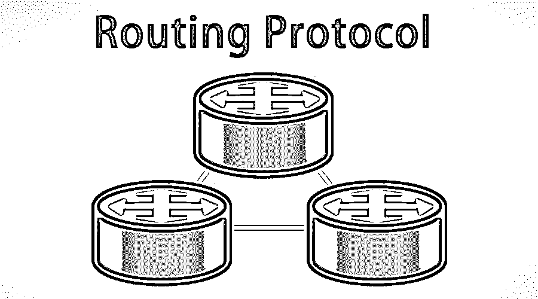

# 路由协议

> 原文：<https://www.educba.com/routing-protocol/>

## 路由协议简介

在[计算机网络](https://www.educba.com/what-is-computer-networks/)中，两个主要的重要组成部分是源和目的地。信息应该不时地从源传送到目的地。数据可以通过多种途径传输。从其他路径中选择最佳路径的过程称为路由；这可以通过被称为协议的软件编程设备来完成。标准协议有助于找到确保良好数据传输的最佳路径。必须发送的数据包也将被提供一些信息以找到最佳路由协议。

[路由协议](https://www.educba.com/routing-protocols-types/)的主要目的是了解所有现有的组网路由，并做出正确的决策。常见的路由协议有 RIP、[、EIGRP](https://www.educba.com/what-is-eigrp/) 、IGRP、BGP、IS-IS 等。,

<small>网页开发、编程语言、软件测试&其他</small>

### 路由协议是如何工作的？

让我们用一个简单的例子来理解这个概念。让我们考虑两个初始配置的直连网络。路由表只包含这两个网络，除了这两个网络之外，其它网络无法进入路由表。那么路由器如何识别其它网络呢？这可以通过以下方式实现。路由器使用远程网络管理员来了解路由，例如

#### 1.静态路由

静态路由可以有一个预定义和安装的路由器，并且只有一条路径通向目的地。该路由优先于由[动态路由](https://www.educba.com/dynamic-routing/)协议选择的路由，并且路由表中的目的地也是强制的。这主要适用于大中型网络，因为运行网络所需的工作量很大。末节网络主要使用[静态路由](https://www.educba.com/what-is-static-routing/)协议。

#### 2.默认路由

默认路由协议可以定义为当不知道到达目的地的特定路由时，路由所采用的手动定义的路径。路由信息被发送到的路由器被称为最终网关。默认路由主要用于小型网络。

#### 3.动态路由

动态路由协议有[预定义的算法](https://www.educba.com/algorithm-in-programming/)，可以分析并选择到达目的地的最佳路径。这主要是因为它对任何类型的网络拓扑的适应性。

它也可以被称为最常用的路由方法之一。为了更好地理解它是如何工作的，有必要先了解某些术语，如收敛性和准确性。

*   **收敛**

在这种路由中，所使用的路由表应该反映关于网络拓扑的准确且最新的信息[以及路由器反映值的新变化所花费的时间，而路由表中的路由被称为收敛时间。具有快速收敛时间的路由协议是优选的，因为在路由器为最优路径计算网络的过程中可能发生干扰。它也可以被称为一种接近状态的行为，在这种状态下，所有具有详细信息的路由表都处于稳定状态。](https://www.educba.com/what-is-network-topology/)

*   **精度**

由路由器更新的收敛时间应该反映关于值的确切细节，即所谓的准确性。

### 路由机制

路由更新机制是相邻路由器之间的信息传输过程。当路由器在特定的持续时间内通过广播或多播来通告其数据信息时，这可以解释如下。各种路由协议有不同的时间间隔。这些路由更新包含有关路由协议的信息，如 as、AD、矩阵值和接口详细信息。

**1。自治系统:** AS 可以定义为拥有相似路由表信息的路由器的集合，简单定义为路由协议的边界线。它可以是一对一或一对多，也可以由数值定义。根据数字的定义，互联网数字分配机构提供了一个从 1-65535 的范围

这有两种类型。

*   私有自治系统用于内部网络。
*   公共自治系统被用作互联网主干。

**2。内部网关协议:**这些协议用于数据传输，在同一个自治系统的路由器之间共享路由信息。内部网关协议包括 RIPv1、RIPv2、IGRP 和 OSPF。

**3。外部网关协议:**这些协议用于数据传输，在不同自治系统的路由器之间共享路由信息。外部网关协议的一个例子是边界网关协议。

**4。管理距离:** AD 可以定义为从邻居路由器接收到的路由更新的可靠性。例如，如果从两个路由协议收到同一路径的两个更新，路由器将检查最佳 AD 值以选择最佳路径。具有最低价值的广告将被给予更多的优先权。

**5。度量:**如果两个路由更新具有相同的 Ad 值，那么度量将进入图片以计算最佳路径。与 AD 类似，不同的路由协议使用不同的度量值。将选择具有最低值的路由协议。示例 EIGRP 使用带宽、MTU 和负载，而 RIP 仅使用跳数作为度量值。

### 路由协议的类型

路由协议主要可以分为三种类型。这些在数据传输中各有其重要性。现在让我们详细讨论这些协议中的每一个。

#### 1.距离向量

这主要使用距离作为度量值，使用方向作为向量来选择到目的网络的最佳路径。基本上，路由器从邻居路由器接收路由信息，邻居路由器从其邻居路由器接收该信息，直到目的网络。目的网络路径中的每个相邻路由器称为一跳。数据包每经过一次路由器，跳数值就会增加，跳数值最小的路由会被选择。

示例 RIP 直接与直接相连的邻居共享整个路由表。

#### 2.链路状态路由协议

链路状态路由协议使用复杂的度量表来选择到达目的网络的最佳路径。因为名字本身就表明它以链接格式工作。它使用三个表。

*   第一个表包含直连邻居的信息。
*   第二个表处理整个网络拓扑。
*   第三个表保存实际路径上的数据。

OSPF 就是一个例子。它与路由器共享自己的链路。

#### 3.混合路由协议

混合路由协议可以定义为距离矢量和链路状态协议的混合。混合路由协议使用距离矢量和链路状态协议来定位更准确的路径。

EIGRP 就是混合路由协议的一个例子。

### 结论

路由协议的主要目的是为数据包从源传输到目的地找到更好、更准确的路径。使用自治系统和度量等各种参数可以找到更好的路径，并且所有类型的协议都有各自的优缺点。它们采用不同的方法来共享路由更新和定位最佳路径。

### 推荐文章

这是路由协议指南。这里我们讨论了路由协议的介绍、理解、工作原理、机制和类型。您也可以浏览我们推荐的其他文章，了解更多信息——

1.  [Java 中的二叉树是什么？](https://www.educba.com/what-is-a-binary-tree-in-java/)
2.  [什么是计算机科学？](https://www.educba.com/what-is-computer-science/)
3.  [网络面试问题](https://www.educba.com/networking-interview-questions/)
4.  [EIGRP 面试问题](https://www.educba.com/eigrp-interview-questions/)

