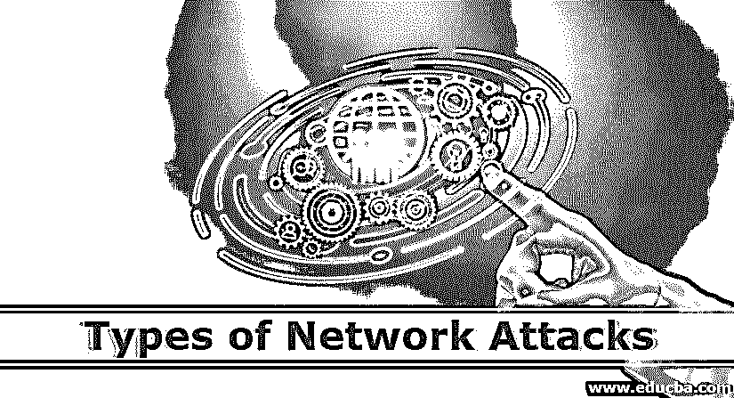

# 网络攻击的类型

> 原文：<https://www.educba.com/types-of-network-attacks/>

## 网络攻击类型介绍

如果没有安全措施和控制，您的数据可能会受到威胁。换句话说，信息是活动的，因此信息被更改以破坏或摧毁数据或网络本身。因此，数据受到积极的监控。许多人的工作、社交和个人活动都依赖于互联网。有些人还试图破坏我们连接到互联网的计算机，侵犯我们的隐私，使互联网服务无法运行。在计算机网络领域，网络安全已经成为当前攻击的强度和范围以及新的和更具破坏性的未来攻击的风险的关键问题。如果您没有安全计划，网络和数据容易受到以下任何攻击。

### 不同类型的网络攻击

不同类型的网络攻击如下:

<small>网页开发、编程语言、软件测试&其他</small>

#### 1.基于密码的攻击

基于密码的访问控制是大多数网络和操作系统安全策略的共同点。因此，您可以确定您是谁，即您的用户名和密码、您的计算机和您的网络访问权限。旧系统并不总是保护身份信息，因为身份验证信息是通过网络传输的。这可能会给窃听者合法的用户访问网络的机会。如果入侵者输入一个合法的用户帐户，他就拥有与实际客户相同的特权。因此，如果客户端具有管理员权限，入侵者也可以构建以后的访问帐户。

攻击者使用合法帐户访问您的网络后，可以执行以下任何操作。

**错误！未指定文件名**

使用相关客户端和网络数据以及设备名称的列表。

**错误！未指定文件名**

修改数据库和网络配置，包括路由和访问控制。

**错误！未指定文件名**

调整您的信息，重新发送或删除它。

#### 2.中间人攻击

顾名思义，当中心有人不断跟踪、捕捉和监视你的联系人时，你和与你互动的人之间的人。例如，攻击者可以重启数据交换。当计算机通信时，计算机不能确定它们如何在网络层的低层共享信息。中间人攻击就像那些冒用你的身份来阅读你的文本的人。其他人可能会认为你是，因为入侵者可能会故意回应，以便你继续交流并获得更多信息。他的攻击可以造成与本节下面提到的应用层攻击相同的损害。

#### 3.近距离攻击

近距离攻击是指有人试图以物理方式进入网络的元素、数据或结构，以了解更多信息。近距离攻击是指普通人进入网络、系统或设施的物理邻近区域，以更改或收集信息或拒绝访问。通过突然的网络进入、开放接入或两者来实现物理上的接近。近距离攻击的一种流行形式是社会工程攻击中的社会工程。通过社交互动、电子邮件或电话，攻击者可以利用网络和设备。

#### 4.身份欺骗

大多数网络和操作系统使用设备的 IP 地址对合法业务进行分类。入侵者还可以使用特定的程序从公司内部网的有效地址创建 IP 数据包。攻击者可以。黑客在使用有效的 IP 地址访问网络后，可能会更改、删除或擦除您的数据。如以下部分所定义的，攻击者还可能执行其他类型的攻击。

#### 5.密钥泄露攻击

一个密钥是处理安全信息所需的秘密代码或数字。虽然攻击者获得密钥可能是一个复杂且资源密集的过程。攻击者获得密码后，它被认为是一个损坏的密钥。攻击者使用受影响的密钥来获得对安全通信的访问，而发送者或接收者不会检测到攻击。攻击者可以通过使用受影响的密钥来解密或改变信息，以生成附加密钥，从而给予攻击者对任何其他安全通信的访问权。

#### 6.应用层攻击

应用层攻击以数据库服务器为目标，故意触发服务器操作系统或应用程序的故障。它帮助入侵者绕过标准的访问控制。入侵者会利用这种情况控制您的应用程序、设备或网络，并可以执行以下任何操作:

*   读取您的数据或添加、删除或更改它们的操作系统。
*   引入病毒系统，使用您的计算机和软件应用程序在您的网络中复制病毒。
*   引入嗅探器来评估和收集最终会导致网络和系统崩溃或损坏的信息。

#### 7.被动攻击

被动攻击跟踪未加密的流量，并扫描代码或机密信息以寻找其他攻击形式。被动威胁包括流量分析、不安全接触监视、弱加密流量解密和加密信息收集，例如密码。被动网络监控让对手看到未来的措施。被动攻击会在用户不同意或不知情的情况下，将信息或数据文件泄露给攻击者。

#### 8.主动进攻

攻击者试图在攻击性攻击中侵入或破解安全系统。它可以通过隐身、蠕虫、病毒或特洛伊木马来实现。攻击性攻击包括试图规避或破坏安全软件、恶意代码以及盗窃或篡改。这种攻击安装在网络主干上，利用传输中的信息，以电子方式加入飞地，或在试图链接到飞地时以远程授权用户为目标。主动攻击导致数据文件、DoS 和篡改。软件被公开和传播。

#### 9.近距离攻击

近距离攻击是指试图以物理方式进入设备、数据或系统以了解近距离攻击的人，包括经常靠近网络、系统或设施以更改、捕获或拒绝访问信息的个人。通过秘密的开放式访问、网络访问或两者兼而有之，可以达到近乎物理的接近。社交工程攻击是一种常见的攻击形式，攻击者通过与个人、电子邮件或手机进行社交互动来危害网络或流程。此人可以使用各种伎俩来暴露公司的安全信息。受害者提供给攻击者的信息最有可能被用来访问未经授权的设备或网络以进行后续攻击。

#### 10.两个

DoS 攻击使合法用户无法使用网络、服务器或其他资源。三组中的一组。

1.  **带宽泛滥:**攻击者向目标主机发送稀释的数据包——如此之多的数据包导致通往目标主机的访问路径被阻塞，合法的数据包无法进入服务器。
2.  **漏洞攻击:**这意味着在目标主机上向易受攻击的程序或操作系统发送一组精心构造的消息。如果向受损的程序或操作系统发送了正确的数据包序列，服务可能会停止，或者主机可能会崩溃。
3.  **连接泛滥:**目标主机上的很多 TCP 连接都是形成半开或者全开的。有了这些假连接，主机可能会陷入其中，以至于无法再接受有效的连接。

#### 11.网络数据包窃听软件

记录每个飞行数据包副本的被动接收器称为数据包嗅探器。通过无线发射机附近的每一个无源接收机，它可以得到每个发射分组的副本。这种包可能包含一些敏感信息，如社会安全号码、密码、个人消息和商业秘密。密码术包括一些防止数据包嗅探的最佳防御措施。

#### 12.恶意软件

[恶意软件](https://www.educba.com/what-is-malware/)专门用于中断、破坏或获取许可的计算机系统访问。如今，一些恶意软件会自我复制:一旦主机被感染，它就会寻找该主机通过互联网与其他主机的连接，并寻找来自新感染主机的更多[主机](https://www.educba.com/types-of-malware/)的入口。自我复制的恶意软件可以以这种方式指数级快速传播。

#### 13.内部攻击

内部攻击涉及来自公司或系统内部的人，例如一个不安全的工作人员，他可能是恶意的，也可能不是恶意的，将网络作为内部攻击的目标。有意恶意的内部人员窃听、窃取数据或删除数据，欺诈性地使用数据或拒绝已获得许可的其他用户访问数据。没有传统的恶意攻击，因为缺乏考虑，意识或故意的安全规避，例如，执行任务。

### 结论

认为网络基础设施无懈可击是一种愿景，但安全是有可能实现的。本质上，你知道你的网络能做什么，知道你的设备和培训你的工人。因此，在本文中，我们已经了解了不同类型的网络攻击。我希望这篇文章对你有所帮助。

### 推荐文章

这是网络攻击类型的指南。在这里，我们以描述性的方式讨论不同类型的网络攻击的基本概念。您也可以浏览我们推荐的其他文章，了解更多信息——

1.  [网络攻击的类型](https://www.educba.com/types-of-cyber-attack/)
2.  [网络安全的类型](https://www.educba.com/types-of-cyber-security/)
3.  [联网设备](https://www.educba.com/networking-devices/)
4.  [网络类型](https://www.educba.com/types-of-network/)

