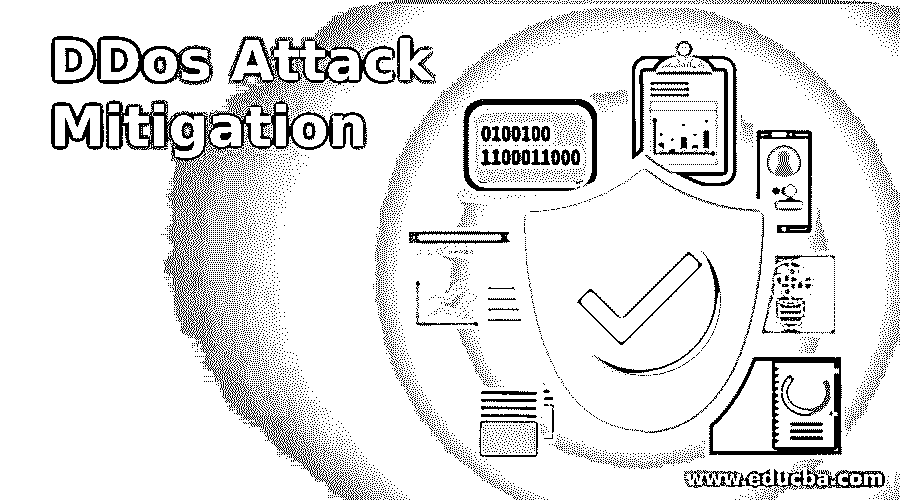

# DDos 攻击缓解

> 原文：<https://www.educba.com/ddos-attack-mitigation/>

## DDos 攻击缓解简介

DDoS 攻击缓解是保护计算机网络或服务器免受 DDos 攻击的过程，也称为分布式拒绝服务，是互联网上最强大的攻击之一。DDoS 的目的是增加来自各种受损系统的服务器传入流量(连接),使服务器无法处理连接并最终崩溃。DDos 攻击缓解对任何人来说都是至关重要的，无论是个人还是使用计算机网络的组织，因为如果不采取必要的措施，有价值的信息就会受到损害，并可能造成巨大的损失。

### 什么是 DDoS 攻击缓解？

如前所述，DDoS 攻击缓解是一种适用于保护网络或服务器免受 DDos 攻击的过程。这是通过各种方式实现的，如配置专门配备的网络设备或基于云的服务等。有许多类型的 DDos 攻击缓解，攻击应该从其中缓解，流量攻击主要集中在流量上。主要针对发送数据的带宽攻击，以及耗尽和占用应用层资源的应用攻击。DDoS 攻击缓解策略应包含一些有助于增强系统功能的特性。

<small>网页开发、编程语言、软件测试&其他</small>

一些功能包括:

*   **可扩展性**
    该解决方案应具有可扩展性，以满足不断增长的业务需求。
*   **网络规模**
    网络规模及其带宽应该很高，因为在 DDoS 的情况下，需要处理大量数据并评估其是否合法。这需要大量的处理能力，并且为了获得系统的快速响应，建议使用更大的网络规模
*   **灵活性**
    战略应该是灵活的，以适应多种威胁。随着威胁类型的数量不断增加，策略应该足够灵活以应对各种情况。

### DDoS 攻击缓解的各个阶段

通常，DDos 攻击缓解分为 4 个阶段。

1.  **检测**–在这些情况下，识别问题非常关键。服务器不应该与正常的高流量混淆。这一阶段的错误假设导致将内容限制在用户范围内，这对组织来说通常是无益的。任何采用的方法的有效性都是通过几乎瞬间检测到攻击的能力来衡量的(这是理想的情况，也是尽可能早的实际情况)。
2.  **转移/路由**—该阶段涉及设计智能路由逻辑，其中大部分可疑数据被路由离开服务器，而剩余的数据很容易以块的形式管理，从而防止拒绝服务。
3.  **过滤–**顾名思义，这一阶段包括过滤传入的数据，并智能地丢弃最有可能是来自机器人的流量的数据包或连接。这可以通过查找有助于区分合法流量和机器流量的模式来识别。
4.  **分析—**分析通过从当前的错误中学习，在避免未来的攻击中扮演着重要的角色。对攻击期间产生的安全日志进行分析。这些日志提供了有关环境和罪犯使用的数据类型的信息。这可以用来使系统更健壮，更不易受到这种攻击。

### DDoS 攻击缓解服务

避免 DDos 攻击缓解的最佳和有效方法是拥有一个具有巨大带宽的网络，以便网络不会被流量淹没。不幸的是，单靠一台服务器不足以实现这一点。因此，建议从外部渠道寻求帮助，大多数人都这样做了。这方面的一个著名例子是 cloudflare。它们在地理上分布传入的流量，为了确保没有攻击，网络容量应该总是大于 DDoS。

市场上可用的 DDoS 攻击缓解服务很少:

1.  Cloudflare
    Cloudflare 是一家非常受欢迎的网络安全和网络基础设施公司，提供 DDoS 缓解服务。这是许可的，因此用户必须付费使用他们的服务。他们还提供互联网安全，DNS 服务器等…
2.  **Alibaba**
    DDoS 缓解服务是一种基于云的安全服务。它由阿里云提供，增加了对所采取的安全措施的控制和可见性。它与阿里云 ECS(弹性计算服务)实例进行交互，以保护用户数据。它不太复杂，易于维护/管理。阿里巴巴反 DDoS(基础版)免费让用户获得动手体验。有一个高级版本可用于定制和增加的要求。
3.  AWS Shield
    AWS shield 基本上是为了保护运行在 AWS 上的应用程序而设计的。AWS Shield 始终主动检测潜在威胁。AWS shield 有两种不同的包装。标准和高级。默认情况下，所有 AWS 应用程序都受到 AWS shield 标准的保护。它是免费的，可以保护系统免受网络层和传输层的基本安全威胁。高级用于更高级别的保护。除了标准版的功能外，它还提供实时分析和基于 web 的防火墙，只允许合法的流量。
4.  Akamai 是一家美国云服务提供商。它们还提供网络安全。他们的服务器分布在全球各地，流量也是分布式的。它位于用户和 web 应用程序之间。Akamai 决定请求是否合法，并将请求重定向到应用程序。

### 结论

总体而言，采用 DDos 攻击缓解非常重要，原因如下

*   随着安全性的提高，与数据失窃相关的风险也随之降低。
*   服务器和网络的维护变得更加容易。
*   可以降低与 web 安全相关的成本，同时保持系统的性能。
*   数据比没有缓解服务时要安全得多。

### 推荐文章

这是 DDos 攻击缓解指南。在这里，我们讨论了 DDos 攻击缓解及其 4 个阶段和服务的介绍。您也可以浏览我们的其他相关文章，了解更多信息——

1.  [DNS 放大攻击](https://www.educba.com/dns-amplification-attack/)
2.  [网络攻击的类型](https://www.educba.com/types-of-network-attacks/)
3.  [什么是 DDoS 攻击？](https://www.educba.com/what-is-ddos-attack/)
4.  [拒绝服务攻击](https://www.educba.com/denial-of-service-attack/)

