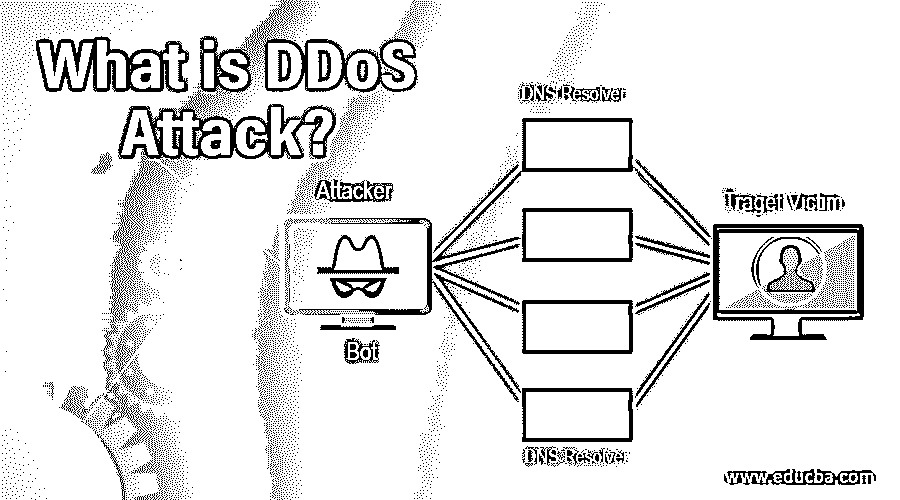
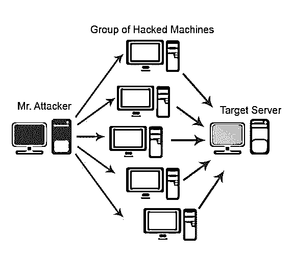
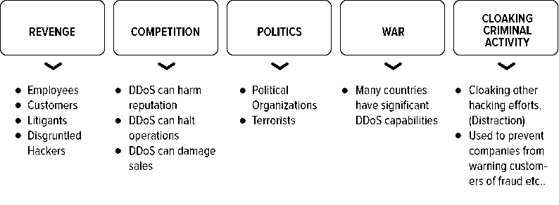

# 什么是 DDoS 攻击？

> 原文：<https://www.educba.com/what-is-ddos-attack/>

## DDoS 攻击简介

DDos，通常缩写为分布式拒绝服务，用于清洗网络资源。最终用户无法访问基本信息，这也使得应用程序的性能非常慢。DDos 试图[使 web 应用程序](https://www.educba.com/what-is-web-application/)或在线服务因拥塞而繁忙，这些拥塞是由多个资源产生的大量流量造成的。很难确定攻击来自哪里或攻击的来源，因为它来自不同的来源，通常使用特洛伊木马感染系统。在本文中，我们将讨论什么是 DDoS 攻击？

DoS(拒绝服务)攻击不同于 DDoS 攻击，因为 DoS 用于针对单个网络连接和单个计算机，而 DDoS 攻击用于同时破坏多个系统和多个网络连接，这被称为僵尸网络。

<small>网页开发、编程语言、软件测试&其他</small>

### 什么是僵尸网络？

僵尸网络被定义为攻击者构建一个被黑客攻击的技术网络；它们通过一段代码[通过社交媒体](https://www.educba.com/career-in-social-media/)、网站和电子邮件传播。攻击者可以在终端用户不知情的情况下远程控制系统；一旦这些系统被感染，它们就会开始对被感染的计算机发起攻击。

有一些症状可以跟踪你的计算机是否被 DDos 感染，

*   不断失去互联网连接。
*   之前可用的网站意外变得不可用。
*   无权使用任何网站。
*   网络性能下降。
*   无法长时间使用互联网服务。

### DDoS 攻击的目的

DDoS 攻击的目的主要包括政治、竞争、报复、战争和犯罪活动。

### 它是如何工作的？

*   DDoS 攻击需要攻击者在一个进程中获得在线系统网络的力量来实施攻击。一旦系统或其他机器被[恶意软件](https://www.educba.com/what-is-malware/)感染，每一个都会变成一个机器人；然后，攻击者可以通过远程控制轻松访问计算机。
*   如果僵尸网络已经建立，攻击者可以通过远程控制将运行良好的指令传输到每个僵尸网络，从而完全访问计算机。一旦最终用户的 IP 地址被僵尸网络跟踪或锁定，每一个僵尸网络都会开始对其进行处理，通过向目标机器发送请求来做出响应，并可能导致服务器或网络在 DoS 下产生正常流量，并产生溢出容量。

### DDoS 攻击是如何发生的？

*   DDos 是一种[网络攻击](https://www.educba.com/types-of-cyber-attack/)的形式，使用密集的关键系统来中断[网络连接](https://www.educba.com/network-security-interview-questions/)或服务，从而为指定资源的用户创建拒绝服务。
*   DDoS 攻击利用大量受恶意软件影响的系统的力量来实现单个系统。

### DDoS 攻击背后的动机

*   DDoS 攻击用于淹没网络资源，使最终用户无法访问必要的信息，还会使应用程序的性能非常慢。
*   DDoS 攻击可以控制或关闭各种规模的网站，从大型企业到小型单位，甚至更易受攻击的网站。
*   攻击的进展不同于纯粹的经济利益和政治利益。
*   DDoS 攻击背后的动机是它们可以被出售，因此消费者可能会要求一个有保证的网站离线，并为其执行支付费用。在这种情况下，报复往往是动机。
*   另一方面，如果攻击者需要钱，他们可能还想勒索网站以获得他们需要的钱，并使他们的网站变慢或突然变得不可用很长一段时间，直到他们需要付款。
*   总之，一种用来控制政治事件和阻挠他人的时髦方法是，打击并关闭观点不同寻常的网站。像这样的活动正在成为使用 DDoS 攻击来对付媒体的一种越来越聪明的方式。

### DDos 攻击后怎么办？

在 DDoS 攻击过程之后，我们可以发现我们的系统行为，例如响应缓慢；不会出现网站无法访问、无法上网的情况；同样，我们也会面临这样的情况。如果我们面对这样的问题要遵循几件事，

*   给 ISP(互联网服务提供商)打电话，让他们知道你受到了 DDoS 攻击。
*   如果您可以控制您的网站，请将其保持在安全模式下，以避免任何数据丢失，并向管理团队报告相关问题。
*   打电话给第三方，告知他们你受到攻击，这可能取决于安全管理或服务交付。
*   获取尽可能多的信息。
*   跟踪事件发生时的服务器日志。
*   监视系统的所有事件，并注意在 DDoS 攻击期间或之后系统上可能发生的任何变化。
*   展示交通吞吐量，交通统计。
*   检查后端数据库和所有关键系统，并记录系统上可能发生的任何变化。
*   留意临时场所发生的问题。

采用专业指导来帮助缓解问题，并执行灵活的解决方案来帮助减少 DDoS 事件的发生。保留风险登记册并更新任何悲剧改善计划，以包含 DDoS 持久性计划。为避免 DDoS 攻击，请联系 DDoS 防御专家。

### 如何预防？

遵循 DDoS 预防，

*   攻击预防和先发制人(攻击前)
*   攻击检测和过滤(攻击期间)
*   追溯和识别(攻击期间和之后)

1.在攻击预防和先发制人(在攻击之前)，我们必须保护主机免受代理植入，并通过使用扫描措施和签名来识别它们。监控主机和攻击者之间发送的已识别攻击信息的网络流量。

2.在攻击源追踪和识别中(攻击期间和攻击之后),不依赖源点就能准确定位数据包的来源。路由器可以记录被注意到的信息，并且路由器也可以将关于被看到的包的消息发送到它们的目标位置。

3.在攻击检测和过滤(在攻击过程中)在攻击检测中，我们可以识别被攻击的 DDoS 数据包和数据包攻击过滤，以对这些数据包进行分类并减少它们。

### 结论

DDoS(分布式拒绝服务)攻击利用网络漏洞，使网络连接持续丢失，降低系统性能，并在互联网上产生更多流量，导致长时间无法使用互联网服务。这种做法有利于希望合法用户配合其重要和敏感信息的安全措施的侵入者。一旦系统受到 DDoS 攻击，它可能不容易被发现，并且它的预防也不是最容易的。从这种情况中解脱的唯一方法是确定它是否造成了任何伤害，并采取行动来恢复它们。

### 推荐文章

这是一个什么是 DDoS 攻击的指南。在这里，我们讨论了介绍，它是如何工作的，它的目的和 DDoS 的动机。您也可以浏览我们推荐的其他文章，了解更多信息——

1.  [什么是网络钓鱼攻击？](https://www.educba.com/what-is-a-phishing-attack/)
2.  [道德黑客面试问题](https://www.educba.com/ethical-hacking-interview-questions/)
3.  什么是网络攻击？
4.  [DDos 攻击缓解](https://www.educba.com/ddos-attack-mitigation/)

