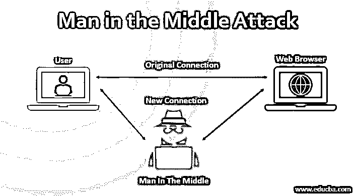
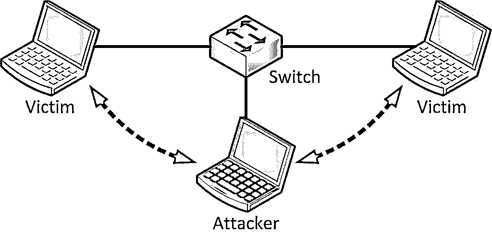
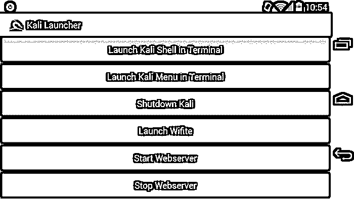

# 激动的想知道谁是秘密攻击者？中间的人

> 原文：<https://www.educba.com/what-is-the-man-in-the-middle-attack/>

## 《中间人》简介

是的。我知道。标题好像很吓人。但这不是某部电影的名字。但我敢打赌这是最可怕的。中间人 MITM 是一种用于黑客和网络劫持的攻击类型。

但是为什么 MITM 中部的人这个名字？等等！不是这样的！它以前被称为中间的猴子。我不知道为什么叫这个名字，但我肯定知道为什么“MITM 中部的人”是这个名字。下图对它的定义就不言自明了。

<small>网页开发、编程语言、软件测试&其他</small>

 

### 中间人攻击(MITM)简介

还在疑惑？让我给你解释一下。假设你是一个需要定期为你的公司做一些 x 类工作的人。您拜访客户的住处，连接您的加密狗以启动互联网。

但是你看到你的上网套餐充值失败(只是假设)。现在你甚至不能充值，因为你的互联网坏了。

现在，客户端已经足够好，允许您访问他的无线局域网或 Wi-Fi。但问题是，这安全吗？绝对不行。你，我的朋友，现在可能是一些大公司间谍活动的受害者。哈哈哈…不完全是，但我的观点只是不安全。让我用另一种方式解释给你听。

我上面告诉你的只是一个警告。我在现实生活中已经这样做了，让我给你看看结果。首先，我是一名渗透测试员。

我建议你在你自己的家庭环境或实验室里做我将要说的任何事情。在公共场所这么做可能会给你带来严重的法律问题。(简而言之，除非你有一个好律师，否则不要这么做)。

### 该事件

两年前，当我还在学习黑客的时候(我还在学习)，我坐在印度浦那的一家麦当劳里。由于极端的降雨，我的网络在那个星期中断了。因为我是一个离不开网络的人，所以我决定去麦当劳过夜，因为那里有免费的无线网络。

是的，人们通常会直接跳到一个有免费互联网的地方(至少印度人是这样)，而不会考虑它会带来的问题(因为像我这样的人)。

于是，我启动了笔记本电脑。那时我已经安装了 Arch Linux，这仍然是我的最爱。但我所做的可以在任何安装了基本 Linux 操作系统(是的——它的 Linux)的笔记本电脑上完成。我很无聊，因为我无事可做，我开始了一个有趣的 MITM 攻击。这次攻击相当复杂。

这可能会使网络上的其他计算机和手机认为我是路由器，并通过我传递所有的数据包。如果你对此不感到恐惧，那么你应该感到恐惧。

原因是现在我处理通过网络的每一条信息，包括传入和传出的流量。现在，我可以查看数据包，嗅嗅它们，浏览所有通过的数据。

无论是人们登录社交网站，人们互相聊天或者更糟的是，人们进行银行交易。我通常会一看到任何一家银行的数字证书就躲开。但我会做的只是为了好玩，我会修改人们过去常做的聊天。

这真的很有趣。 [WhatsApp](https://www.whatsapp.com/ "WhatsApp") 是安全的(或者至少它一通过网络你就无法破解)。很多人以前用的 [We-chat](https://www.wechat.com/en "WeChat ") 和 [Hike](https://get.hike.in/ "Hike ") ，都是极低[加密](https://www.educba.com/encryption-process/ "The Process of Encryption")或者根本不加密。所以，当一个男生约一个女生在某个地方见面时，我通常会改变他们的见面地址。

我知道这很幼稚，但正如我所说，这很有趣。(我其实做的远不止这些)。所以，问题是，我不仅可以看到交易和流量发生，我甚至可以改变它们，发送一些完全超出图表的东西。

例如，如果有人在 YouTube 上播放一段视频，我完全可以用一些简单的 JavaScript 修改这段视频，然后窃取它们。现在，让我再问你一次我第一次使用完全随机 Wi-Fi 的例子。你认为这安全吗？

### 方法和原因

好了，现在你们一直想问的主要问题是？为什么？这可能甚至不是一个问题。对此有很多答案，比如让自己变得安全，或者了解相关的风险，以及它在现实中如何运作的科学，事实上，如何知道并抓住任何对你做同样事情的人。

因此，首先，为了进行 MITM 攻击，我推荐使用 [Kali Linux](https://www.educba.com/software-development/courses/linux-training-certification/ "Kali Linux Training Course") 。这样，你安装任何东西都不会有太多的麻烦，因为 Kali Linux 是一个测试软件，它几乎预装了所有的工具。

MITM 通常使用 ARP 中毒来执行。MITM 包括 cookie 窃取，会话劫持，其中你可以捕捉任何人的整个登录会话等等。

有了足够的信息，人们甚至可以进行分布式拒绝服务攻击，使整个网络瘫痪。我不会在这里写下完整的代码。但是我会告诉你 MITM 的基本知识让你开始。这是因为攻击主要取决于路由器的安全性。

现在你不可能拿着笔记本电脑黑进什么东西。如果你有一个合适的设置会有所帮助。[所以，在安装了](https://www.educba.com/kali-linux-vs-ubuntu/) kali Linux 之后，我会推荐有好的监控和注入 Wi-Fi。

我用了几个月的就是 TP-Link Wn722n。它有一个很好的射程，并且非常强大和便携，可以进行 MITM 攻击。

现在你需要做的就是使用 ArpSpoof 欺骗你的 Mac ID，让网络认为你是路由器，然后通过 [Wireshark](https://www.educba.com/wireshark-alternatives/) 和 tcpdump 捕获所有数据包。您也可以使用 Dsniff 嗅探流量，但是，您将无法嗅探 https 数据包。

Dsniff 仅适用于不安全的套接字层，即 http 而非 https。要使用 http，您需要使用 SSL Strip 来丢弃安全套接字层，然后通过它嗅探数据包。

还有一些事情需要记住。确保您的防火墙配置为接受这些数据包。如果你在局域网上这样做，这不是问题，但是如果你试图在广域网上这样做，你将不得不通过端口转发来获得这些数据包。

以下是一些可以使用的 MITM 攻击工具:

#### 对于 windows

该隐和亚伯——一个用于嗅探 ARP 中毒的 GUI 工具。由于我在这个领域很长时间了，我宁愿建议不要去找中间人攻击 windows 的工具。原因是，如果你试图进行多次攻击，windows 不会帮助。你将不得不切换到 [Linux](https://www.educba.com/software-development/courses/linux-training-certification/ "Linux System Administration with Python") 或者拥有多台电脑，这些都不好。

#### 对于 Linux

1.  Ettercap 和 Wireshark: 嗅探局域网上的数据包
2.  **Dsniff:** 捕获 SSH 登录
3.  **SSLStrip:** 移除数据包上的安全层
4.  **Airjack:** 一次完成多个 MITMs
5.  用于 SSL 和 HTTPS 移除的工具

如果你认为这是它，等等。还有一个平台你们大多数人可能都不知道:这是我最喜欢的安卓系统。让我们看看 Android 的商店里有什么:

1.  用于不同类型的 MITM 攻击的工具
2.  Zanti2: Zanti 是一款商业软件，以前它是一款付费应用，但最近他们将其变成了免费软件。在 MITMs 和其他攻击的情况下，它是极其强大的。
3.  **Wireshark:** 与 Linux 相同
4.  **卡莉 Linux:** 是的。有适用于 Android 的 Kali Linux，现在被称为 NetHunter。最棒的是，你甚至可以用它 ssh 进入你自己的家用电脑，然后不留痕迹地开始入侵。

所以，下次你看到有人在你的网络上捣乱，你要怀疑的不仅仅是一个拿着笔记本电脑的家伙。任何拥有 Nexus 或 One plus 等优秀安卓手机的人都可以在你不知情的情况下侵入你的网络。

以下是 Nethunter 上 Kali 的图形用户界面:

 

*图片来源:kali.org*

### 偏执是安全的关键。

在这个充满寄生虫的世界里，保持安全的唯一方法就是保持偏执。这不仅仅是为了 MITM 的攻击，而是因为这是为了一切。以下是您在访问公共 Wi-Fi 时可以考虑的几个步骤，以确保您的安全:

1.  连接到电子邮件服务时，始终使用 [VPN](https://www.educba.com/android-vpn-app/ "17 Best Android VPN Apps") 。
2.  使用具有适当电子邮件安全性的安全电子邮件来检测恶意软件，例如 Google 或 Protonmail。
3.  如果你自己是一个公共 Wi-Fi 所有者，你应该安装一个 IDS，即入侵检测系统，以捕捉任何类型的非正常活动。
4.  请不时检查您的凭据，查看是否发生了任何随机活动，或者是否从其他位置访问了这些活动。每个月都要更换密码。最重要的是，不要让人们更容易破解它们。大多数人都保留 18two19Eight4 这样的密码。这个密码非常容易破解；因为这可能只是一个出生日期，即 1984 年 2 月 18 日日。密码应该类似于“iY_lp#8*q9d”。是的，这就是一个体面的安全密码的样子。我不是说这是不可破解的。但是，它将消耗 10 倍以上的时间，在这种情况下优先。

所以，现在就这样了。等我下一篇关于[网络安全](https://www.educba.com/cybersecurity-basic/ "Cybersecurity Tips and Tricks")的博客发布更多更新。在那之前，保持安全，继续入侵。

### 推荐文章

这里有一些文章，将帮助您获得更多关于秘密攻击者的细节，所以只需通过链接。

1.  [电子邮件礼仪规则](https://www.educba.com/email-etiquette-rules/)
2.  [Java 面试问题](https://www.educba.com/java-interview-questions/)
3.  [网络安全基础知识](https://www.educba.com/cybersecurity-basic/)
4.  [Linux vs Windows](https://www.educba.com/linux-vs-windows/)

