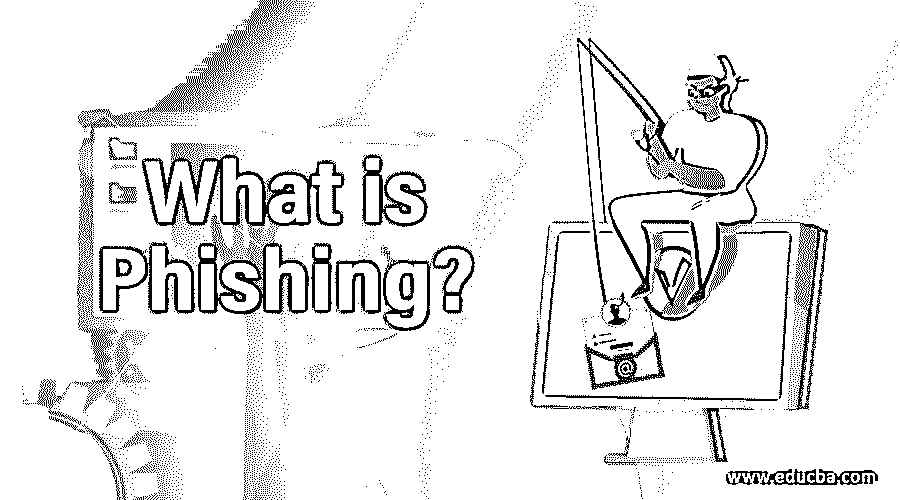

# 什么是网络钓鱼？

> 原文：<https://www.educba.com/what-is-phishing/>

## 网络钓鱼简介

“费西合唱团”这个词是一个比喻，指的是一个垂钓者把鱼当作诱饵来钓。网络钓鱼是用来欺骗用户的社会工程技术的一个例子。这是一种网络犯罪，可以通过电子邮件、短信和电话联系目标，让目标相信它来自合法来源，可以从目标那里收集敏感信息和数据。这样收集的数据可以包括银行详情、账户信息等。

网络钓鱼是最古老的网络攻击之一，始于 20 世纪 90 年代。这是从 20 世纪 90 年代 AOL 用户开始的，目的是欺骗他们提供登录凭证。尽管如此，这仍是近期的主要攻击之一，而且变得非常复杂。对付网络钓鱼有几种方法，如用户意识、立法、用户培训、适当的网络安全技术措施。

<small>网页开发、编程语言、软件测试&其他</small>

### 网络钓鱼的类型

网络钓鱼攻击的类型可以分为以下几类:

#### 1.鱼叉网络钓鱼

这是网络钓鱼，目标是个人或公司。与批量网络钓鱼不同，网络钓鱼攻击者通常攻击个人或公司，并使用他们的个人信息来提高成功率。在这种攻击中，攻击者向个人发送指定的消息，而不是一般的消息。攻击者添加尽可能多的个人信息来欺骗目标，使其相信这些信息来自高度合法的来源。

它们是如何工作的？

鱼叉式网络钓鱼是通过在社交网站上扫描个人档案来实现的。从个人资料，他们将能够获得他们的电子邮件 id，性别，朋友名单，位置等。有了这些信息，攻击者就可以把目标当作朋友或某个熟悉的实体，向他们发送令人信服但带有欺骗性的帖子或消息。通常，这个人会发送一个链接到一些假冒的网站，这些网站看起来是一个真实的网站，但却被用来注册用户名、密码等..有点敏感的信息。一旦攻击者收集了所有必要的信息，他们就可以访问银行信息，诱骗攻击者下载一些恶意软件，等等。

**要谨慎:**

*   人们需要知道哪些敏感数据在社交网站和网上可见。
*   密码可以灵活地创建，因此很难猜测。
*   软件必须经常更新。
*   我在点击电子邮件中的链接时需要小心。即使有点怀疑，也尽量避免点击链接。

#### 2.克隆网络钓鱼

克隆网络钓鱼是一种网络钓鱼，其中来自合法来源的电子邮件的内容被完全克隆，并添加了恶意内容。攻击者可能会欺骗用户说这是一封更新的电子邮件，然后进行网络钓鱼。赢得电子邮件，恶意链接可能会被发送，目标用户可能会被敲诈或勒索或暴露。

#### 3.鲸鱼钓鱼

鲸鱼网络钓鱼可以被认为是鱼叉式网络钓鱼的一种，因为其目标是个人而不是群体。鲸鱼钓鱼是一种只针对知名员工的网络钓鱼。这是针对公司的高度敏感信息。这种攻击的目标通常是首席财务官/首席执行官级别的人，他们掌握着公司的重要和敏感信息。术语捕鲸是根据攻击的大小(鲸鱼的大小/大的尺寸)来的。由于其非常高的针对性，很难阻止这种类型的攻击，因为攻击者非常担心被抓住，因此攻击成功的可能性很高。捕鲸攻击是高度定制化的，它们包含攻击者的邮件、姓名和其他各种信息，这些信息可以通过各种渠道获得。

攻击者准备花费大量的时间，因为这些信息给他们带来了比普通信息更高的回报。捕鲸攻击最近发生在 2016 年，首席执行官们被骗向一些未经授权的第三方提供所得税相关数据。

### 实施网络钓鱼的方式

下面给出了执行网络钓鱼的不同方法和途径:

*   **欺骗性网络钓鱼:**这是最常见的技术，攻击者利用这种技术冒充受信任的公司，试图窃取用户名等敏感数据。他们还可以在电子邮件中发送一些链接，这些链接会将他们重定向到虚假网站，以收集登录凭据等数据。
*   **网站伪造:**在这种攻击中，攻击者使用 [javascript 命令](https://www.educba.com/what-is-javascript/)来更改他们所指向的 URL 地址。打开伪造的网址而不是合法的网址，就会发生这种情况。
*   **过滤规避:**网络钓鱼者已经开始使用图像而不是文本，因此反网络钓鱼过滤器很难检测到他们。但是，一些反网络钓鱼过滤器能够使用 ocr 检测图像中嵌入的隐藏文本/脚本。
*   **语音钓鱼:**有时候，网络钓鱼不一定发生在网上。它们可以通过打电话给用户，就像他们来自银行一样，并说服他们提供 pin、用户名和其他敏感数据，通过这些数据可以进行金融安全攻击，如偷钱、购物等。
*   **短信钓鱼:**钓鱼欺诈链接可以通过短信而不是电子邮件发送。该链接的作用与电子邮件上的垃圾链接完全相同。由于人们几乎什么都用手机，这已经变得相当流行了。这些信息可以用吸引人或吸引人的信息欺骗用户，比如“你已经在一次抽奖中赢得了 500 万卢比”。要申领，请点击……”
*   **会话网络钓鱼:**这是网络钓鱼依赖于浏览器会话，能够检测到另一个会话的存在。在这里，通过打开一个欺骗用户的弹出窗口，就好像目标会话正在打开它，就可能发生网络钓鱼。

### 如何鉴别？

*   显示名称不可信。
*   正确检查发件人的电子邮件地址。有时，发件人的电子邮件或电子邮件地址中给出的网站地址可能是可疑的，这可以通过敏锐的检查发现。
*   有时，电子邮件正文可能写得很差，表明电子邮件的来源不合法。
*   该电子邮件可能包含可疑附件，其中可能包含恶意软件或在打开时安装了某些病毒。
*   如果电子邮件询问你任何听起来可疑的个人信息，你应该避免相信。
*   “紧急”邮件可能是一种威胁。当电子邮件带有紧迫感时，要小心。通常，这是一个诡计，让用户不要再想什么，立即采取行动，如提供个人信息，让他们下载恶意软件。
*   检查签名。合法来源将非常透明，并提供完整的联系信息、支持电话号码等。因此，检查签名是否有效，是否有一些可信的信息，这有助于了解电子邮件是否是真实的。
*   使用适当的浏览器，在浏览器中启用一些反网络钓鱼功能。Chrome、Firefox、IE、Safari 等..在其中启用反网络钓鱼。

### 反网络钓鱼

*   互联网上有一些网站，可以帮助人们显示在互联网上传播的有关网络钓鱼的确切信息。这类网站有助于传播意识。
*   许多组织开始实施一些方法，培训员工在组织内合法地实施适当的技术，以防止网络钓鱼攻击。组织还开展网络钓鱼宣传活动，让员工了解安全防范网络钓鱼的重要性。此外，组织试图在官方电子邮件中采用一种模式/签名，以便员工知道该电子邮件实际上是否是官方的。然而，这也确实取决于个人对电子邮件中这种微小细节的关注。
*   可以训练用户识别网络钓鱼企图，并用一些适当的技术来对付它们。
*   像 IE，Chrome，Firefox 这样的浏览器维护着一个欺诈网站的列表，这些网站经常进行网络钓鱼攻击。这些让用户在打开网站之前就知道了，这样用户就安全了。然而，这只能防止 50%的问题，因为攻击者在知道他们的网站被阻止后，显然会选择另一种方式，可能会更改域等…
*   一些银行网站已经采用了一些智能方法来检测网络钓鱼，比如只有在某个操作可靠时才要求用户输入密码。例如，网站显示了一组图像，用户可以从中选择一个，并显示出来。只有这样，用户才会被要求输入密码，这表明他们正在查看的网页是可靠的。
*   几乎所有过滤收件箱邮件的邮箱都有垃圾邮件过滤器。
*   目前，有更多的方式来授权用户，如为手机号码提供两步验证方法，如动态口令。
*   有了 OAuth，你可以利用谷歌/脸书/ Twitter 认证，欺诈登录已经变得不太可能，因为这些大公司完全接管了完整的登录安全。
*   渗透测试是一种通过模拟攻击计算机系统来检查系统安全级别的技术。这基本上用于风险评估，其中评估评估系统在多大程度上可以免受安全攻击，以及系统在多大程度上易受此类攻击。在这种情况下，目标系统被完全检查并得到数据。然后，通过设定攻击特定数据的目标，然后测试系统遭遇攻击的能力，来执行测试。Pen 测试是全面安全审计的一个组成部分。

### 笔测试的阶段

下面给出了笔测试的各个阶段:

*   **侦察:**这是收集所需信息的阶段。
*   **扫描:**利用工具进一步加深攻击者对系统的了解。
*   **获得访问权限:**在这里，攻击者可以通过使用来自第 1 和第 2 阶段的数据，使用有效载荷来攻击系统。
*   **保持访问:**持续攻击系统，检查任何漏洞。
*   **翻唱曲目:**无论表演什么都匿名。

这些是渗透测试的阶段，这是网络攻击的标准建议。

笔测试有两种类型:

*   **外部测试:**对外部的数字数据进行测试，如公司网站、邮件服务器、域名服务器等。
*   **内部测试:**这是对公司防火墙后的每个系统的数据进行测试的地方。

### 报告的网络钓鱼攻击

即使计算机变得越来越智能，新的技术来对付网络钓鱼，网络钓鱼攻击者也变得越来越聪明，并提出了最新的攻击。

*   当人们收到一封邮件说他们的帐户被停用时，他们通常会感到害怕。攻击者利用人类思维的这种心理，通过电子邮件要求他们立即点击链接进行攻击。由于电子邮件附有紧急通知，人们很容易陷入困境，甚至没有检查现实。
*   一些来自尼日利亚的电子邮件带有非常糟糕的语法和上下文，比如要求一些捐款，支付高额的医院费用等。这些电子邮件只是另一种获得用户同情和吸引他们金钱的方式。这些电子邮件，在最大程度上，据报道，他们来自国外，主要来自尼日利亚诈骗犯。
*   攻击者知道人类有负罪感的另一个伎俩，并利用这一点来吓唬他们。这些电子邮件会附带说明你受到了侵犯的内容。你需要立即采取行动，如在 3 天内支付一些金额，否则，你可能会受到监禁或支付一大笔钱。
*   电子邮件也有类似“注意…立即采取行动”的内容。拨打我们的 1800…号码，立即获得支持等。只要您拨打该号码(欺诈者很容易购买该号码)，技术人员就会提供帮助，并要求您为您的系统提供远程访问。只要你提供，他们就会进入系统，安装一些恶意软件或访问他们的数据等。

强烈建议人们了解所有这些类型的网络钓鱼攻击，并制定在这个数字世界中确保安全的最佳实践。

### 推荐文章

这是什么是网络钓鱼的指南？这里我们分别讨论了执行网络钓鱼的阶段、类型和方式。您也可以浏览我们推荐的其他文章，了解更多信息——

1.  [网络钓鱼与域名欺诈](https://www.educba.com/phishing-and-pharming/)
2.  [什么是贪婪算法？](https://www.educba.com/what-is-a-greedy-algorithm/)
3.  [渗透测试面试问题](https://www.educba.com/penetration-testing-interview-questions/)
4.  [什么是网络安全？](https://www.educba.com/what-is-network-security/)

