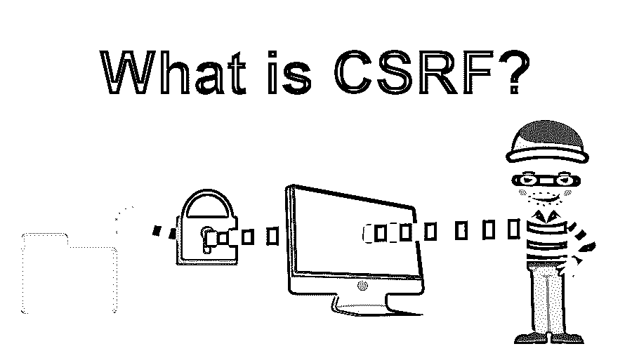

# 什么是 CSRF？

> 原文：<https://www.educba.com/what-is-csrf/>

## CSRF 介绍？

跨站点参考伪造也被称为 CSRF，有时也称为 XSRF。这是一种欺诈攻击，利用用户进入网站的凭证并访问用户的数据。它通常通过提示未知链接或页面广告，要求用户点击它，并引导它欺骗恶意软件来执行。吸引用户进入 CSRF 的另一种方法是通过电子邮件或短信发送诈骗链接，并鼓励他们访问提供的链接。

### 它是如何工作的？

*   只有当潜在的受害者被认证时，它才起作用。
*   攻击者可以使用 CSRF 攻击绕过身份验证过程进入网站。
*   CSRF 攻击在以下场景中使用:拥有额外权限的受害者执行某些操作，而其他人无法访问或执行这些操作。例如网上银行。

### CSRF 攻击分两个主要部分执行

*   第一步是吸引用户/受害者点击链接或加载恶意页面。攻击者使用社会工程来欺骗受害者。
*   第二步，通过向受害者的浏览器发送伪造的请求来欺骗受害者。该链接会将看似合法的请求重定向到一个网站。攻击者会有受害者的价值观或细节，这肯定是他在寻找的；受害者会认为这个要求是合法的。攻击者还将获得受害者浏览器相关 cookies 的详细信息。

### CSRF 的主要概念

*   攻击者向用户访问的站点发送恶意请求，攻击者认为受害者通过了该特定站点的验证。
*   受害者的浏览器针对目标站点进行身份验证，并用于路由目标站点的恶意请求。
*   在这种情况下，受害者的浏览器或实施了 CSRF 预防方法的网站不容易受到攻击；受影响的网站是主要的漏洞。

### 如何防止跨站点请求伪造(CSRF)？

有几种预防 CSRF 的方法；其中几个是:

<small>网页开发、编程语言、软件测试&其他</small>

*   在不使用 web 应用程序时将其注销。
*   保护您的用户名和密码。
*   不要让浏览器记住密码。
*   当您使用应用程序并登录时，请避免浏览。

### 反 CSRF 代币

阻止跨站点请求伪造(CSRF)的最常见实现是使用与所选用户相关的令牌，该令牌可能是在线应用程序上呈现的每个状态的隐藏表单、动态表单。

#### **1。这个令牌，被称为 CSRF 令牌**

*   客户端请求一个带有表单的 HTML 页面。
*   为了响应这个请求，服务器追加两个令牌。它将一个令牌作为 cookie 发送，并将其他令牌保存在一个隐藏的表单字段中。这些令牌是随机生成的。
*   一旦提交了表单，客户机就将这两个令牌发送回服务器。cookie 令牌作为令牌发送，表单令牌在表单数据中发送。
*   如果一个请求不包含两个请求，服务器不会响应或拒绝该请求。

试图伪造请求的攻击者必须猜测反 CSRF 令牌和用户的身份验证密码。一段时间后，会话结束时，这些令牌就会失效。这使得攻击者猜测令牌很难破解。

#### 2.相同站点 Cookies

有一些 cookie 与某个来源或网站相关联，当一个请求被发送到那个特定的来源时，cookie 会随之发送。这种请求被称为跨来源请求。在此过程中，cookies 被发送给第三方，这使得 CSRF 攻击成为可能。

#### 3.相同的站点 Cookie 属性

*   为了防止 CSRF 攻击，可以使用相同站点的 cookie 属性。它禁止第三方使用特定的 cookie。
*   这是由服务器在设置 cookie 时完成的；然后，它请求浏览器仅在用户直接使用 [web 应用程序](https://www.educba.com/what-is-web-application/)时发送 cookie。
*   如果有人试图从 web 应用程序请求某些东西，浏览器不会发送 cookie。
*   然而，它阻止了 CSRF 的攻击。

这有一个限制，现代浏览器不支持同站点 cookie，而旧浏览器不支持使用同站点 cookie 的 web 应用程序。

### CSRF 的例子

<class>下面< class=”word”>我们有< class=”word”>解释过< class=”word”>一些<class>CSRF 的例子<class>:</class></class></class>

#### 1.使用 GET 请求

假设您已经实现并设计了一个网站 banking.com，通过使用 GET 请求来执行诸如在线交易之类的操作。现在，知道如何创建恶意 URL 的聪明攻击者可能会使用元素让浏览器静默加载页面。

包含恶意 URL 的 [HTML 图像](https://www.educba.com/html-image-tags/)元素示例:

``

#### 2.下面的技术之一可以用来做同样的事情

*   通过发送包含 HTML 内容的电子邮件。
*   通过在页面上植入脚本或恶意 URL。

#### 3.使用发布请求

对于 HTTP POST 请求有一个普遍的误解，认为可以通过允许 HTTP POST 请求来防止 CSRF 攻击，这实际上是不正确的。攻击者可以使用 [HTML 或 JavaScript](https://www.educba.com/html-vs-javascript/) 创建一个表单，并使用自动提交功能来提交 POST 请求，而不需要用户点击提交按钮。

### 结论

Cookies 很容易受到攻击，因为它们会随请求自动发送，使得攻击者能够实施 CSRF 和发送恶意请求。CSRF 漏洞的影响还取决于受害者的权限，即攻击者请求发送受害者的 Cookie。虽然数据检索不是 CSRF 攻击的主要范围，但状态更改肯定会对被利用的 web 应用程序产生负面影响。因此，建议防止您的网站使用预防性方法来保护您的网站免受 CSRF 病毒的侵害。

### 推荐文章

这是一本关于什么是 CSRF 的指南？在这里，我们讨论了关键概念，反 CSRF 令牌，其工作原理，以及 CSRF 的例子。您也可以浏览我们推荐的其他文章，了解更多信息——

1.  [什么是 Java Hibernate？](https://www.educba.com/what-is-java-hibernate/)
2.  什么是 ASP.NET？
3.  [什么是 AWS Lambda？](https://www.educba.com/what-is-aws-lambda/)
4.  [XHTML 是什么？](https://www.educba.com/what-is-xhtml/)

