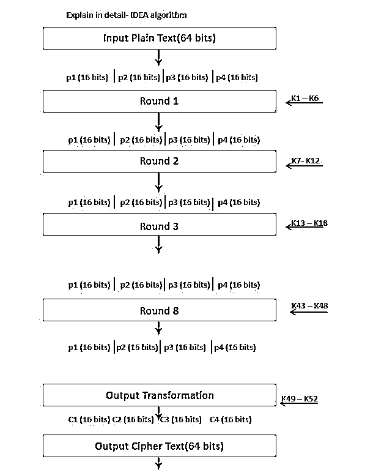
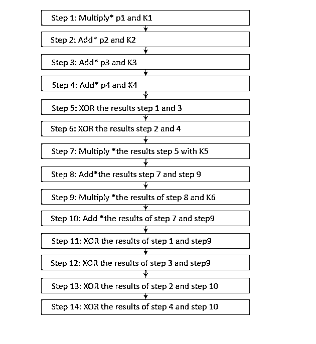
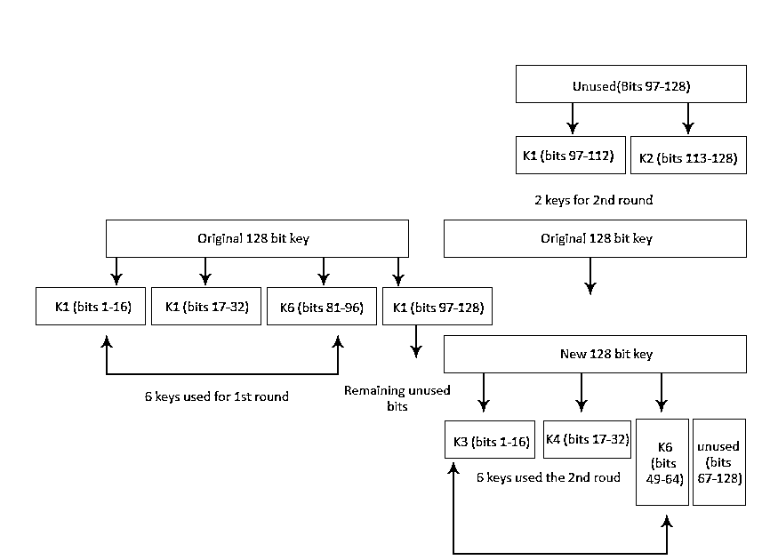
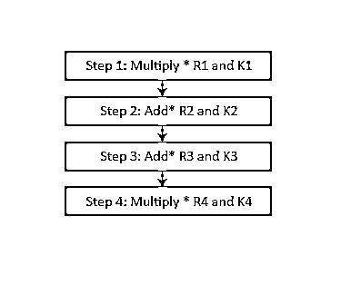

# IDEA 算法

> 原文：<https://www.educba.com/idea-algorithm/>

## IDEA 算法是什么？

IDEA(国际数据加密算法)是一种加密算法。它是一种对称分组密码，采用 64 位作为输入，28 位密钥，执行 8 轮相同的加密，其中使用 6 个不同的子密钥，4 个密钥用于输出变换。

### 理解 IDEA 算法

*   典型的块大小是 128 位的 16 字节。块密码通常在循环块中操作，其中部分密钥应用于循环，然后对其执行其他操作。经过一定数量的循环，比如 10 到 16 次，我们最终得到了该块的密文。
*   密文块的大小与纯文本块完全相同，都是 16 个字节。我们使用加密密钥的一部分(我们称之为循环密钥)对每一轮的块进行操作。我们使用密钥表从加密密钥中导出多个轮密钥。
*   密钥调度是一种[算法，它对原始加密密钥进行移位](https://www.educba.com/types-of-algorithms/)、异或、相乘和执行其他类型的操作，以便得出这些轮密钥。如果我有一个 16 字节的块，我有一个 128 位的密钥，也是 16 字节，

### 混乱和扩散

我们来理解一下混淆和扩散的区别。

<small>网页开发、编程语言、软件测试&其他</small>

#### 混乱

*   混淆与密钥和密文的关系有关。
*   我们确保密钥的小变化会导致密文的大变化。
*   XOR 是不够的；一对一。
*   关键时刻表。

#### 传播

*   扩散与消息和密文之间的关系有关。
*   消息的小变化->密文的大变化。
*   隐藏消息中的模式。

所以电子密码本的操作模式，我们通常会在密码块链操作模式或 CBC 中运行[块密码。使用密码块链接，在加密之前，您将对前一个块的密文与前一个块的密文和下一个块的明文进行异或运算。这样，消息中的每个块都依赖于之前的所有块。](https://www.educba.com/block-cipher-modes-of-operation/)

### 数据加密标准

让我们看看数据加密标准(DES)的一些方面。

**密钥长度**

*   64 位输入
*   8 位奇偶校验
*   56 位有效密钥

**弱点**

*   理论的
*   快捷键

### 详细了解 IDEA 算法

64 位输入纯文本块被分成 4 部分(每部分 16 位),声明 p1 到 p4。

*   因此，p1 到 p4 将是算法初始回合的输入。
*   这样的回合有 8 个。
*   密钥由 128 位组成。
*   每轮将产生 6 个子密钥。
*   每个子密钥包括 16 位。
*   所有这些子键将被放在 4 个输入块 p1 到 p4 上。
*   最后的动作包括输出转换，它通常只对 4 个子键有益。
*   最后的结果是 C1 到 C4 的密文的 4 个块(每个 16 比特)。
*   它们被混合以创建最后的 64 位密文块。

### 单轮信息

*   IDEA 有 8 个回合。
*   每一个都需要应用 6 个密钥对 4 个数据块进行多次操作。
*   这些步骤在许多数学活动中起作用。
*   有多个*，加法* &异或过程。
*   乘法*表示模乘。
*   Add*需要模加法。

### 输出转换

*   它可以是一次性的程序。
*   它要求在第八轮结束前获得名额。
*   输出转换输入是分成 4 个子块的 64 位值(16 位中的每一位表示 R1 到 R4)。
*   这里使用了四个 16 位子密钥(K1 到 K4)。
*   结果转换的过程如下。

### 结论

*   IDEA 可能是一个公认的密码，许多专家已经检查了该轮的前 10 个子密钥创建，8 轮中的每一轮使用 6 个子密钥(因此 8 * 6 = 48 个子密钥对于该轮是必不可少的)。最后的结果转换有利于 4 个子键(即总共 48 + 4 = 52 个子键)。从一个 128 位的输入密钥，所有这 52 个子密钥将产生年，以及；然而，还没有发现对其 8.5 轮中的 5 轮或更高轮的打击。
*   由于 IDEA 对密码分析攻击具有很强的抵御能力，并且在一些著名的密码交易中包含了 IDEA，因此 IDEA 是可信的。基本的 IDEA 算法肯定不是，可以用简单的 DES 或者 AES 版本来比喻有效性或者安全性。基本 IDEA 算法旨在通过提供一个版本的 IDEA 来帮助学习者熟悉 IDEA 算法，该版本使实例能够很好地手动工作，并提供 IDEA 技术与 DES 和 AES 方法的比较。

### 推荐文章

这是 IDEA 算法的指南。这里我们讨论了 IDEA 算法的理解，数据加密标准，以及混淆和扩散 IDEA 算法的区别。您也可以浏览我们推荐的其他文章，了解更多信息——

1.  [K 均值聚类算法](https://www.educba.com/k-means-clustering-algorithm/)
2.  [朴素贝叶斯算法](https://www.educba.com/naive-bayes-algorithm/)
3.  [光线追踪算法](https://www.educba.com/ray-tracing-algorithm/)
4.  [什么是贪婪算法？](https://www.educba.com/what-is-a-greedy-algorithm/)

