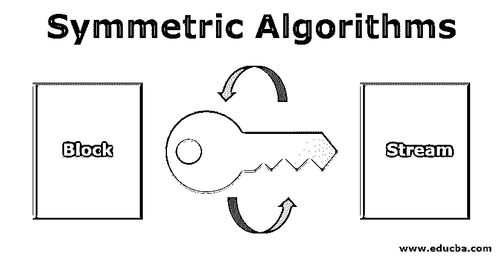
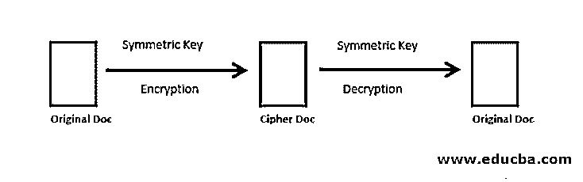
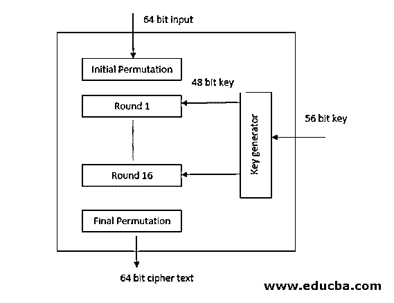
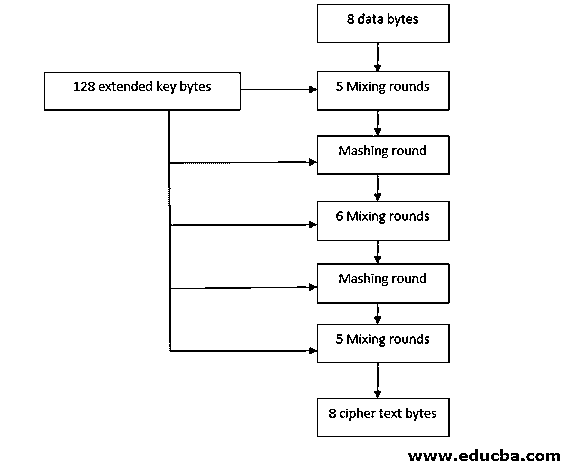

# 对称算法

> 原文：<https://www.educba.com/symmetric-algorithms/>

## 对称算法简介

对称加密也可以称为密钥算法，它只使用一个密钥:用于消息加密和解密的密钥。对称密钥加密的主要缺点是，参与通信的所有各方必须先交换用于加密消息的密钥，然后才能解密消息。

图 1.a 描述了基本的对称密钥加密:

<small>网页开发、编程语言、软件测试&其他</small>

图 1 .对称密钥加密

### 对称算法的类型

广义对称算法分为两类。

*   街区
*   溪流

#### 块算法

块算法逐块(许多字节)加密数据。块是指指定的一组位，这些位使用密钥进行更改/加密。块算法有一个缺点，那就是，让我们假设我们要加密网络流数据；该数据由加密系统保存在其存储器组件中。这种数据保留是在系统实际等待完整的数据块时完成的。这种等待时间可能会导致安全漏洞，危及数据的安全性和完整性。为了避免这种威胁，我们可以减少块并将数据与先前加密的数据块合并，直到接收到更多的块；简单来说，这种技术叫做反馈。只有收到完整的块，该算法才会加密。

#### 流算法

在流算法中，数据被逐字节加密，有时甚至是逐位加密。在流算法的情况下，数据不会保留在系统内存中；因此，可以说这比块算法安全得多，因为没有加密，数据不会保留在系统中。

此外，它们是下面列出的几种加密算法中的几种。

*   DES 和三重 DES
*   RC2
*   河豚

### DES 和三重 DES

DES 代表一种数据加密标准，它采用 64 位明文，加密成 64 位密文，并在 56 位密钥的帮助下解密。在 DES 中，加密过程从初始置换阶段开始，它将输入作为 64 位数据，并以预定义的方式进行置换。初始置换之后是 16 轮 Feistel 密码(Feistel 密码将输入分成两部分，只对一部分进行加密)，其中每轮使用不同的 48 位密钥。出于加密和解密的目的，它[使用一个密码](https://www.educba.com/types-of-cipher/)并反转一个密码算法。最后，数据经过最后的排列阶段，得到密文。类似于 DES，Triple DES 不过是重复 3 次的 DES 密码。图 2.a 显示了 DES 算法的一般结构。

DES 算法的一般结构

### RC2

这是一种分组密码算法，首先，数据被分成 8 字节大小的块，这些块被分别处理。这个算法在 90 年代被广泛使用。Rc2 密码使用一个用户密钥，其大小可以从一个字节到 128 个字节不等。它获取这个秘密用户密钥，使用密钥扩展算法，并加密数据。这种算法的设计使得它可以很容易地在 16 位微处理器中实现。这里没有 Feistel 轮；相反，数据要经过 18 轮的混合和捣碎。图 2.b 显示了 RC2 算法的一般架构。

RC2 算法的一般结构

### 河豚

这是一种替代 DES 的非对称算法。这里使用的块大小是 64 位，密钥大小范围是 32 到 448 位。使用 blowfish 的加密主要包括两个阶段

*   [圆形功能](https://www.educba.com/python-round-function/)
*   输出操作

round 函数执行以下步骤。

1.  取输入数据的左边部分的密钥白化和异或操作被执行。
2.  在第二步中，它使用 S 盒，这些 S 盒将 8 位数据映射到 32 位，并且将输出与加法和 XOR 运算的组合进行组合。
3.  以上两步结合在一起称为 F 函数。对于 F 函数的输出和右侧的输入数据，执行 XOR 运算。
4.  最后一步涉及输出的交换。

输出函数反转最终交换并执行输出白化。这个函数的输出是一个 blowfish 密文。用 blowfish 解密涉及到使用与加密相同的结构，因为它使用 Feistel 密码，但是轮密钥必须以相反的顺序使用。这种算法的主要优点是它可以在公共领域中容易地获得。缺点是；基本上，生成密钥有点耗时，如果块大小很小，就容易受到攻击。

### 对称算法的应用

使用对称加密算法的一些地方有

*   卡交易用于防止身份盗窃和欺诈交易。
*   确认送信人的身份。
*   哈希和随机数生成
*   数据库加密

### 结论-对称算法

与不对称算法相比，对称算法更快、更有效。这就是它们被用于批量加密的更多原因。但是它的缺点是密钥管理非常穷举；因此，大规模的维护是一项繁琐的任务，我们需要高等级的安全性，为了实现这一点，我们必须维护使用单独系统生成的密钥的生命周期。因此，我们必须始终使用适当的加密来避免对我们数据的任何攻击。

### 推荐文章

这是对称算法的指南。这里我们讨论对称算法的介绍和类型以及 DES 和三重 DES。您也可以浏览我们推荐的其他文章，了解更多信息——

1.  [什么是 WebSocket？](https://www.educba.com/what-is-websocket/)
2.  [网络应用安全](https://www.educba.com/web-application-security/)
3.  [分组密码的操作模式](https://www.educba.com/block-cipher-modes-of-operation/)
4.  [C++算法](https://www.educba.com/c-plus-plus-algorithm/)

