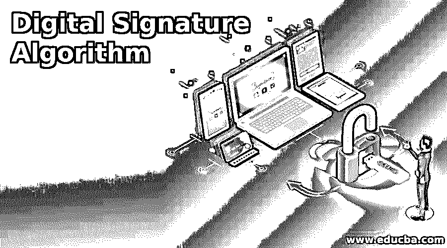

# 数字签名算法

> 原文：<https://www.educba.com/digital-signature-algorithm/>

## 数字签名算法简介

当一个人通过文档发送数据时，出于安全原因，识别他/她的真实性变得很重要。数字签名用于这种识别。文档的认证意味着知道谁创建了它们，并且它们在传输过程中没有干扰。这些签名是使用特定算法创建的。数字签名算法(DSA)就是其中之一。DSA 是一种公钥[加密算法](https://www.educba.com/encryption-algorithm/)，用于生成电子签名。

正如我们已经看到的，DSA 是用于为数据传输创建数字签名的众多算法之一。在 DSA 中，一对数字被创建并用作数字签名。这些是使用一些特定的算法生成的。它们允许接收者验证消息的来源。使用 DSA 创建的数字签名在数据传输的起点是保密的，而在终点是公开的。这意味着只有传输数据的人才能签名，签名将被添加到消息中，但任何人都可以在另一端验证签名。

<small>网页开发、编程语言、软件测试&其他</small>

### 了解数字签名算法

有几种算法用于创建数字签名。大多数都遵循一种简单的方法，即使用发送方的私钥对消息摘要进行签名。这就是为要发送的数据形成数字指纹的方式。请注意，签名的是消息摘要，而不是数据。因此，签名的大小很小。然而，[数字签名](https://www.educba.com/digital-signature-types/)算法却不是这样。使用 DSA 时遵循的过程不像在传输开始和结束时分别使用私钥和公钥那样简单。另一方面，它通过应用复杂而独特的数学函数生成两个数字签名，这一点我们将在本文的后面部分详细了解。

因此，可以理解，DSA 仅用于创建签名。它们不能用于数据的[加密。因此，它不受进出口限制，而 RSA 通常会受到这种限制。](https://www.educba.com/cryptography-vs-encryption/)

### 数字签名算法的工作原理

DSA 算法是数字签名的标准，它基于离散对数问题和模幂运算的代数性质，并基于公钥[密码系统原理](https://www.educba.com/cryptosystems/)。

数字签名的工作原理是两个相互认证的密钥。签名基于公钥/私钥对。使用像 RSA 这样的公钥算法，可以创建数学上相关联的私钥和公钥。人们可以用自己的私钥签署数字消息。一个人可以使用私钥加密与签名相关的数据。私钥应该总是由想要创建数字签名的人保管。公钥和私钥总是可以相互推导，因为它们在数学上是相关的。签名者的公钥是解密这些数据的唯一方法。一个人可以把公钥给任何需要验证签名者签名的人。这是至关重要的保持私人密钥的秘密，因为一个人可以生成你的签名的文件的帮助下。这样，认证数字签名就完成了。在数字签名中，有效性只能由公钥和私钥来保证。

另一方面，数字签名算法不使用私钥来加密数据。此外，数字签名算法确实使用公钥来解密这些数据。为了创建具有两个 160 位数字的数字签名，DSA 基于独特的数学函数原理工作。这两个数字是通过使用私钥和消息摘要生成的。

由于公钥不用于认证签名，因此验证过程很复杂。这两个密钥都用于在特殊的数字签名算法中保护数据，以获得进一步的安全保证。

现在，使用散列函数来创建消息摘要。生成的消息摘要和 DSA 算法就是[给出的数字签名](https://www.educba.com/digital-signature-cryptography/)。然后，该签名将与邮件一起发送。在接收端，使用相同的哈希函数对源和数据进行身份验证。

**总结-**

*   在密钥生成算法的帮助下生成密钥。创建的密钥用于签署文档。
*   为了生成签名，使用数字签名算法。
*   哈希函数用于制作消息摘要。
*   DSA 的消息摘要给出数字签名。
*   然后，数字签名与发送的数据一起传输。
*   使用[验证算法](https://www.educba.com/algorithm-in-programming/)完成签名的认证。为了验证，使用相同的散列函数。

### 数字签名算法的优点

*   除了具有很强的强度级别之外，与其他数字签名标准相比，签名的长度更小。
*   签名计算速度较慢。
*   与其他数字标准相比，DSA 需要更少的存储空间。
*   DSA 没有专利，因此可以免费使用。

### 数字签名算法的缺点

*   由于验证过程包括[复杂的余数运算符](https://www.educba.com/python-remainder-operator/)，因此需要大量时间进行验证。它需要大量的计算时间。
*   DSA 中的数据没有加密。我们只能认证这个里面的数据。
*   数字签名算法首先用 SHA1 哈希运算并签名。SHA1 加密安全性的任何缺陷都会反映在 DSA 中，因为 DSA 隐含地依赖于它。
*   DSA 应用于保密和非保密通信，是美国国家标准。

### 结论

在上面的脚本中，我们提出了一个关于数字签名算法的要点。本文介绍了数字签名算法、其工作方式和优缺点。

数字签名是电子文件最好的认证工具之一。由于其成本、安全性、时间和速度，数字签名现在很受欢迎。在当今互联的数字世界中，数字签名算法对于创建更安全的环境至关重要。

### 推荐文章

这是一个数字签名算法指南。这里我们讨论了数字签名算法的概念。您也可以浏览我们推荐的其他文章，了解更多信息——

1.  [算法介绍](https://www.educba.com/introduction-to-algorithm/)
2.  [网络安全职业](https://www.educba.com/careers-in-cyber-security/)
3.  什么是数字签名？
4.  [数字签名 vs 数字证书](https://www.educba.com/digital-signature-vs-digital-certificate/)

