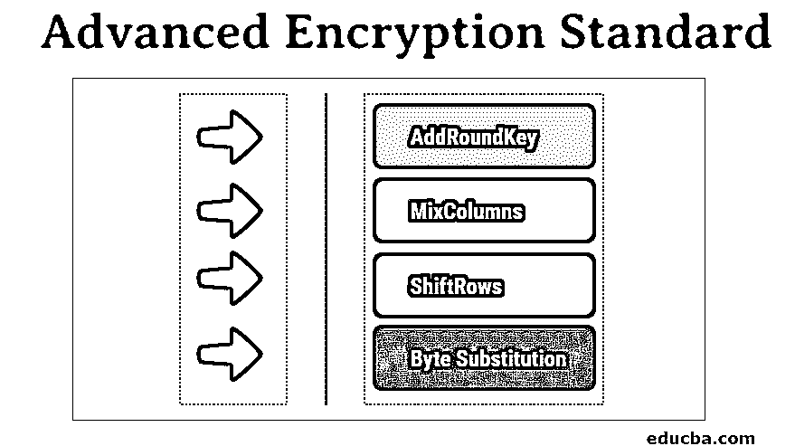

# 高级加密标准

> 原文：<https://www.educba.com/advanced-encryption-standard/>

## 什么是高级加密标准(AES)？

高级加密算法(AES)是非对称的[算法](https://www.educba.com/symmetric-algorithms/)。由于 DES 的密钥非常小，高级加密标准(AES)开始发挥作用。

**AES 的主要特性:**

<small>网页开发、编程语言、软件测试&其他</small>

*   对称密钥对称分组密码。
*   128 位的数据。
*   与 triple-DES 相比，它更快、更强。
*   设计细节和规格已经完成。
*   可以用 Java 和 C 语言实现。

### 高级加密标准(AES)加密

它在一个替代置换网络上工作，在该网络中一系列不同的操作被链接在一起。这里所有的计算都是以比特而不是字节的形式进行的。高级加密标准(AES)将每 128 位数据块视为一个 16 字节的数据段。每个 16 字节的数据段都以 4 字节和 4 字节矩阵的形式存在。钥匙的长度决定了所涉及的回合数。

每轮有四个子流程，每个流程中涉及的步骤如下:

#### 1.字节替换(子字节)

通过参考固定的表，16 个输入字节在特定的设计中被替换。再次形成一个四行四列的矩阵。

#### 2.ShiftRows

将左移应用于四行中的每一行；所有超出的条目都在右侧输入。

该流程包括:

*   不移动到第一行。
*   将第二行左移一个位置。
*   第三排左移两位。
*   从第四排开始，进行三个位置的移动。
*   一个全新的矩阵由相同的 16 个字节组成，但与几个位置变化相关联。

#### 3.混合列

一个深奥的数学函数现在应用于每一个四字节的列。这里，该过程从一列中吸收 4 个字节，并将这 4 个字节完全转化为 4 个不同的字节。因此创建了另一个新的矩阵，同样是 16 字节和 4 * 4 格式。

#### 4.AddRoundKey

这 16 个字节现在被测量为 128 位，然后被异或为 128 位的循环密钥。如果这是加密段的最后一轮，则输出形成所需的密文。否则，得到的 128 位被解释为 16 个字节，并开始一个更相似的循环。

### 解密过程

解密过程非常类似于[加密过程，](https://www.educba.com/encryption-process/)但是这与相同的过程相反，因此与这里的加密一样，每一轮由以相反顺序执行的四个过程组成。

*   添加圆形密钥
*   混合列
*   移动行
*   字节替换

对于高级加密标准(AES)密码，加密和解密必须分别应用和实现。

### 高级加密标准(AES)的优势

下面提到了以下优点:

*   这意味着这是一个非常健壮的协议，因为它可以应用于硬件和软件。
*   由于它的大密钥长度，对于黑客来说也是非常健壮的。这里使用的密钥大小非常高，例如 128、192 和 256 位用于加密。
*   诸如电子商务、加密格式的数据存储和无线通信等大量应用在很大程度上利用了这些高级加密标准(AES)协议。
*   在商业上，他的密码协议是全世界使用最广泛的协议之一。
*   黑客攻击在这里变成了一个噩梦般的过程。
*   128 位需要 2128 次以上的解密尝试；这使得密码非常安全，几乎不可能被破解。

### 为什么使用高级加密标准(AES)？

作为高级加密标准(AES)，[密码术的关键标准](https://www.educba.com/what-is-cryptography/)正在数据加密和保密过程中。它是最受欢迎的密码，被广泛应用，甚至包括美国政府使用 AES 来确保数据隐私和安全。高级加密标准(AES)是对称的，与流密码不同，在流密码中，每个字符一次加密一个字符。Sysmetricity 意味着在加密过程中使用相同种类的密钥。由于它的大密钥长度，对于黑客来说也是非常健壮的。这里使用的密钥大小非常高，如加密的 128、192 和 256 位。在商业上，他的密码协议是全世界使用最广泛的协议之一。

这些分组密码的突出特点如下:

*   对称密钥对称分组密码。
*   128 位的数据。
*   与 triple-DES 相比，它更快、更强。
*   设计细节和规格已经完成。
*   可以用 Java 和 C 语言实现。

### 高级加密标准(AES)的受众

高级加密标准的受众是:

*   有兴趣了解高级加密标准(AES)的观众。
*   专业人士愿意提升他们在密码学和数据安全方面的技能。
*   愿意深入数据和信息安全部门并提升自身能力的专业人士。
*   它有助于推进打算做同样事情的专业人员的专业方面和技术技能。

### 结论

高级加密标准定位自身是安全领域中最健壮和可扩展的加密算法或协议之一，并且有望在信息技术流中跨各种安全网络继续其分类扩展。

### 推荐文章

这是高级加密标准指南。在这里，我们讨论 AES 加密过程，它的用途，以及优势和有兴趣学习的观众。您也可以阅读以下文章，了解更多信息——

1.  [加密算法](https://www.educba.com/encryption-algorithm/)
2.  [对称密钥加密](https://www.educba.com/symmetric-key-encryption/)
3.  [想法算法](https://www.educba.com/idea-algorithm/)
4.  [流密码 vs 分组密码](https://www.educba.com/stream-cipher-vs-block-cipher/)

