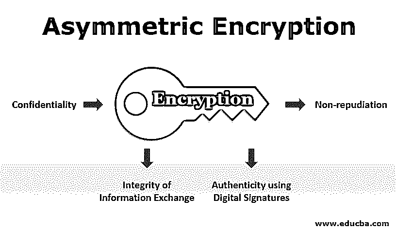

# 不对称加密

> 原文：<https://www.educba.com/asymmetric-encryption/>

## 不对称加密简介

非对称加密也称为公钥加密，它使用私钥和公钥来加密和解密数据。密钥只是配对在一起的大数字；然而，它们的不对称意味着不完全相同。公钥是密钥对中可以与每个人共享的一个密钥，而私钥是密钥对中另一个保密的密钥；它被称为私钥。任何密钥都可以用来加密消息，而另一个不用于加密的密钥则用于解密。

### 什么是非对称加密？

[加密是使用密钥将数据转换成密码格式的方法](https://www.educba.com/what-is-encryption/)。加密的数据可以安全地与其他人共享。如果所使用的算法/密钥是强有力的并且被正确实现，那么破解密码格式将是困难的。接收方使用之前用于加密的密钥将数据解密为原始格式。

<small>网页开发、编程语言、软件测试&其他</small>

在[对称加密](https://www.educba.com/symmetric-key-encryption/)中遵循上述方法，其中加密的数据和密钥被发送到接收器用于解密后的消费。这种模式的挑战是许多参与者的可管理性和以安全的方式交换密钥。

非对称加密通过一对密钥(公钥和私钥)有力地解决了这些挑战。而数据在发送方使用接收方的公钥加密，交换的数据由接收方使用自己的私钥解密。尽管每个人都可以使用公钥，但解密数据所必需的私钥却由所有者保留。

**对称和非对称加密的区别**

| **对称** | **不对称** |
| 使用一个密钥进行加密和解密。 | 使用两个密钥，一个用于加密，另一个用于解密。 |
| 交换加密的数据和密钥。 | 只交换加密的数据，任何人都可以使用公钥。 |
| 快的 | 慢的 |
| 如果没有参与者变得更高，就无法控制。 | 使用成对的公钥和私钥可以简化操作。 |
| 在网络通道中交换密钥的风险。 | 不交换私钥。 |

### 不对称加密是如何工作的？

公钥和私钥是使用算法随机生成的，并且这些密钥彼此之间具有数学关系。密钥的长度应该更长(128 位、256 位)，以使其更强，并且即使知道另一个配对密钥，也不可能破解该密钥。可能的密钥数量随着密钥长度成比例增加，因此破解它也变得更加困难。

数据用任何一个密钥加密，用另一个密钥解密。不对称加密中使用算法有:

| **名称** | **描述** |
| Diffie-Hellman 密钥协商 | 自信地交流信息的共享密钥。 |
| 里维斯特·沙米尔·阿德曼 | 加密和[数字签名](https://www.educba.com/digital-signature-cryptography/) |
| 椭圆曲线加密 | 功能类似于 RSA，它迎合细胞设备。 |
| 埃尔加梅尔 | 数字签名和密钥通过这种逻辑进行交换。 |
| 数字签名算法 | 仅用于数字签名。 |

#### 情节

让我们分析一个假设的场景来理解非对称加密是如何工作的。

各个地区的销售代理必须在月底以安全的方式向总部发送销售数据，以防止竞争对手获取这些信息。

总部将为每个代理生成私钥/公钥，并传达代理的公钥。代理将使用公钥加密销售数据，并将其发送给 HO。HO 将使用代理的私钥对其进行解密，并获得原始形式的数据。整个信息交换是以安全的方式进行的，即使公钥被泄露，保密性也不会丧失，因为唯一的私钥被用来解密，它安全地保存在 HO。

另一个场景是在涉及支付的银行 https 站点中。客户从银行网站获得公钥，并在用公钥加密后向银行发送密码和其他机密细节，银行用客户的私钥解密这些细节。

### 不对称加密的应用

下面是不对称加密的不同应用:

#### 1.机密

不对称加密最常见的应用是保密性。这是通过用接收方的公钥加密关键信息并用自己的私钥解密来实现的。

#### 2.使用数字签名的真实性

发送方将其私钥作为数字签名附加到消息中，并与接收方交换。接收方使用发送方的公钥，并验证发送的私钥是否属于发送方，从而确定发送方的真实性。

#### 3.信息交换的完整性

一种方法是使用发送方的私钥创建和加密要交换的数据的散列。与接收方交换加密的散列和数据。使用发送方的公钥，接收方解密哈希并重新创建哈希。两个哈希之间的任何差异都表明内容在签名和完整性丢失后被更改。数字现金和比特币交易都遵循这种完整性检查。

#### 4.不可否认性

有了数字签名加密工具，与他人交换文档或信息的文档或信息的所有者就不能否认其内容，而在线交易的发起者也不能否认其内容。

### 不对称加密的优势

不对称加密为安全交换信息提供了一个平台，无需共享私钥。不可否认性、使用数字签名的身份验证和完整性是这种加密提供的其他独特功能。

该方法还克服了对称加密的缺陷(需要交换用于加密/解密的秘密密钥),这是通过以非对称方式经由公共密钥/私有密钥单独交换密钥，并且仍然使用对称模式交换大量数据。

### 结论

非对称加密为交换敏感信息提供了一个安全的平台，它将有助于加速电子商务的发展，并为数字计划增加一个新的层面。

### 推荐文章

这是不对称加密的指南。在这里，我们讨论非对称加密、其工作原理、应用以及非对称加密的优势。您也可以阅读以下文章，了解更多信息——

1.  [加密算法](https://www.educba.com/encryption-algorithm/)
2.  [密码术 vs 加密](https://www.educba.com/cryptography-vs-encryption/)
3.  [密码技术](https://www.educba.com/cryptography-techniques/)
4.  [加密过程](https://www.educba.com/encryption-process/)

