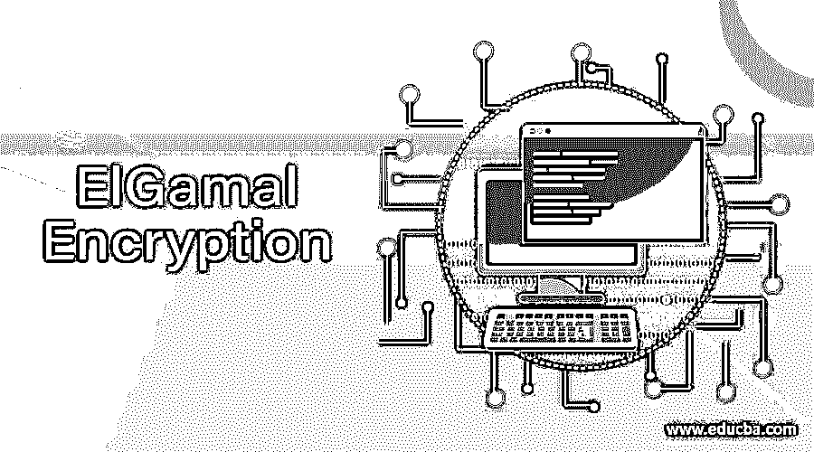

# 埃尔加马尔加密

> 原文：<https://www.educba.com/elgamal-encryption/>

## ElGamal 加密简介

ElGamal 密码系统可以定义为使用公钥和私钥概念来保护两个系统之间通信的加密算法。它可以被认为是不对称算法，其中加密和解密是通过使用公钥和私钥进行的。为了加密消息，客户端使用公钥，而消息可以在服务器端使用私钥解密。这被认为是执行加密和解密的有效算法，因为密钥极难预测。引入消息事务签名的唯一目的是保护它免受 MITM 攻击，这一点该算法可以非常有效地实现。

### ElGamal 加密算法及实例

**EIGamal 加密算法方法的唯一概念是，即使攻击者知道某些重要信息，也几乎不可能计算出加密方法。主要是担心利用循环群求离散对数的困难。**

 **<small>网页开发、编程语言、软件测试&其他</small>**  **用一个简单的例子就很好理解了。假设即使像 g^a 和 g^b 这样的值是攻击者已知的值，攻击者也会发现很难找出 g^ab 的值，因为它只不过是被破解的值。

为了理解整个场景，我们需要逐步了解消息的加密和解密实际上是如何发生的。我们将考虑两个对等体的例子，他们愿意利用 ElGamal 算法以安全的方式交换数据。让我们假设用户 1 和用户 2 想要秘密地交换信息；在这种情况下，将遵循以下程序。

#### 步骤 1:生成公钥和私钥。

*   用户 1 将试图选择一个很长或很大的数 x，同时，他也将选择一个循环群 Fx。从这个循环群中，他将进一步选择另一个分量 b 和另一个元素 c。这些值将以这样的方式选择，即如果通过特定的函数，结果将等于 1。
*   一旦值选择阶段结束，将计算一个值，该值将进一步用于生成私钥。通过应用公式 fm=b^c，将计算出该值。在当前场景中，user1 将选择 f，fm = b^c，a，b 作为他们的公钥，而 a 的值将被保存为私钥，该私钥将进一步用作私钥。

#### 步骤 2:用户 2 将使用用户 1 的公钥加密数据。

*   为了开始消息的加密，user2 需要选择某些值。用户 2 还将要求从循环群中选取一个值 p。循环组将与用户 1 的循环组相同。应该以这样的方式选取值，使得 Inc 在特定函数中传递 a 将生成结果 1。
*   知道 user2 将生成一些其他值，这些值将用于使用公钥加密消息。产生的价值将是 Pm=b^p.，另一个重估 b^c 将等于 b^ap.该计算的结果将乘以另一个值 Z，以便更接近加密方法。最终，将使用 b^p,Z*b^ap.的计算结果发送该值

#### 步骤 3:在用户 1 端解密消息。

*   然后，用户 1 将使用在第一和第二阶段中选取的值的计算来识别适当的数字，该数字将用于解密加密的消息。User1 将处理 b^ap，然后将结果除以 z，以获得解密后的值。解密值是在第二阶段加密的值。
*   在上面的场景中，user1 通过计算私钥和公钥启动了这个过程，这是算法的灵魂。在第二步中，用户 2 进一步使用该密钥来加密该方法。
*   消息被加密，使得在初始阶段计算值可以被用来解密消息。在第三步中，可以看到，在用第三步中计算的数除以整个值之后，它本身完全解密了消息，使其对终端用户可读。每当迫切需要安全地传递消息时，都会遵循相同的方法。

### 结论

ElGamal 算法用于加密和解密，这主要是因为它能够使密钥预测变得极其困难。非对称算法使用私钥和公钥机制，使得密钥预测更加困难。所有不仅仅依靠通道加密来保护数据的应用程序都会发现在程序中实现这种算法很有帮助。除了应用层的安全性之外，该算法也被认为是处理私有或公共网络上的数据传输的最佳算法。

### 推荐文章

这是 EIGamal 加密的指南。这里我们也分别用一个例子介绍和讨论 EIGamal 加密算法。您也可以看看以下文章，了解更多信息–

1.  [不对称加密](https://www.educba.com/asymmetric-encryption/)
2.  [对称密钥加密](https://www.educba.com/symmetric-key-encryption/)
3.  [高级加密标准](https://www.educba.com/advanced-encryption-standard/)
4.  [加密算法](https://www.educba.com/encryption-algorithm/)

**