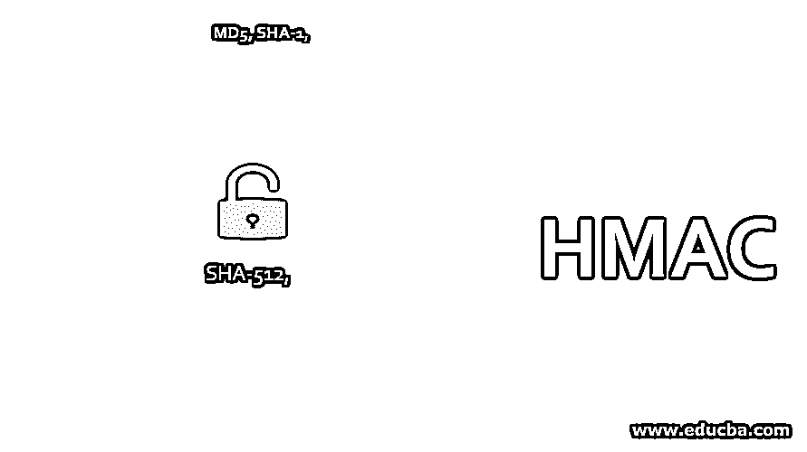

# HMAC

> 原文：<https://www.educba.com/hmac/>

## HMAC 简介

HMAC 代表基于散列的消息认证码。它是一种数字签名算法，旨在重用 MD5 和 SHA-1 等消息摘要算法，并提供高效的数据完整性协议机制。由于 HMAC 被用于以安全的方式加密纯文本，所以它被用于安全套接字层协议 [SSL 证书](https://www.educba.com/what-is-ssl-certificate/)中，并且已经被选择作为因特网协议(即，IP)的强制性安全实现。

### HMAC 是如何工作的？

下面给出了工作原理:

<small>网页开发、编程语言、软件测试&其他</small>

**第一步:**使每个块中对称密钥的长度等于若干比特。

有三种可能；基于每一个；我们需要使密钥的长度等于位数。密钥的长度小于每个块中的位数。在这种情况下，要使一个密钥的长度等于几个比特，我们需要通过添加许多 0 比特来扩展密钥的长度。

密钥的长度等于每个块中的几个比特。我们不需要执行任何操作，因为密钥等于位数。密钥的长度大于每个块中的位数。在这种情况下，为了使密钥的长度等于位数，我们需要通过应用消息摘要算法来调整密钥，我们将使用该算法来产生 HMAC。

**第二步:**用一个 pad 进行 XOR 对称。

在这一步中，我们将对称与 pad 进行 XOR 运算，产生一个名为 S1 的变量。

**Note:** pad= It is a string 00110110 repeated b/8 times.

第三步:将原始消息附加到 S1。

在这一步中，我们将原始消息附加到 S1 的末尾。

**步骤 4:** 应用消息摘要算法。

在这一步，我们应用选定的消息摘要算法(MD5、SHA-1、SHA-512 等)。)到步骤 3 的输出。让我们假设第 4 步的输出是 H

**第五步:**用 pad 对对称密钥进行 XOR 运算。

在这一步中，用 pad 对对称密钥进行 XOR 运算，产生名为 S2 的变量。

**Note:** pad= It is a string 01011010 repeated b/8 times.

第六步:在 S2 后面加上 H。

在此步骤中，我们获取在步骤 4 中计算的消息摘要，并将其附加在 S2 的末尾，该消息摘要是在前一步骤(即步骤 5)中导出的。

**第七步:**消息摘要算法。

在这一步中，我们将把选择的消息摘要算法应用到步骤 6 的输出中。这一步生成的消息摘要就是最终的 MAC。

### HMAC 的缺点

以下是给出的一些缺点:

*   让我们讨论一下在基于散列的消息认证码中可能会遇到的一些问题。
    正如我们之前所讨论的，基于哈希的消息认证码使用对称密钥。对称密钥是指发送方和接收方使用的相同密钥。这里出现的问题是发送方和接收方将如何交换密钥？.
*   不知何故上述问题，对称密钥的交换被解决了；在不止一个接收者的情况下，我们不能使用基于散列的消息认证码。这是因为 HMAC 使用对称密钥来生成 MAC。对称密钥必须仅由两方共享，即发送方和接收方。
*   另一个问题是，如果我们与多方共享对称密钥，接收者如何知道消息是由发送者准备和发送的，而不是其他接收者。密钥也与他们共享，因此存在欺诈的可能性，接收者之一可能创建虚假消息。

### 结论

在本文中，我们已经看到了基于散列的消息认证码的基本概念，并且它正在工作。

### 推荐文章

这是 HMAC 旅游指南。这里我们讨论基于散列的消息认证码的介绍及其缺点。您也可以浏览我们推荐的文章，了解更多信息——

1.  [对称密钥加密](https://www.educba.com/symmetric-key-encryption/)
2.  [协议测试](https://www.educba.com/protocol-testing/)
3.  [IPS 工具](https://www.educba.com/ips-tools/)
4.  [回归测试工具](https://www.educba.com/regression-testing-tools/)

