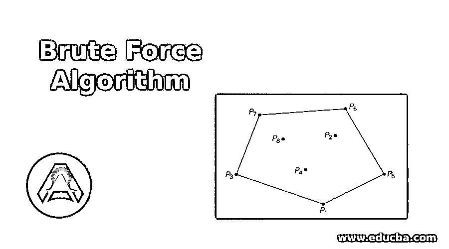
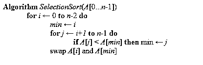
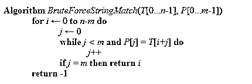
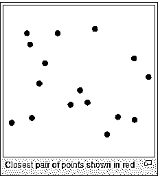
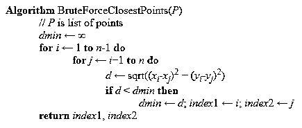
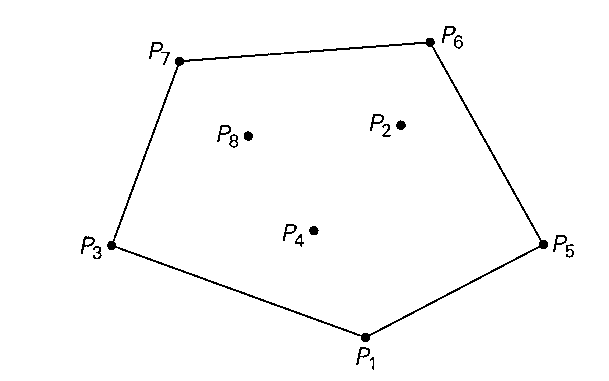

# 强力算法

> 原文：<https://www.educba.com/brute-force-algorithm/>

## 强力算法简介

“数据是新的石油”这是主导全球经济的新口号。我们生活在数字世界中，每项业务都围绕着数据，数据转化为利润，帮助行业在竞争中保持领先地位。随着快速数字化，基于应用的商业模式呈指数增长，网络犯罪是一个持续的威胁。黑客执行的一种常见活动是暴力破解。

暴力破解是一种反复试验的方法，攻击者使用程序尝试各种组合来闯入任何网站或系统。他们使用自动化软件重复生成用户 id 和密码组合，直到最终生成正确的组合。

<small>网页开发、编程语言、软件测试&其他</small>

### 强力搜索

强力搜索是最常见的搜索算法，因为它不需要任何领域知识；所需要的只是状态描述、合法操作符、初始状态和目标状态的描述。它没有提高性能，完全依赖计算能力来尝试可能的组合。

强力算法搜索文本中 0 到 n-m 之间的所有位置，不管模式的出现是否从那里开始。每次尝试后，它都会将模式向右移动 1 个位置。该算法的时间复杂度为 O(m*n)。如果我们在 m 个字符的字符串中搜索 n 个字符，那么要尝试 n*m 次。

让我们看一个旅行推销员以简单的方式理解算法的经典例子。

假设一个推销员需要在一个国家的 10 个不同的城市旅行，他想在所有可能的组合中确定最短的可能路线。这里的蛮力算法只是计算所有城市之间的距离，并选择最短的一个。

另一个例子是试图破解 5 位密码；那么暴力破解可能需要 10 次 5 次的尝试。

### 强力排序

在强力排序技术中，数据列表被扫描多次以找到列表中的最小元素。在列表的每次迭代之后，它将最小的元素替换到堆栈的顶部，并从列表中第二小的数据开始下一次迭代。

上面的语句可以用伪代码写成如下。

这里的问题大小为“n ”,基本操作是“if”测试，即在每次迭代中比较数据项。最坏和最好的情况没有区别，因为交换的次数总是 n-1。

### 强力字符串匹配

如果模式中的所有字符都是唯一的，那么可以应用复杂度为大 O(n)的强力字符串匹配，其中 n 是字符串的长度。强力字符串匹配将模式与文本的子字符串逐字符进行比较，直到得到不匹配的字符。一旦发现不匹配，子字符串的剩余字符将被丢弃，算法将移动到下一个子字符串。

下面的伪代码解释了字符串匹配逻辑。这里，算法试图在文本 T[0…中搜索 P[0…m-1]的模式。n-1]。

这里最坏的情况是直到第 M 个比较时才转移到另一个子串。

**

** 

### 最接近对

**问题陈述:**找出二维笛卡儿平面上 n 个点的集合中最近的两个点。有 n 种情况会出现这个问题。现实生活中的一个例子是在空中交通管制系统中，你必须监控彼此靠近飞行的飞机，你必须找出这些飞机应该保持的最安全的最小距离。

**来源链接:**维基百科

强力算法计算每组不同点之间的距离，并返回距离最小的点的索引。

蛮力以[O(n2)]的时间复杂度解决了这个问题，其中 n 是点数。

下面的伪代码使用了蛮力算法来寻找最近的点。

### 凸包

**问题陈述**:凸包是包含所有点的最小多边形。点集 s 的凸包是包含 s 的最小凸多边形。

这组点的凸包是顶点在 P1、P5、P6、P7 和 P3 的凸多边形。

一组 n 个点的线段 P1 和 Pn 是凸包的一部分，当且仅当该组的所有其他点位于由该线段形成的多边形边界内。

让我们把它和橡皮筋联系起来，

点(x1，y1)，(x2，y2)使直线 ax+by = c

当 a = y2-y1，b = x2-x1，c = x1 * y2–x2 * y1 并将平面除以 ax+除以-c < 0 and ax+by-c > 0

所以我们需要检查 ax+by-c 的其他点。

蛮力求解这个问题的时间复杂度为 O(n **3**

### 穷举搜索

对于没有已知有效解决方案的离散问题，有必要依次测试每一个可能的解决方案。

穷举搜索是以系统的方式找出一个问题所有可能的解决方案的活动。

让我们尝试使用穷举搜索算法来解决旅行推销员问题(TSP)。

**问题陈述:**销售人员需要前往 n 个城市，他想找出覆盖所有城市的最短路线。

我们正在考虑用汉密尔顿赛道来解决这个问题。如果存在回路，那么任何点都可以是起点和终点。一旦选择了起始顶点，那么我们只需要剩余顶点的顺序，即 n-1

那么就会有(n-1)！可能的组合和计算路径的总成本将是 O(n)。因此，总的时间复杂度是 O(n！).

### 结论

既然我们已经到了本教程的结尾，我希望你们现在已经对什么是蛮力有了一个公平的概念。我们还看到了可以在应用程序中应用的各种强力算法。

### 推荐文章

这是一个暴力算法的指南。这里我们讨论了强力算法的基本概念。您也可以浏览我们推荐的其他文章，了解更多信息——

1.  [什么是算法？](https://www.educba.com/what-is-an-algorithm/)
2.  [算法面试问题](https://www.educba.com/algorithm-interview-questions/)
3.  [算法介绍](https://www.educba.com/introduction-to-algorithm/)
4.  [编程中的算法](https://www.educba.com/algorithm-in-programming/)

