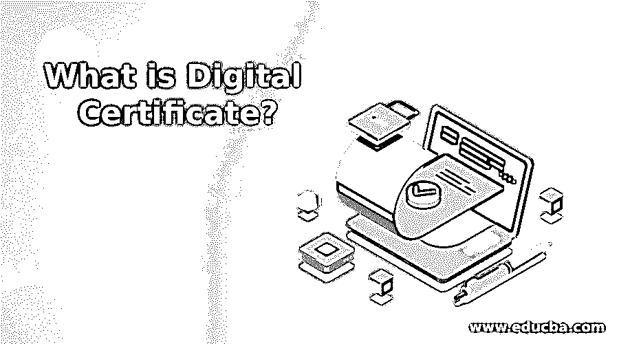
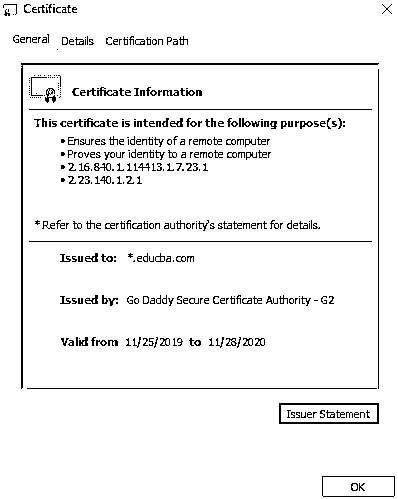
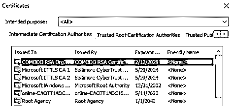
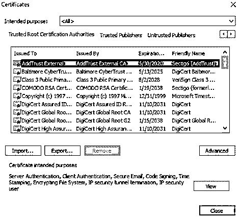

# 什么是数字证书？

> 原文：<https://www.educba.com/what-is-digital-certificate/>

## 什么是数字证书？

在互联网的世界里，保护你的数据是至关重要的。与任何商家进行网上交易都需要足够的信任。这就是密码学的用武之地。这是一种使用代码保护信息和通信的方法，只有指定的接收者才能读取它。该证书在加密中用作身份文档。该证书也称为公钥证书或身份证书。它是一种电子文档，用作公钥所有权的证明。

### 数字证书的重要性

数字证书是 big word Security *的一部分。*它有关于密钥、所有者和验证证书的第三方实体的数字签名的信息。如果证书有效，验证证书的软件信任证书颁发者，并可用作安全通信的密钥。证书由第三方组织提供，称为证书颁发机构(CA ),如 VeriSign、GeoTrust 和 DigiCert。X.509 定义了公钥证书的通用格式。

<small>网页开发、编程语言、软件测试&其他</small>

1.  每天都有数十亿封电子邮件通过网络传输。出于安全目的，证书被用作电子邮件的附件，以验证发件人的真实性。
2.  对于网上银行来说，数字证书是一个重要的信任变量。它还确保了敏感数据的保护。
3.  为了避免在线欺诈和身份盗窃的威胁，CA 提供了数字证书，这让数百万互联网用户和临时上网者放心。

### 为什么我们需要数字证书？

数字证书充当信任文档。它声明您是通过对信息进行数字签名来转换信息的人。它帮助接收者识别发送者的真实性。

数字证书可用于保护电子邮件以及基于网络的交易，或者识别交易的其他参与者。该证书证明了域名的所有权，并为交易在网站和用户之间建立了 SSL/TLS 加密的安全会话。作为开发人员，您可以使用数字证书来证明代码的作者身份，并且可以保持分布式软件程序的完整性。这些证书还可以用于提交所得税申报表、签署网络表格、电子投标文件等。

服务器和客户端使用证书颁发机构颁发的证书。证书将公钥绑定到个人或服务器。之后，它会验证连接并防止假冒。

下面是[https://www.educba.com/](https://www.educba.com/)的数字证书，只需点击网页浏览器>证书地址栏中的挂锁，就会打开证书弹出窗口。

下面是添加到我的浏览器的可信数字证书的屏幕截图:

要在 chrome 浏览器中查看，请打开设置>高级>管理证书。

它将打开一个弹出窗口，选择“中间证书颁发机构”选项卡和“受信任的根颁发机构”选项卡，以查看 CA 列表。

### 数字证书的好处

*   使用数字证书，身份验证是保密的
*   对数据证书进行加密可以保护您的私人信息，并防止意外的接收者看到这些信息。
*   数字证书系统也是用户友好的，它们通常自动工作。它们只需要发件人或收件人最少的操作或参与。
*   根据微软的说法，证书服务器比其他用于加密的证书颁发机构或系统更容易管理。

### 数字证书的类型

有三种类型的证书:

1.域验证(DV SSL):这种证书对证书所有者提供的保证最少。它只是证明了所有者有权使用该域名。这种类型的证书不保证该实体是谁。

2.组织验证(OV SSL):这种证书提供了一些关于证书所有者的额外保证；除了使用域名的权利之外，申请人还需要对他们的域名所有权进行额外的确认。

3.扩展验证(EV SSL):这种类型的证书只有在所有者能够证明他/她的身份并对证书感到满意之后才颁发给所有者。筛选过程包括验证申请人是否存在，验证他/她的身份是否与官方记录相符，验证申请人是否被授权使用域名，以及确认域名所有者是否授权签发证书。

除了上述类型，还有用于不同目的的其他类型的证书:

*   电子邮件证书
*   代码签名证书
*   附条件证明书
*   根证书
*   中级证书
*   自签名证书

### 结论

我们现在知道为什么数字证书是重要的，它有什么好处。一个真正的企业总是希望它的网站在一个安全的层。对于用户来说，知道自己的数据是安全的，不会被滥用，还有什么比这更重要的呢？

### 推荐文章

这是什么是数字证书的指南？.这里我们讨论了什么是数字证书，数字证书的内容及其类型。你也可以看看下面的文章来了解更多-

1.  [数字签名 vs 数字证书](https://www.educba.com/digital-signature-vs-digital-certificate/)
2.  [数字证书](https://www.educba.com/digital-certificate/)
3.  [什么是数字图像？](https://www.educba.com/what-is-digital-image/)
4.  [数字签名加密](https://www.educba.com/digital-signature-cryptography/)

