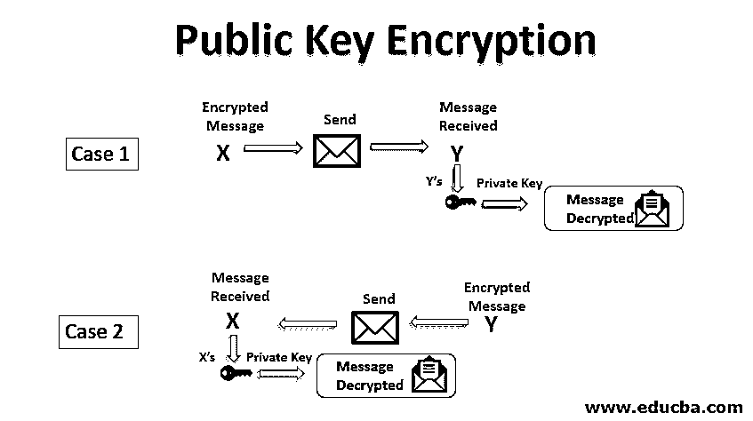

# 公钥加密

> 原文：<https://www.educba.com/public-key-encryption/>

## 公钥加密简介

公钥加密也称为非对称密钥加密。顾名思义，非对称密钥是两种不同的密钥，用于公钥加密。一个密钥用于加密过程，另一个密钥用于解密过程。一旦决定了加密和解密的密钥，就不会使用其他密钥。这两个密钥中一个密钥叫公钥，另一个叫私钥。

让我们假设你想通过互联网与朋友交流，安全地开始交流；您需要获得公钥和私钥。私钥是秘密密钥；你应该保守这个秘密。如果私钥被交给另一方，就有可能通过第三方受到攻击。

<small>网页开发、编程语言、软件测试&其他</small>

如果 X 想要安全地与 Y 通信，X 和 Y 都应该有一个公钥和一个私钥。

*   x 应该对她的私钥保密。
*   x 应该把她的公钥告知 y。
*   你应该对她的私钥保密。
*   y 应该把她的公钥告知 x。

### 公钥加密是如何工作的？

公钥加密的工作原理解释如下:

#### 案例 1

当 X 要和 Y 通信时，X 用 Y 的公钥加密消息；这是可能的，因为 Y 与 x 共享她的公钥。

*   x 将加密的消息发送给 y。
*   y 接收来自 x 的消息。
*   Y 使用她(即 Y 的私钥)解密消息。

**Note:** Only Y know her private key, and the message can be decrypted using Y’s private key. The advantage of this is the party cannot decrypt the message because he/ she does not know the private key of Y. Only Y’s private key can decrypt the message.

#### 案例 2

当 Y 想和 X 通信时，Y 用 X 的公钥加密消息。这是可能的，因为 X 与 y 共享她的公钥。

*   y 将加密的消息发送给 x。
*   x 接收来自 Y 的消息
*   X 用她，即 X 的私钥解密消息。

### 成分

以下是公钥加密的组成部分:

*   **纯文本:**可读格式且任何人都能理解的文本称为纯文本。明文被用作加密过程的输入。
*   **密文:**使用[加密算法](https://www.educba.com/encryption-algorithm/)将不可读格式转换成可读格式的文本称为密文。密文是加密过程的输出。它是一种不可读格式，任何人都不理解。
*   **公钥:**每个人都知道的密钥称为公钥。公钥通常用于发送方的加密过程。
*   **私钥:**不为所有人所知的密钥，作为秘密保存，称为私钥。私钥用于接收器端的解密过程。
*   **加密算法:**用于将明文转换为密文的算法称为加密算法。
*   **解密算法:**用于将密文转换为明文的算法称为解密算法。

### 公钥加密算法

以下是公钥加密的算法。

#### RSA 算法

RSA 是最流行的公钥加密算法。 [RSA 算法基于](https://www.educba.com/rsa-algorithm/)数学计算，识别并乘以一个大素数很容易，但对其因子进行因式分解却很困难。RSA 中使用的私钥和公钥都是大质数。

**RSA 算法的步骤:**

*   选择两个大质数 X 和 y。
*   计算乘积 N = X*Y。
*   选择公钥 E，使它不是(X–1)和(Y–1)的因子。
*   选择私钥 D 使得下面的等式成立。
*   (D * E)mod(X–1)*(Y–1)= 1
*   对于加密，计算 CT 为 CT = PT^E 模 n
*   将 CT 发送给接收者。
*   对于解密，计算 PT 为 PT = CT^D 模 n

**Note:** In the RSA algorithm, selecting and generating a public key and the private key is a critical task.

#### ElGamal 密码算法

ElGamal 是另一种流行的公钥加密算法。

**ElGamal 密钥生成:**

*   选择大素数 P 作为公钥，Q 作为私钥。
*   选择第二个加密密钥为 E1。
*   选择第三个加密密钥作为 E2，使得 E2 = E^Q mod P ElGamal 密钥加密。
*   选择随机数 r。
*   计算密文为 CT = E1 ^R 模 p
*   计算第二密文 CT2 = (PT * E2^R) mod P ElGamal 密钥解密
*   将纯文本计算为 PT = (CT2 *(CT^Q)^-1) mod P

### 推荐文章

这是一个公钥加密的指南。在这里，我们讨论公钥加密，它的组成部分，它是如何工作的，以及一些例子。您也可以阅读以下文章，了解更多信息——

1.  [对称密钥加密](https://www.educba.com/symmetric-key-encryption/)
2.  [密码术 vs 加密](https://www.educba.com/cryptography-vs-encryption/)
3.  [对称算法](https://www.educba.com/symmetric-algorithms/)
4.  [私有云 vs 公有云](https://www.educba.com/private-cloud-vs-public-cloud/)

