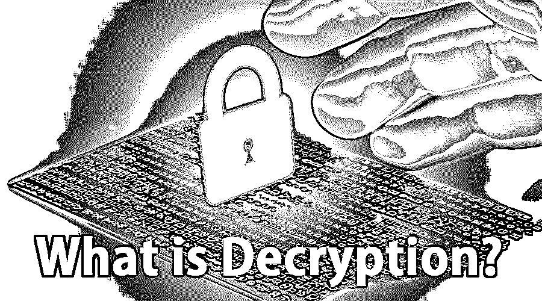

# 什么是解密？

> 原文：<https://www.educba.com/what-is-decryption/>

## 解密简介

这是一种通过加密将已经作为不可破译材料完成的数据修改为可破译状态的过程。在这个过程中，系统获取混淆的数据，并将其转换成读者和系统都可以简单理解的文字和图片。它可以自动或手动执行。它甚至可以通过各种代码或密码来实现。

这是一个揭示安全数据的过程，对于它来说，该结构获取并转换混合的数据，并将其修改为系统中的读者都可以访问的语言和图像。任何有窗口的人收到的解密数据将输入获得加密数据所需的密码。它可以自动或手动执行，甚至可以通过收集密码或代码来完成。

<small>网页开发、编程语言、软件测试&其他</small>

### 什么是解密？

执行解密处理器[加密过程](https://www.educba.com/encryption-process/)的最重要原因是隐私。随着数据在万维网上迁移，它变成了未经批准的个人或公司的分析和访问问题。因此，信息被加密以减少数据的丢失和被盗。很少有普通的项目被加密:图像、目录；电子邮件、用户数据和文本文件。处理它的人得到一个即时窗口，必须在这个窗口中打卡才能获得加密数据。

### 为什么要用解密？

大量加密的连续算法的发展在计算军备竞赛中对情报和执法专家提出了更高的要求。此外，需要处理数字安全检查或找回丢失密码的组织也面临着类似的挑战。此外，利用最先进的方法解密，大量的计算要求无法避免，这是进一步解密的原因。联邦机构和独立软件开发商将 Frontier 作为他们的弹药选择。

此外，该功能还可以帮助机构使用 Frontier 和 Paragon 进行内部解密或隐写算法，其中包括一些优秀的商业解码器，以提供在整个公司的众多计算机上提供解密的交钥匙企业网络。

### 解密是如何工作的？

同时，您从 Veeam 备份、加密的备份文件中恢复信息，复制会在后台自动产生信息解密，或者需要您提供密钥。

如果需要加密密码来解开备份文件，并且可以在复制配置数据库& Veeam Backup 中访问，则不需要插入密钥。复制和 Veeam 备份利用数据库中的密码来打开备份文件。信息是在后台实现的，数据恢复与未加密数据的恢复没有什么不同。

自动化信息在随后的要求中完成，这就足够了:

*   您将使用类似的复制配置数据库& Veeam Backup 在类似的备份服务器上加密或加密备份文件。
*   因为它们没有从复制控制台和 Veeam 备份中排除。
*   如果在复制配置数据库& Veeam Backup 中无法访问加密密码，您需要提供一个密钥来解密加密的文件。
*   信息在源端获得，随后信息从目的地点传送回来。因此，加密密码不会从原点传回，这有助于规避信息捕获。

下面的过程显示了 VeeamZIP 任务、备份和备份拷贝作业的过程。该过程包括以下动作。请注意，如果您要解密备份服务器上的文件，而不是备份服务器上的加密文件，则需要执行操作一和操作二。

将文件导入备份服务器。Replication & Veeam Backup 通知您文件已加密，需要一个密钥。您应该为导入的文件提供一个密钥，但是，如果密码被多次更改或仅更改一次，您需要以后续方式提供密钥:

*   如果您选择导入一个. vbm 文件，那么您应该提到用于在备份链中加密该文件的当前密钥。
*   如果您选择导入整个备份文件，您应该拥有完整的密钥集合，可以用来加密备份链中的文件。

复制和 Veeam 备份检查提交的密码，并根据密码生成用户密钥。通过访问用户密钥，复制和 Veeam 备份会以相应的方式进行解密:

*   为了解密存储密钥，Replication & Veeam Backup 使用用户密钥。存储解开主要会话密钥和元密钥。
*   借助会话密钥，您可以解密数据块。
*   下面的加密文件被解开，因为你可以操作它。

### 优点和缺点

使用解密的原因是不同的；然而，足够的安全性无疑是优势之一。这种方法给组织带来了顺畅的管理。显而易见，该系统可以使安全专业人员受益，因为它避免了加密使用，从而混淆了敏感信息的加密迭代。

缺点基本上是双重的。第一个涉及隐私；如果一家公司选择使用解密技术，那么它就要承担分离重要员工的风险。如果员工偶然查看他们的电子邮件或银行详细信息，他们可能会发现，由于任何选择不当的关键字，他们随时都可能触发防火墙事件。因此，由于没有经验的旁观者(他们不关心暴露敏感的组织数据)可能会由于无意中激活防火墙而使他们的网络流量被观察到，所以在执行时放弃了对最终消费者隐私的特定预期。

### 结论

在开启解密的同时，可以操作解密的设备经历了大约 60%的大范围性能损失。这种压力经常意味着公司出于对业绩恶化的担忧而不解密。

### 推荐文章

这是一个什么是解密的指南？在这里，我们讨论了解密的介绍以及使用，工作，优点和缺点。您也可以浏览我们推荐的其他文章，了解更多信息——

1.  [密码术 vs 加密](https://www.educba.com/cryptography-vs-encryption/)
2.  [什么是数据处理？](https://www.educba.com/what-is-data-processing/)
3.  [什么是软件测试？](https://www.educba.com/what-is-software-testing/)
4.  [密码类型](https://www.educba.com/types-of-cipher/)

