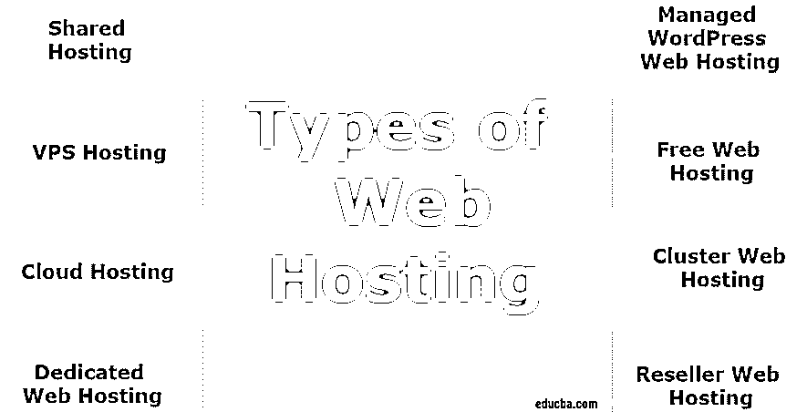

# 虚拟主机的类型

> 原文：<https://www.educba.com/types-of-web-hosting/>

## 虚拟主机类型介绍

这篇文章将介绍什么是[虚拟主机](https://www.educba.com/what-is-web-hosting/)以及市场上有哪些虚拟主机。然后，我们将讨论不同的虚拟主机类型，包括他们如何工作，他们做什么，以及哪些是最适合你的。

### 什么是虚拟主机？

虚拟主机是一种允许组织和个人在互联网上发布网站或网页的服务。在称为服务器的特殊计算机上，网站被托管或存储。如果你想浏览你的网站，你只需要在浏览器中输入你的网址或域名。许多虚拟主机服务提供商都提供了 FrontPage 扩展来在 FrontPage 中创建您的网站，并提供了[文件传输协议](https://www.educba.com/what-is-ftp/) (FTP)来帮助您快速从桌面上传虚拟主机文件。

<small>网页开发、编程语言、软件测试&其他</small>

### 虚拟主机的类型

有不同类型的虚拟主机如下:

#### 1.共享主机

这是一个完美的入门级主机托管。在这种情况下，你的网站将与许多不同的网站存储在同一个服务器上，这将是任何地方的范围在数百或数千。通常，当大多数人开始在线业务时，他们会从共享主机方案开始，以降低成本；所有域都使用相同的服务器资源，如 RAM 和 CPU，但这种托管非常低。

**优点**

*   这种解决方案的主要好处是与许多人分担服务器成本。如果主机服务提供商可以将数百或数千个客户端放在一台服务器上，那么运营成本可以分摊给多方。
*   这也是为什么共享托管最便宜的原因。平均价格为每月 5-10 美元，最低为每月 2 美元。

**缺点**

*   然而，这种安排的主要缺点是多方共享一个服务器。如上所述，服务器是一台具有硬盘空间、CPU 速度和 RAM 资源的计算机。
*   对于这个东西，我们称之为穷邻居效应，这也是为什么共享托管问题比较多的主要原因。

#### 2.VPS 托管

VPS 代表虚拟专用服务器。VPS 主机是一种互联网主机帐户，您可以选择在线主机。要在 Internet 上建立网站，您必须将数据库文件放在 web 服务器上。这些物理服务器通常被分成各种不同的或共享的 VPS 服务器。

**优点**

*   它比专用服务器成本低。
*   你的托管环境更加可控。
*   VPS 服务器提供了更大的灵活性，并帮助您定制您的环境和另一个重要的优势
*   您可以在不影响他人的情况下进行更改，因为您的帐户位于虚拟机中。
*   VPS 主机有一个支持人员来帮助他们的客户和技术问题。

**缺点**

*   然而，虽然 VPS 的平均成本是每月 50 美元左右，但也有可能是每月 20 美元左右。
*   价格大概是 VPS 托管最大的劣势。

#### 3.云托管

如今，云托管更受欢迎。云是一个在许多技术领域使用的概念，现在也被用于托管领域。[云托管](https://www.educba.com/cloud-hosting-providers/)以实用模式向服务提供商提供基础设施服务，以外包组织的计算和存储资源。云中没有任何物理事物可以被你标示为云。就像没有物理服务器有云托管一样，你可以看出它是云主机。

**优点**

*   可扩展性是云托管的最大优势。
*   它将提高您的数据传输速度
*   现代云托管服务可以识别哪个服务器离客户最近，以便从最近的来源接收内容，从而减少延迟和页面加载时间。

**缺点**

*   虽然云服务提供商实施最好的安全和行业认证标准，但外部供应商存储数据和重要文件总是会带来风险。
*   组织很难将其服务从一个供应商转移到另一个供应商。
*   云托管的主要缺点是成本无法完全估计。

#### 4.专用虚拟主机

专用虚拟主机意味着你只需为一台服务器付费，也就是说这台服务器上没有其他网页。这意味着它完全控制了网站所有者；甚至所有者也拥有 root 访问权限。因为高流量，人们使用这种专用的虚拟主机。

这意味着如果你计划使用专用的虚拟主机，你应该知道如何使用和管理服务器。专用虚拟主机为您提供托管和非托管服务器。

**优点**

*   你有自己的专用服务器，所以你可以随心所欲地使用它。
*   专用服务器非常安全，因为几个客户端不会共享它们。
*   您可以选择最合适的服务器，因为有多种选择可供选择。

**缺点**

*   最昂贵的主机类型是专用于托管。
*   如果您不熟悉服务器，专用服务器可能很难管理。
*   安装软件、日常维护、日常操作以及其他您必须控制且需要技术知识的任务。
*   主机可以提供安全指导，但保证您的服务器安全是您的责任。

#### 5.托管 WordPress 虚拟主机

这个托管的 WordPress 虚拟主机仅用于 [WordPress](https://www.educba.com/what-is-wordpress/) 。你的主机处理一切，而不是使用 cPanel，Plesk 等。这种类型的计划是为那些不喜欢虚拟主机技术的人准备的。

**优点**

*   托管 WordPress 主机的建立是为了帮助 WordPress 并保证它们尽快可用。
*   他们不断优化，所以即使你的网站增长，你也不必担心速度变慢。

**缺点**

*   托管 WordPress 虚拟主机比共享主机花费更多，因为 WordPress 虚拟主机处理技术问题。
*   这是令人不快的，但有时网站会被黑。WordPress 网站通常通过后台或者使用有缺陷的插件或主题被黑客攻击。
*   对技术感兴趣的网站设计者和网站所有者可能会感到失望，因为特定的插件不能被允许，或者高级服务器功能在访问它们时会受到限制。

#### 6.免费虚拟主机

免费虚拟主机意味着非付费的免费服务托管。许多互联网主机为任何对制作网站感兴趣的人提供子域名。Blogger 和 WordPress 在他们当中很受欢迎。当你用这些免费的网站服务主机创建你的站点时，你的站点将被命名为[your.blogspot.com](http://your.blogspot.com/)和[your.wordpress.com](https://your.wordpress.com/)站点。如果你想拥有一个没有外国网站名称的网站，你必须购买一个域名，然后获得一个通常需要付费的虚拟主机服务。

**优点**

*   免费网站托管，而且是免费的。
*   当你创建免费网站时，他们利用你的网站创建广告、横幅和其他广告媒体类型来获利。

**缺点**

*   有时广告收入与网站持有者分享，有时不分享。
*   具体的计划和政策可能因主机供应商而异。
*   免费托管计划不提供域名；他们只向所有者提供子域名。
*   免费虚拟主机没有客户支持来解决技术问题。

#### 7.集群虚拟主机

集群网络托管将提高托管的可靠性和各种服务器的性能。在这个客户中，网站托管在许多不同的集群站点中，正因为如此，网站获得了流量而不影响网站的性能。

**优点**

*   因为 web 服务器的整个集群用它们的硬件和带宽资源为主机帐户提供动力，所以客户端获得高处理能力。
*   当消费者需要时，连接到每个前端服务器的多个服务器提供更多空间。

**缺点**

*   集群虚拟主机的成本非常高。
*   集群虚拟主机需要完美的硬件和设计。

#### 8.经销商虚拟主机

面向经销商的虚拟主机是一项允许您销售各种共享计划的计划。经销商计划中有一个控制面板，可以帮助您控制您的共享帐户，包括账单、存储、RAM 等。这将有助于你有完全的控制权，你将提供给你的客户不同的计划。许多网站设计者使用经销商托管来跟踪他们的客户。

**优点**

*   有了你的网络托管账户，你可以有更多的灵活性。
*   从经销商网站托管，你可以省钱。
*   价格低，可以获得更多的收入。

### 结论

在这篇文章中，我们看到了不同类型的虚拟主机。你可以根据自己的需求决定你需要什么类型的托管计划。它可能因人而异。许多主人提供各种各样的计划。因此，你可以随时转向更高或更低的计划。

### 推荐文章

这是一个网站托管类型的指南。在这里，我们也讨论了不同类型的虚拟主机的基本含义，以及它们的详细解释和优缺点。您也可以浏览我们推荐的其他文章，了解更多信息——

1.  [什么是 VPS 托管？](https://www.educba.com/what-is-vps-hosting/)
2.  [网络营销](https://www.educba.com/web-based-marketing/)
3.  [网页模板 HTML](https://www.educba.com/web-templates-html/)
4.  [免费虚拟主机网站](https://www.educba.com/free-web-hosting-sites/)

