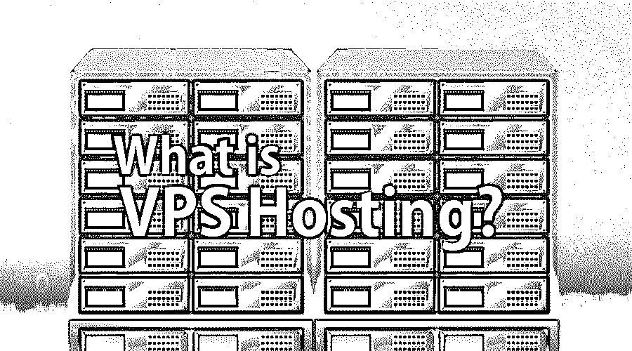

# 什么是 VPS 托管？

> 原文：<https://www.educba.com/what-is-vps-hosting/>

## VPS 托管简介

在深入 VPS 托管之前，让我们先来关注一下服务器。简而言之，服务器是一台功能强大的计算机或设备，它管理对网络中集中资源或 web 服务的访问，并存储来自网站的所有数据。当用户在网络浏览器中键入域名时，服务器获取用户的特定网站。VPS 的概念是将一个强大的服务器拆分成多个虚拟服务器，使其对用户来说更具成本效益。对于可能不需要相关费用和效率的特定用户来说，专用服务器可能非常昂贵。因此，VPS 为那些希望灵活高效地共享主机，同时利用专用服务器的所有设施的用户提供了一个很好的选择。

### 什么是 VPS 托管？

虚拟主机是指托管网站的服务器。VPS 代表虚拟专用服务器，它是一个虚拟主机服务器。它充当网站文件和数据的存储中心。VPS 运行自己的操作系统实例，客户可以通过超级用户权限安装在该操作系统上运行的任何软件。因此，我们可以将 VPS 总结为在另一个服务器中运行的服务器，其中一个物理服务器托管多个彼此隔离的虚拟服务器。

<small>网页开发、编程语言、软件测试&其他</small>

### 了解 VPS 托管

专用服务器用户不与他人共享资源，并且它的价格很高，因为所有者必须支付整个服务器的成本。而共享主机服务器的用户使用用户之间的共享资源，并且是可负担的。VPS 介于共享主机和专用主机之间，其中特定的虚拟空间分配给特定用户，以便用户获得自己的 CPU、操作系统和存储。借助 VPS，用户可以经济高效地获得专用服务器的特权。

### VPS 主机是如何工作的？

VPS 是共享主机服务器和专用主机服务器之间的一种媒介，放置在一台为多个网站服务的计算机上。VPS 是一种将一台物理服务器划分为多台服务器的方法。每台服务器都能够运行自己的专用机器和操作系统，并且每台服务器都可以独立重启。

一台服务器被划分为多个隔离专区，以形成多个虚拟服务器，并为所有用户提供一个专用环境，使他们能够以 root 用户身份访问自己的专用服务器。VPS 服务器提供了可扩展性，并且可以通过添加新资源的能力来配置以适应单个用户的业务需求。此外，用户将能够在一台机器上运行多个虚拟化操作系统。在这种情况下，用户在使用通用硬件(包括 RAM 和 CPU)的同时享受独立的软件。

在 VPS 中，用户可以控制自己的应用程序，这带来了与其他用户共享服务器成本的额外好处。它提供了根访问，具有磁盘空间、CPU 和带宽方面的优势。它在 web 服务器中运行一个独立的进程。

VPS 的行为就像一个真正的专用服务器，以及用户自己的登录、系统进程、具有无限根访问权限的文件系统和定制应用软件。像专用服务器一样，它也提供最高的安全级别，并配有可定制的防火墙保护和隔离磁盘空间的安全性。

### VPS 托管的优势

*   它比专用服务器托管更便宜。它可以根据客户的需要定制，以便他们根据自己的要求付款。
*   此外，它很容易扩展，用户可以从他们需要的最少量的资源开始，并可以在需要时增加资源。
*   有了 VPS 托管，用户可以更好地控制他们的虚拟服务器，并拥有根访问权限。
*   它为用户提供了价格、性能、安全性和隐私性的良好平衡。

### VPS 托管的优势和劣势

下面给出了提到的优点和缺点:

#### 优势:

*   用户可以以较低的价格使用专用服务器的设施。
*   为用户提供更多的访问控制，如 root 访问。
*   与共享主机相比，安全性更高，因为用户不会与其他人共享资源。
*   比共享主机更灵活，因为用户可以定制硬件和软件配置，运行自己的应用程序。

#### 缺点:

尽管 VPS 比共享主机有很多优势，但从财务或服务的角度来看，可能会有一些缺点。

*   VPS 托管可能比专用托管便宜，但比共享托管贵。
*   如果主机没有适当地分配资源，那么当一个网站在高峰水平使用它的资源时，它可能会引起问题。

### 谁会用这种托管？

与共享主机相比，需要对虚拟环境进行更多控制的用户可以选择 VPS 主机。VPS 以比专用服务器更低的成本为用户提供了更多的独立性。寻求更多访问控制(如 root 访问，运行自己的操作系统实例)的客户可以选择 VPS 托管。

<class>如何<class>将<class>这个 T> < class=”word”>技术<class>帮助<class>你 G <class>排<class>在<class>你 C <class>排在前面？</class></class></class></class></class></class></class></class></class>

任何对经营自己的生意或创建网站、虚拟主机和 VPS 感兴趣的人都可以加入进来。对于那些希望以较低价格获得专用服务器设施以及访问控制、隐私、性能等所有优势的用户来说，VPS 是一个很好的选择。此外，由于 VPS 介于共享主机和专用主机之间，组织或用户可能会以更低的成本从专用主机的额外特权中受益，这可能符合他们的要求。

### 结论

对于希望以较低价格获得专用服务器特权的用户来说，虚拟专用服务器是一个不错的选择。此外，对于比共享主机需要更多访问控制的用户来说，这是一个更好的选择。VPS 弥补了专用主机和共享主机之间的差距，可能适合那些希望以比共享主机更低的价格获得更好的性能、隐私和访问控制的用户。

### 推荐文章

这是一个什么是 VPS 托管的指南？在这里，我们讨论了虚拟主机的工作，优势和劣势。您也可以浏览我们推荐的其他文章，了解更多信息——

1.  [什么是 JMS？](https://www.educba.com/what-is-jms/)
2.  [云计算的例子](https://www.educba.com/example-of-cloud-computing/)
3.  [什么是数据处理？](https://www.educba.com/what-is-data-processing/)
4.  [什么是 VMware？](https://www.educba.com/what-is-vmware/)

