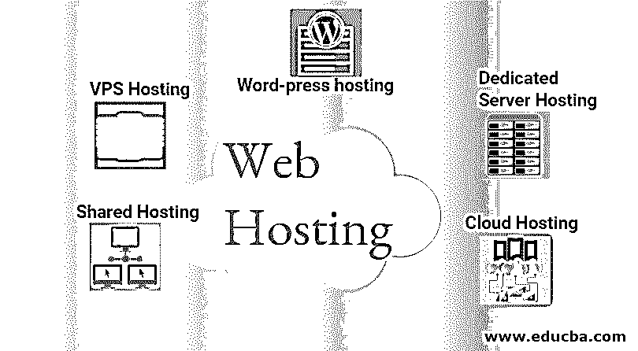

# 什么是虚拟主机？

> 原文：<https://www.educba.com/what-is-web-hosting/>

## 虚拟主机简介

虚拟主机是一种允许其他人在互联网上浏览你的网站的服务。web 主机在其服务器上提供空间，允许世界上的其他计算机通过网络或调制解调器访问您的网站。虚拟主机服务提供商拥有服务器、连接和相关的虚拟主机服务。有字面上成千上万的虚拟主机服务，从免费设施有限的可选服务，以昂贵的，具体到专门的虚拟主机服务。他们通过提供独特的托管程序来满足小型博客和大型组织的托管需求。

### 虚拟主机是如何工作的？

如果你想在现实世界中创业，你需要建立、存储和销售你的产品。在数字世界里完全一样的东西；同样的规则也适用于网站的创建。在网站中，当你建立网上业务时，你的网站中有许多文件、图片和 HTML 代码。如果您没有联机空间，那么您的数据或文件将不会被设置，因此，没有人可以在互联网上看到您的域。

<small>网页开发、编程语言、软件测试&其他</small>

主机运营商将把你所有的文件存储在服务器上，一旦浏览器要求通过输入你的域名发送文件，它将负责提供你的网站文件。简而言之，我们可以说，当你为托管服务付费时，你就在互联网上租用存储空间——就像你租用实体店一样。虽然 cPanel 是大多数网站托管者使用的一个强大的工具，但是对于那些只想让网站快速工作和运行的非技术用户来说，它可能会令人生畏。

除了为您的网站提供服务器空间，主机提供商还可以提供其他基于网站的服务，例如:

*   SSL 证书
*   [页面生成器](https://www.educba.com/online-website-builder/)
*   实时聊天(客户支持服务)
*   一键安装软件。(Drupal 和 WordPress)

### 什么是域名？

当你开始或考虑网上业务时，首先想到的是一个域名，也就是你的网址或公司名称。在网上。举个例子，如果你有一家店，有人想参观你的店，你会怎么做？首先，你将提供地址给那个人完全一样，如果有人想访问你的网上业务，然后你将提供你的域名给她。

每当有人键入你的域名，托管公司就会转换所有与你的 IP 地址相连的文件，并返回你网站上的所有图像、视频和文字。每个域名都是独一无二的，就像你的注册地址一样。因此，每当你打开一个新网站，你将能够选择一个反映你的品牌的名称。

### 虚拟主机的类型

以下是不同类型的虚拟主机:

*   共享主机
*   VPS 托管
*   专用服务器托管
*   [云托管](https://www.educba.com/what-is-cloud-hosting/)
*   WordPress 主机

#### **

** 1。共享主机

共享主机是最常见的主机类型，是大多数小公司和博客的完美解决方案。当你听到“虚拟主机”时，它通常指的是共享主机同一服务器上的托管网站共享所有内存、电脑存储、磁盘存储和其他资源。共享托管人性化，也就是说不需要了解[编码知识](https://www.educba.com/what-is-coding/)。主机负责维护和服务器管理。共享主机的好处是负担得起，因为每个人都为服务器平等付费。

可以便宜到 2 美元/月，平均费用 5-10 美元/月。但是也有各种弊端，比如很多网站共用同一个服务器，导致资源相同，网站变慢。即在共享主机上，许多程序同时运行。

如果一个网站由于流量增加或代码错误而消耗更多的电力，其他网站就必须面临加载速度变慢或停机的问题，这意味着该网站将无法访问。这种现象被称为“坏邻居效应”。

#### **

** 2。VPS 托管

VPS 代表托管的[虚拟专用服务器。但是，您仍然与其他用户共享一个服务器；但是，您的 web 主机在服务器上给了您一个单独的分区。因此，您将拥有专用的服务器空间，以及保留的计算机能力和内存。VPS 托管对于拥有快速增长的网站的中型企业来说是非常好的。](https://www.educba.com/what-is-vps-hosting/)

VPS 托管在可扩展性和高度定制服务器方面非常容易。VPS 提供了比共享主机更高的可靠性和稳定性。它通常被限制在每台服务器 10 到 20 个网站。但是这可以根据服务器的需求而减少。这种类型的主机的另一个优点是，如果网站的限制超过，那么该网站的服务器可能会关闭。

但是，其他服务器将保持稳定。这是在负责服务器内分离的[虚拟机](https://www.educba.com/what-is-virtual-machine/)的帮助下实现的，以克服坏邻居效应。它还提供了灵活性，即所有者可以在不影响他人的情况下定制自己的环境，而不像共享虚拟主机那样同时对他人的环境进行更改。

#### **

** 3。专用服务器托管

作为一种专用的托管类型，网站所有者可以完全控制存储网站的服务器。即所有者拥有完全的管理和根访问权限。因此，它允许更快的执行和高级别的安全性，并且所有的资源都在所有者的控制之下。

专用主机的主要优势之一是没有坏邻居效应的问题，因为没有其他网站参与使用网站的资源。因此，所有者可以有效地定制环境。

这提供了更大的灵活性，因为所有者可以选择操作系统、硬件组件类型和内存所需的空间等。然而，这是有代价的，这意味着所有者将完全支付服务器的运行费用。

#### **

** 4。云托管

云托管是目前市场上最可靠的解决方案，不会停机。与该类型中的 VPS 主机相同的[；使用虚拟机。您的主机提供了一个包含云托管](https://www.educba.com/what-is-vps-hosting/)的[服务器集群。每台服务器都是为您的文件和资源复制的。](https://www.educba.com/web-hosting-vs-cloud-hosting/)

如果其中一个云服务器繁忙或出现问题，您的流量会自动路由到集群中的另一个服务器。它更具可扩展性，因为它将几台计算机组合成一个虚拟服务器，然后该服务器可以根据它们的需求提供资源。不像 VPS 服务器，因为它可以扩展到一定的限制。

所有者必须为他实际使用的资源付费，而不是为全部资源付费。云托管的另一个主要优势是它提供了更高的安全级别，因为像 DDOS 这样的攻击可以分布在不同的计算机上，比单个服务器系统更好地减轻严重影响。

#### **

** 5。文字媒体托管

WordPress 主机有点像共享主机，但这是为 WordPress 网站所有者创建的。你的服务器是专门为 WordPress 配置的[，并且在你的网站上安装了缓存和安全等重要项目的插件。因为你的网站是极度优化的，它加载更快，运行更少的故障排除问题。](https://www.educba.com/what-is-wordpress/)

### 结论

这是一种在服务器上存储网站信息的服务。没有它，你的网站就无法上线。网站域名，即网站地址，是所有网站托管的主要组成部分。所以在这篇文章中，我们已经看到了什么是虚拟主机和虚拟主机的类型。

### 推荐文章

这是一个什么是虚拟主机的指南？在这里，我们详细讨论了基本概念、工作原理以及各种类型的托管。您也可以浏览我们推荐的其他文章，了解更多信息——

1.  [虚拟主机的类型](https://www.educba.com/types-of-web-hosting/)
2.  [什么是主机？](https://www.educba.com/what-is-hosting/)
3.  [什么是 WordPress？](https://www.educba.com/what-is-wordpress/)
4.  [云托管提供商](https://www.educba.com/cloud-hosting-providers/)

