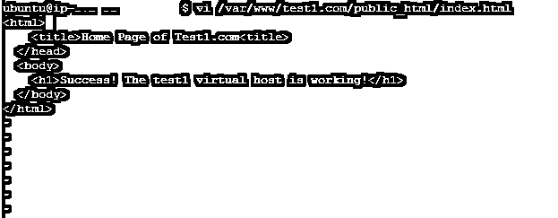

# 什么是虚拟主机？

> 原文：<https://www.educba.com/virtual-host/>

## 虚拟主机简介

在最初的日子里，虚拟主机开始的目的不仅仅是托管网站(如 website1.example.com、website2.example.com 等)。)在单台机器上。这也意味着共享单个机器的资源，比如内存和 CPU。资源以这样的方式被共享和利用，从而实现最大的效率。

现在，随着云计算的发明，虚拟现在比以往任何时候都有更多的用途，例如虚拟应用程序托管、虚拟服务器托管、虚拟存储托管等解决方案，有时还包括虚拟/整个数据中心托管。

<small>网页开发、编程语言、软件测试&其他</small>

### 虚拟主机的工作

配置虚拟主机的方法有很多，下面列出了目前使用的大多数方法:

*   基于 IP
*   基于端口的
*   基于名称

#### 1.基于 IP

这是三种方法中最简单的一种，可以用来根据 IP 地址应用不同的指令。在基于 IP 的虚拟主机中，我们为每个域使用不同的 IP。

多个 IP 实际上将指向服务器的唯一域，并且一个服务器将只有一个 IP。这种虚拟主机是通过为一台服务器创建多个 IP 地址来实现的。

#### 2.基于端口的

基于端口的虚拟主机也类似于基于 IP 的虚拟主机；不同之处在于，我们没有为每个虚拟主机使用不同的 IP 地址，而是使用不同的端口来配置服务器，以响应依赖于服务器端口的多个网站。

#### 3.基于名称

基于名称的虚拟主机是目前最常用的虚拟主机技术。基于名称的虚拟主机将对给定服务器上的所有域使用单个 IP 地址。当浏览器试图连接到服务器时，它会向服务器发送一条消息，通知它试图连接的域名。当提供域名时，服务器检查主机配置，从而返回带有正确网站的请求。

### 如何创建一个虚拟主机/例子和插图？

为了便于说明，我们将使用 Apache 服务器在 Ubuntu 操作系统上设置 Apache 主机。选择 Apache 的一个原因是，它是用来设置 Iy 的最值得信赖和可靠的服务器之一。

**先决条件**

如果你有一个 Ubuntu 操作系统和一个 Apache 安装程序，那会很有帮助。

如果没有安装 Apache，请使用以下命令进行安装:

`sudo apt-get update
sudo apt-get install apache2`

至于我们的教程，我们将为域创建虚拟主机:

1.  Test1.com
2.  Test2.com

#### 步骤 1:创建目录结构

第一步是创建一个目录结构，用于存储我们将向网站访问者提供的网站数据，或者我们将接受来自访问者的数据。

因此，我们将在文档根目录(/var/www 目录)下创建如下目录结构

`sudo mkdir -p /var/www/test1.com/public_html
sudo mkdir -p /var/www/test2.com/public_html`

#### 第二步:权限

正如我们已经看到的，我们创建的目录结构由 root 用户拥有。因此，如果您想要更改它以便修改 web 目录中的文件，我们可以通过以下方式来完成:

`sudo chown -R $USER:$YOUR_USER_NAME /var/www/test1.com /public_html
sudo chown -R $USER:$ YOUR_USER_NAME /var/www/test2.com /public_html`

#### 步骤 3:为每个虚拟主机创建示例(演示)页面

让我们首先为 test1.com 创建样本/测试页面。

用 vi 编辑器或任何你选择的编辑器打开它，做一些 HTML 的事情！

`vi /var/www/test1.com/public_html/index.html`

一旦打开，请编写一些基本的 HTML 代码，保存编辑器并关闭它。
 `<html>
<head>
<title>Home Page of Test1.com<title>
</head>
<body>
<h1>Success! The test1 virtual host is working!</h1>
</body>
</html>`

类似地，我们可以为另一个网站创建 HTML 页面，例如 test.com。

`vi /var/www/test2.com/public_html/index.html`

一旦打开，请编写一些基本的 HTML 代码，保存编辑器并关闭它。

`<html>
<head>
<title>Home Page of Test2.com<title>
</head>
<body>
<h1>Success! The test2 virtual host is working!</h1>
</body>
</html>`

#### 步骤 4:为虚拟主机创建新文件

这些文件包含我们主机的实际配置。由于我们已经安装了 Apache，它附带了一个默认的虚拟主机文件，名为 000-default.conf，我们将使用它。

让我们首先将 apache conf 文件复制到我们第一个域:

`sudo cp /etc/apache2/sites-available/000-default.conf /etc/apache2/sitesavailable/test1.conf`

完成后，请用你最喜欢的编辑器打开它。

它应该看起来像下面这样:

`<VirtualHost *:80>
ServerAdmin webmaster@localhost
DocumentRoot /var/www/html
ErrorLog ${APACHE_LOG_DIR}/error.log
CustomLog ${APACHE_LOG_DIR}/access.log combined
</VirtualHost>`

这里我们需要更改电子邮件，用服务器管理员的电子邮件替换它。

`ServerAdmin admin@test1.com`

下一件事是添加 2 个指令:ServerName(这应该是您的域)和 ServerAlias。它是这样实现的:

`ServerName test1.com
ServerAlias www.test2.com`

最后，请更改我们域的文档根目录的位置。

这可以通过以下方式实现:

`DocumentRoot /var/www/test1.com/public_html.`

同样，请遵循上述程序为我们的第二个领域。

#### 步骤 5:启用虚拟主机的文件

我们刚刚设置了虚拟文件，现在我们需要启用它们。

这可以通过下面的命令来完成:

`sudo a2ensite test1.com.conf
sudo a2ensite test2.com.conf`

完成后，请重启我们的 apache 服务器:

`sudo service apache2 restart`

#### 第六步:测试你的结果

现在是检验你的结果的时候了。

打开网络浏览器，一个接一个地打开你的网站的域名，你会看到如下页面:

### 结论

在本文中，我们从虚拟主机的基础知识开始，然后我们看到了配置主机的不同方法。

最后，我们还做了一个实际演示，展示了如何使用 Apache 作为我们的 web 服务器，使用 Linux 作为我们的操作系统来设置它。

### 推荐文章

这是什么是虚拟主机的指南。在这里，我们讨论的概念，工作，步骤，创造与插图和例子。您也可以浏览我们推荐的其他文章，了解更多信息——

1.  [什么是主机？](https://www.educba.com/what-is-hosting/)
2.  [云计算是虚拟化吗？](https://www.educba.com/cloud-computing-virtualization/)
3.  [OpenStack 与虚拟化](https://www.educba.com/openstack-vs-virtualization/)
4.  [阿帕奇面试问题](https://www.educba.com/apache-interview-questions/)

