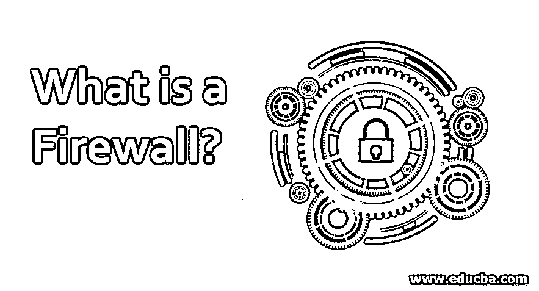
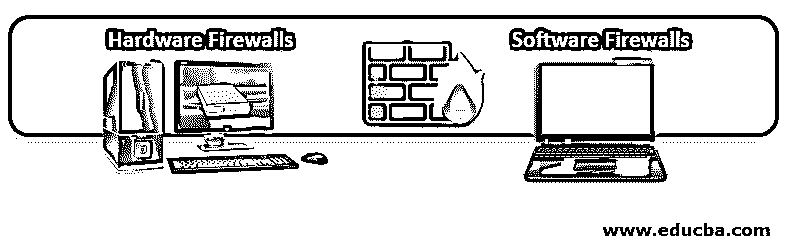

# 什么是防火墙？

> 原文：<https://www.educba.com/what-is-a-firewall/>

## 防火墙简介

它是一种计算机元件，试图阻止未经授权的用户访问连接到互联网的专用网络。因此，防火墙重点检查进出网络的每一条消息，以阻止不符合特定安全标准的消息进入网络，同时允许受管制的通信自由进入。为了阐明这个概念，我们将使用一个非常简单的比喻:防火墙对于一个[计算机网络](https://www.educba.com/what-is-computer-networks/)来说是一个房子的门。

这扇门阻止陌生人进入我们的家，就像防火墙阻止未经授权的用户进入私有网络一样。防火墙的功能非常重要，因为如果没有防火墙，计算机或计算机网络可能会频繁受到攻击和感染。一些反病毒公司还提供额外的防火墙保护，以改善防御系统，阻止恶意代码的进入和安装。

<small>网页开发、编程语言、软件测试&其他</small>

### 防火墙是如何工作的？

*   防火墙的主要功能是阻止外部互联网连接(通常称为 WAN)对我们的数据网络(LAN)的私有内部设备进行任何未经授权的访问。
*   它提供了一种过滤通过网络连接传递的信息的方法。
*   针对个人计算机的防火墙称为个人防火墙。
*   当企业网络中存在用于保护多台计算机的防火墙时，它被称为网络防火墙。
*   它根据规则允许或阻止团队之间的交流。
*   每个规则都定义了特定的网络流量模式和检测到时要执行的操作。这些可定制的规则提供了对网络使用的控制和流畅。
*   如果流量符合防火墙中配置的规则，流量可以进入或离开我们的网络。否则，流量将被阻塞，无法到达目的地。

### 可以在防火墙中实现的规则

可以在其中构建的规则和功能类型如下:

*   管理用户对专用网络服务(如服务器应用程序)的访问。
*   记录所有进出网络的尝试。进入和退出尝试存储在日志中。
*   根据数据包的来源、目的地和端口号过滤数据包。这就是所谓的地址过滤器。因此，使用地址过滤器，我们可以阻止或接受 IP 192.168.1.125 通过端口 22 访问我们的设备。还有一点，端口 22 通常是 SSH 服务器的端口。
*   过滤我们网络或个人电脑上的某些类型的流量。这种过滤也称为协议过滤。协议过滤器允许根据使用的协议接受或拒绝流量。可以使用的不同类型的协议有 HTTP、https、SSH、Telnet、TCP、UDP、FTP 等。
*   控制从同一点出现的连接数量，如果它们超过某个限制，就阻塞它们。这样，[就有可能避免一些拒绝服务攻击](https://www.educba.com/denial-of-service-attack/)。
*   控制可以访问互联网的应用程序。因此，我们可以将对 dropbox 等特定应用的访问权限限制在特定的用户组。
*   检测正在监听但原则上不应该监听的端口。因此，防火墙可以警告我们某个应用程序想要使用某个端口来等待传入的连接。

### 防火墙的类型

有以下两种类型的防火墙:

#### 1.硬件防火墙

*   正如我们在定义中看到的，有两种类型的防火墙。有硬件类型的设备，如思科类型或路由器有此功能。
*   在我们必须保护企业网络的情况下，硬件设备是一个极好的解决方案，因为该设备将保护网络中的所有计算机，并且我们还可以在同一个防火墙的单个点上执行整个配置。
*   除此之外，这些硬件防火墙还实现了一些有趣的功能，如 CFS、提供 SSL 或 VPN 技术、集成防病毒、反垃圾邮件、负载控制等。

#### 2.软件防火墙

*   软件类型是最常见的，也是家庭用户在家中使用的。
*   这些软件类型直接安装在我们想要保护的计算机或服务器上，并且只保护安装了这些软件的计算机或服务器。
*   软件防火墙通常提供的功能比以前的更有限，一旦安装，软件将消耗我们计算机的资源。

### 结论

虽然在这种情况下，配置良好的防火墙确实是非常稳定和非常必要的安全工具，但是，在任何情况下都不应该认为它是足够的。建议防火墙必须配备一个良好的最新防病毒软件。

### 推荐文章

这是一个什么是防火墙的指南？这里我们讨论防火墙的基本概念、工作原理、实施规则和类型。您也可以看看以下文章，了解更多信息–

1.  [什么是网状拓扑？](https://www.educba.com/what-is-mesh-topology/)
2.  [什么是 VLAN 网络？](https://www.educba.com/what-is-vlan-network/)
3.  [安卓 VPN 应用](https://www.educba.com/vpn-applications-for-android/)
4.  [防火墙 vs 防病毒](https://www.educba.com/firewall-vs-antivirus/)

