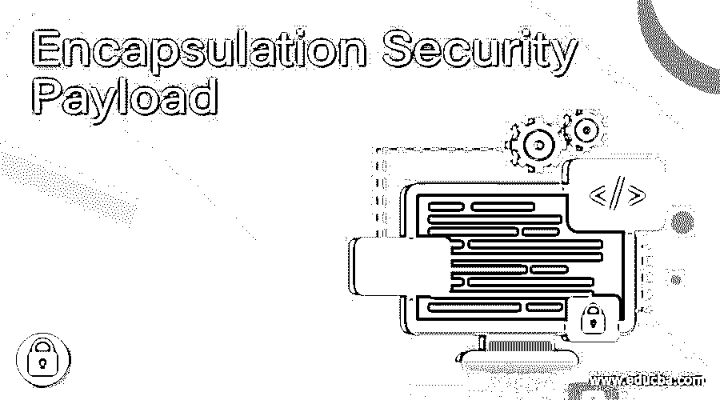

# 封装安全负载

> 原文：<https://www.educba.com/encapsulation-security-payload/>

## 封装安全负载介绍

封装安全负载是一种 IPsec 协议，它提供机密性和完整性功能。封装安全有效载荷协议还定义了要插入到 IP 分组中的新报头。ESP(封装安全有效载荷)处理还包括将受保护数据转换成其加密格式，即不可读格式。在正常情况下，封装的安全有效载荷将在 AH(认证报头)内。那意味着第一；加密过程发生在认证完成之后。ESP 基于对称密钥加密技术。ESP 可以单独使用，也可以与身份验证标头结合使用。在本主题中，我们将学习封装安全负载。

### 封装安全负载是如何工作的？

在收到 IPsec 处理的 IP 数据包时，接收器首先处理身份验证报头(如果存在)。基于输出结果，接收器识别分组的内容是正确的，即原始的，还是在传输期间被改变了。如果包的内容是原始的，接收器提取与封装的安全有效载荷相关联的密钥和算法，然后解密内容。

<small>网页开发、编程语言、软件测试&其他</small>

### 封装安全有效载荷分组

封装安全有效载荷分组包括七个字段，其中四个字段是固定长度的，三个字段是可变长度的。让我们逐一讨论这些领域。

1.  **SPI** :代表安全参数索引，由 32 位字段组成。它可以与源地址和目的地址以及用于唯一标识数据报所属流量的 SA(安全关联)的 IPsec 协议结合使用。
2.  **序列号**:32 位字段，用于防止重放攻击。
3.  **净荷数据**:包含传输层段或 IP 包的可变长度字段，受加密保护。
4.  **填充**:包含填充 s 位，如果有的话。这些由[加密算法](https://www.educba.com/encryption-algorithm/)使用，或者用于对齐填充长度字段，使其从 4 字节字内的第三个字节开始。
5.  **填充长度**:8 位字段，指定前一字段的填充字节数。
6.  **Next header**:8 位字段，用于标识净荷中封装数据的类型。例如，该字段中的值 6 表示有效负载包含 TCP 数据。
7.  **认证数据**:该字段是一个可变长度字段，包含图中称为 ICV(完整性检查值)的认证数据。这通过封装安全有效载荷分组的长度减去认证数据字段来计算。

### 操作模式

封装安全有效载荷有两种模式:传输模式和隧道模式。让我们逐一详细讨论。

#### 1.ESP 运输模式

封装安全有效负载的传输模式用于加密和验证 IP 承载的数据。这里，封装安全有效载荷被插入 IP 分组中，紧接在传输层头部之前，并且封装安全有效载荷尾部被添加在 IP 分组之后。如果还使用认证，则在封装安全尾部之后添加封装安全有效载荷认证数据字段。整个传输层数据段和封装的安全有效载荷尾部都被加密。整个密文连同封装的安全有效载荷报头一起被认证。

*   在发送方，包含 ESP 尾部和整个传输层数据段的数据块被加密，然后用相应的密文替换明文以形成 IP 数据包。如果选中，将附加身份验证。这个数据包现在可以传输了。
*   分组被路由到目的地地址。中间路由器需要查看 IP 报头和任何 IP 扩展报头，但不需要查看密文。
*   在接收端，检查 IP 头和任何纯文本 IP 扩展头。然后，对数据包的剩余部分进行解密，以检索原始的纯文本传输层数据段。

#### 2.ESP 隧道模式

封装安全有效负载的隧道模式用于加密整个 IP 数据包。这里，ESP 报头被固定到分组上，然后分组和 ESP 报尾被加密。IP 报头包含目的地址以及中间路由信息。因此，该分组不能按原样传输。否则，数据包的传送将是不可能的。因此，添加了一个新的数据包，其中包含足够的路由信息。

*   在发送方，发送方准备内部 IP 数据包，将目的地址作为内部目的地。该数据包预先固定有 ESP 报头，然后该数据包和 ESP 报尾被加密，然后添加认证数据。新的 IP 报头被添加在该块的开始处。这形成了外部 IP 包。
*   外部数据包被路由到目的防火墙。每个中间路由器需要检查和处理外部 IP 报头以及其他外部 IP 扩展报头。如果不需要知道密文。
*   目标防火墙处理外部 IP 报头和任何扩展报头，并在接收方站点从密文中恢复明文。然后，数据包被发送到实际的目的主机。

### 推荐文章

这是一个封装安全有效载荷的指南。这里我们讨论封装安全有效载荷及其工作和两种操作模式，即隧道模式和传输模式。您也可以看看以下文章，了解更多信息–

1.  [数据库安全](https://www.educba.com/database-security/)
2.  [嵌入式系统安全](https://www.educba.com/embedded-systems-security/)
3.  [C 语言中的封装](https://www.educba.com/encapsulation-in-c/)
4.  [PHP 中的封装](https://www.educba.com/encapsulation-in-php/)

