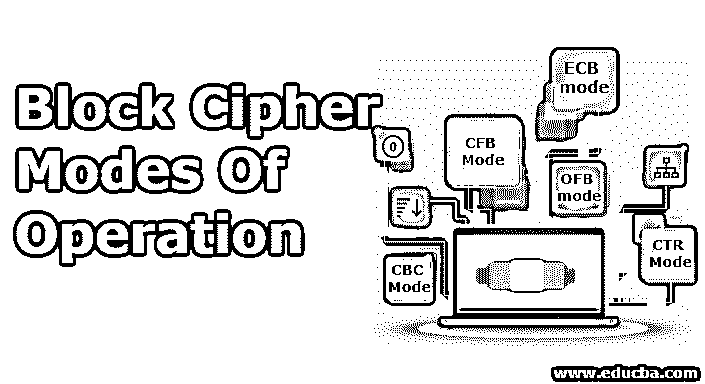
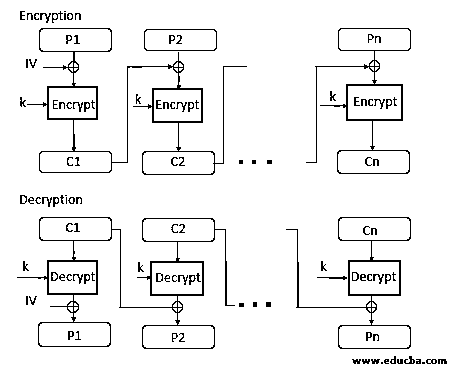
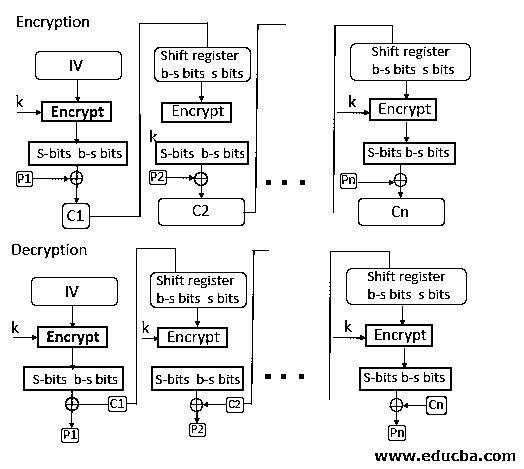
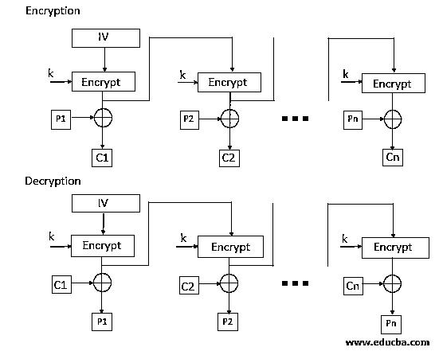
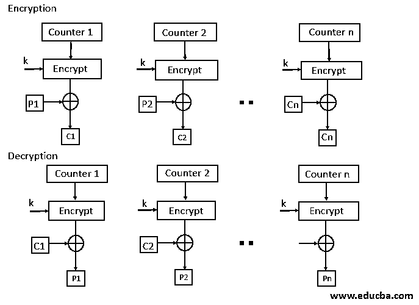

# 分组密码操作模式

> 原文：<https://www.educba.com/block-cipher-modes-of-operation/>

**

** 

## **介绍**到**分组密码模式**

在块密码模式中有五种类型的操作，ECB(电子代码块)模式、CBC(密码块链接)模式、CFB(密码反馈)模式、OFB(输出反馈)模式和 CTR(计数器)模式。其中 ECB 和 CBC 模式对分组密码起作用，而 CFB 和 OFB 模式对充当流密码的分组密码起作用。ECB 用于以不安全的方式传输单个值，CBC 用于加密文本认证块，CFB 用于传输加密数据流认证，OFB 用于传输加密数据流，CTR 用于传输面向块的应用。

### 分组密码操作模式

分组密码有 5 种操作模式。

<small>网页开发、编程语言、软件测试&其他</small>

#### 1.欧洲央行模式

*   ECB 模式代表电子代码块模式。这是最简单的操作模式之一。在这种模式下，明文被分成一个块，每个块是 64 位。然后每个块被单独加密。相同的密钥用于所有块的加密。每个块使用密钥加密，形成密文块。
*   在接收端，数据被分成一块，每块 64 位。用于加密的同一密钥用于解密。它接受 64 位密文，并使用密钥将密文转换成明文。
*   由于相同的密钥用于所有块的加密，如果明文块在原始消息中重复，则密文的相应块也将重复。与用于所有块的相同密钥一样，为了避免块的重复，ECB 模式仅用于较小的消息，其中纯文本块的重复较少。

#### 2.CBC 模式

*   CBC 模式代表发送方的密码块模式；纯文本被分成块。在这种模式下，使用 IV(初始化向量)，它可以是一个随机的文本块。IV 用于使每个块的密文唯一。
*   使用 XOR 运算将明文和 IV 的第一个块组合，然后使用密钥对结果消息进行加密，并形成密文的第一个块。第一个密文块用作第二个明文块的 IV。所有纯文本块都将遵循相同的过程。
*   在接收方，密文被分成块。使用用于加密的相同密钥来解密第一分组密文。解密后的结果将与 IV 进行 XOR 运算，形成第一个纯文本块。第二密文块也使用相同的密钥解密，解密的结果将与第一密文块进行异或运算，并形成第二明文块。相同的程序用于所有的块。
*   CBC 模式确保如果明文块在原始消息中重复出现，它将为相应的块生成不同的密文。
    注意，CBC 模式中使用的密钥是相同的；只有 IV 不同，它是在一个起点初始化的。

#### 3.CFB 模式

*   CFB 模式代表密码反馈模式。在这种模式下，数据以单元的形式加密，其中每个单元为 8 位。
*   像密码块链接模式一样，IV 被初始化。IV 保存在移位寄存器中。使用密钥对其进行加密，并形成密文。
*   现在，加密 IV 最左边的 j 位与明文的前 j 位进行异或运算。这个过程将形成密文的第一部分，并且这个密文将被传送给接收者。
*   现在 IV 的位左移 j 位。因此，移位寄存器最右边的 j 位置现在具有不可预测的数据。这些最右边的 j 位置现在与密文一起归档。将对所有纯文本单元重复该过程。

#### 4.OFB 模式

*   OFB 模式代表输出反馈模式。OFB 模式类似于 CDB 模式；唯一的区别是在 CFB，密文用于加密过程的下一阶段[，而在 OFB，IV 加密的输出用于加密过程的下一阶段。](https://www.educba.com/encryption-process/)
*   使用密钥对 IV 进行加密，并形成加密的 IV。使用 XOR 将明文和加密 IV 最左边的 8 位组合在一起，生成密文。
*   对于下一阶段，密文，即前一阶段的形式，被用作下一次迭代的 IV。所有程序块都遵循相同的程序。

#### 5.CTR 模式

*   CTR 模式代表计数器模式。因为名字是 counter，所以它使用数字序列作为算法的输入。当块被加密时，使用下一个计数器值来填充下一个寄存器。
    注意:计数器值将增加 1。
*   对于加密，使用密钥对第一个计数器进行加密，然后将明文与加密结果进行异或运算以形成密文。
*   对于下一阶段，计数器将增加 1，并且对于所有块将遵循相同的过程。对于解密，将使用相同的序列。这里要将密文转换成明文，每个密文都要与加密的计数器进行异或运算。对于下一阶段，计数器将递增，并且将对所有密文块重复相同的操作。
    

    

### 推荐文章

这是分组密码操作模式的指南。这里，我们已经详细了解了分组密码的操作模式及其加密和解密过程。您也可以看看以下文章，了解更多信息–

1.  [密码类型](https://www.educba.com/types-of-cipher/)
2.  [对称算法](https://www.educba.com/symmetric-algorithms/)
3.  [密码技术](https://www.educba.com/cryptography-techniques/)
4.  [加密算法](https://www.educba.com/encryption-algorithm/)

