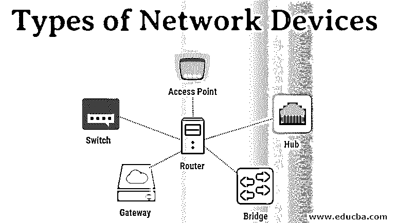

# 网络设备的类型

> 原文：<https://www.educba.com/types-of-network-devices/>

## 网络设备类型介绍

在这篇文章中，我们将讨论不同类型的网络设备，但首先，我们要知道什么是网络设备。网络设备被称为将计算机、打印机、传真机和其他电子设备连接到网络的硬件设备。这种设备可以轻松、安全、正确地通过一个或其他网络传输数据。网络间或网络内设备可能是可用的。一些设备(如网卡或 RJ45 连接器)安装在设备上，而其他设备则是网络组件(如路由器、交换机等)。让我们更仔细地看看这些手机。调制解调器是一种可以通过电话或电缆从计算机发送和接收数据的系统。

存储在设备上的数据是数字的，而电话线或电缆线只能传输模拟数据。数字信号被转换成模拟信号，反之亦然，这在调制解调器中很重要。调制器将数字数据转换成模拟数据。当处理器发送数据时，解调器会将数据转换成数字数据。

<small>网页开发、编程语言、软件测试&其他</small>

### 不同类型的网络设备

让我们看看不同类型的网络设备及其工作原理。

#### 1.存取点

虽然有线或无线链路在 AP 中是技术性的，但它通常指的是无线设备。AP 在 OSI 的第二层[数据链路层](https://www.educba.com/data-link-layer-osi-model/)上运行，它既可以充当将标准无线网络连接到无线设备的网桥，也可以充当将数据传输到另一个接入点的路由器。无线连接点(WAP)是一种用于生成无线局域网(WLAN)发射器和接收器的设备。接入点通常是具有集成天线、发射器和适配器的独立网络机器。

为了在 WLAN 和有线以太网 LAN 之间提供链接，AP 正在使用无线基础设施网络模式。它们有几个端口，允许您扩展网络以支持其他客户。一个或多个接入点可能需要完全覆盖，这取决于网络的规模。APs 还可以提供多个端口，用于增加网络规模、防火墙功能和 DHCP。因此，我们有了基于交换机的接入点、DHCP 服务器、防火墙和路由器。

#### 2.路由器

路由器通过监控与[不同网络拓扑](https://www.educba.com/types-of-network-topology/)互连的网络设备的海洋，允许数据包被传输到目的地。路由器是智能设备，在它们所连接的网络上存储数据。大多数路由器可以调整为包过滤的防火墙，并且可以使用 ACL。路由器还与网络控制单元/数据服务单元(CSU / DSU)一起用于从 LAN 到 WAN 成帧的转换。这种路由器被称为边界路由器。

路由器是你的第一道防线，只有网络管理员批准的流量才需要通过。路由器是你的第一道防线，只有网络管理员批准的流量才需要通过。

#### 3.中心

集线器连接各种网络设备。网络还具有放大功能，可以放大长距离传输后在电缆上衰减的信号。集线器是网络通信系统家族中最简单的，集线器是最简单的，因为它用相同的协议连接局域网的各个部件。只要服务器的配置为格式化输入数据做好了准备，服务器就可以使用数字或模拟数据。集线器不处理或寻址数据包；它们只向所有连接的设备发送数据包。我们发送数据包。集线器在开放系统互连(OSI)物理层上运行。存在两种类型的集线器:简单集线器和多重集线器。

有两种类型的集线器:

1.  活动集线器
2.  无源集线器

**主动集线器:**这些集线器可以通过其电源与网络一起清理、提升和分发信号。它既是中继器，又是电缆集线器。节点之间的总距离可以增加。

**被动集线器:**这些是从主动网络节点收集电缆和电力的集线器。这些集线器将信号中继到电网，没有经过清洗和改进，也不能增加节点之间的距离。

#### 4.桥

网桥连接两个或多个主机或网段。网桥处理和各种网桥链路之间的帧传输是网络架构中的关键角色。对于图像传输，您使用媒体访问控制(MAC)硬件。网桥可以通过查看连接到每条线路的设备的 MAC 地址来传输数据或阻止交叉。也可以用网桥将两个物理局域网与一个更宽的理论局域网连接起来。网桥只在 OSI 物理层和数据链路层工作。[网桥用于](https://www.educba.com/what-is-bridge/)通过物理网络的两个网段之间的放置和两者之间的数据流管理，将大型网络划分为较小的部分。

网桥在许多方面像集线器，像将局域网组件链接到相同的协议。然而，被称为帧的网桥在传输之前将传入的数据包过滤到地址。当网桥在动态网桥表的帮助下过滤数据分组时，它不修改输入数据的格式或内容；网桥在网络中过滤和转发帧。最初为空的网桥表保存了每台局域网计算机的局域网地址和将局域网连接到其他局域网的每个网桥接口的地址。

#### 5.门

OSI 模型的传输层和会话层通常在网关中工作。在传输层和更高层，有许多针对不同供应商的指导方针和规范；网关管理这些。网络技术之间的连接，如 OSI 和传输控制协议/互联网协议，[如 TCP / IP，](https://www.educba.com/what-is-tcp-ip/)由网关支持。因此，网关链接两个或多个具有自己的算法、协议、拓扑、域名系统和策略以及网络管理的自含式网络。网关处理所有的路由功能等等。事实上，增加一个转换路由器就是一个网关。协议转换器被称为在不同网络技术之间进行转换的功能。

#### 6.转换

总的来说，交换机比集线器更聪明。交换机提高了网络的容量。交换机保留内部网络中路由节点的有限信息，并提供到集线器或路由器等系统的链接。通常局域网海滩是由交换机连接的。交换机通常会读取输入数据包的硬件地址，将它们传送到各自的目的地。由于数字电路的灵活性，交换机比集线器或路由器更能提高网络的效率。由于网络控制使数字电路更容易研究，开关也提高了网络保护。

你可以把交换机看作是一个结合了一些最好的路由器和集线器的系统。交换机可以在接口数据链路或 OSI 模型的网络层上运行。多层交换机可以在两层都工作，因此交换机和路由器都可以工作。采用与路由器相同的路由过程的高性能交换机是多层交换机。DDoS 可能攻击交换机；泛洪控制可用于防止恶意流量阻止交换机。交换机端口的保护对于确保停用所有未使用的端口至关重要，并且使用 DHCP、ARP 和 MAC 地址过滤来确保稳定的交换机。

#### 7.调制解调器

使用调制解调器(调制器解调器)通过模拟电话线传输数字信号。调制解调器将数字信号转换成各种频率的模拟信号，并将它们传输到接收机处的调制解调器。接收调制解调器转向另一个方向，向连接到调制解调器的设备(通常是计算机)提供数字输出。大多数情况下，数字数据通过 RS-232 标准接口与串行线路调制解调器进行双向传输。大多数有线电视运营商使用调制解调器作为最终终端来定位和记住他们的家和个人客户，许多电话公司提供 DSL 服务。所有物理层和数据链路层都在调制解调器上运行。

#### 8.布鲁特尔

桥接路由器也是结合了网桥和路由器功能的设备。它可以用于数据连接层或网络层。它可以作为路由器在网络间路由数据包，充当网桥，并在本地过滤网络流量。

### 结论

因此，在本文中，我们看到了不同类型的网络设备。凭借对网络设备类型的扎实知识，您可以开发和构建一个对您的公司有益的安全网络。尽管如此，您需要仔细监控网络设备及其周围的行为，以确保网络的持续安全性和可靠性，从而快速识别硬件问题、配置问题和攻击。

### 推荐文章

这是网络设备类型的指南。这里我们讨论了网络设备的基本概念和不同类型:接入点、路由器、集线器和网桥等。您也可以浏览我们推荐的其他文章，了解更多信息——

1.  [网络协议的类型](https://www.educba.com/types-of-networking-protocols/)
2.  [防火墙设备](https://www.educba.com/firewall-devices/)
3.  [什么是路由器？](https://www.educba.com/what-is-router/)
4.  [调制解调器 vs 路由器](https://www.educba.com/modem-vs-router/)

