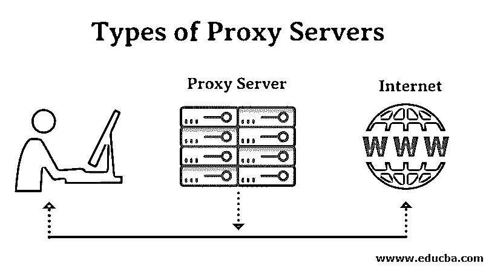
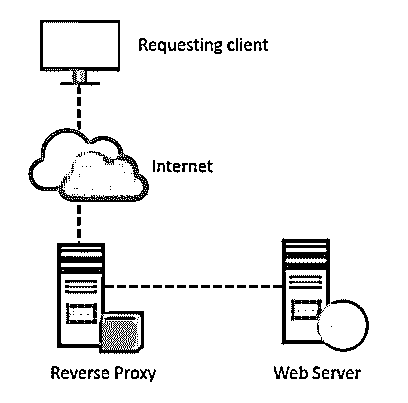

# 代理服务器的类型

> 原文：<https://www.educba.com/types-of-proxy-servers/>

## 代理服务器简介

代理服务器是指那些充当客户端向特定服务器请求某些服务或请求某些资源的中介的服务器。有几种类型的代理服务器可用，它们的使用将取决于客户端向服务器发出的请求的目的。代理服务器的目的是保护互联网客户端与互联网和互联网资源的直接连接:代理服务器防止在向任何其他服务器发出任何请求时识别客户端的 IP 地址。

*   **互联网客户端和内部资源:**代理服务器还充当内部网络的屏障，阻止来自客户端的访问该服务器上的数据的请求。从该服务器访问数据时，节点的原始 IP 地址保持隐藏。
*   **保护真实的主机身份:**传出流量似乎来自代理服务器。必须针对特定应用进行配置，例如 HTTPS 或 FTP。

<small>网页开发、编程语言、软件测试&其他</small>

例如，作为跨国公司的客户，客户可以使用代理来观察其合同员工的流量，以便高效地完成工作。它还可以用来检查内部高度机密数据的任何泄漏。一些人也可以用它来提高他们的网站排名，并匿名转移流量。

### 对私人代理的需求

下面提到了对私有代理的一些需求:

#### 击败黑客

每个组织都有自己需要防止恶意使用的个人数据。因此，使用了密码，并设置了不同的架构师，但是如果 IP 地址很容易访问，这些信息仍有可能被黑客攻击。设置代理服务器是为了防止跟踪原始 IP 地址；相反，数据显示来自不同的 IP 地址。

#### 内容过滤

代理服务器还有助于过滤掉不符合 web 应用程序策略或服务器要求的内容。它提供了对用户进行身份验证的工具，并提供了通过代理发出的用户请求的 URL 日志。

#### 内容可以缓存。

代理还有助于缓存网站的内容。这有助于快速访问经常访问的数据。

#### 检查数据包报头和有效负载

我们还可以检查内部服务器请求中节点的有效载荷和数据包报头，以便可以轻松跟踪和限制对社交网站的任何访问。

### 代理服务器的类型

以下是不同类型的代理服务器:

#### 1.反向代理

这代表服务器。如果在不同的服务器上有多个网站，那么反向代理服务器的工作就是监听客户端的请求并重定向到特定的 web 服务器。
示例–监听 TCP 端口 80 网站连接。这些通常放置在 DMZ 区域中，用于公共可访问的服务，并保护主机的真实身份。这对外部用户是透明的，因为外部用户将无法识别内部服务器的实际数量。反向代理的职责是根据内部服务器的配置重定向流。通过受防火墙保护的专用网络的请求需要一个不遵守任何本地策略的代理服务器。来自客户端的这种类型的请求使用反向代理服务器来完成。这也用于限制客户端对特定服务器上的敏感数据的访问。

#### 2.Web 代理服务器

这种类型的代理转发 HTTP 请求。此请求与 HTTP 请求相同；只传递 URL 而不是路径。代理服务器响应发送的请求。这种代理的例子有 Apache、HAPProxy。

客户机-服务器代理自动配置协议解决了多个代理服务器的问题。

#### 3.匿名代理

这是一种不生成原始 IP 地址的代理服务器。尽管这些服务器是可检测的，但仍然向客户端设备提供合理的匿名。

#### 4.高匿名代理

此代理服务器不允许检测原始 IP 地址，任何人都无法将其检测为代理服务器。

#### 5.透明代理

这种类型的代理服务器从不向客户端提供任何匿名性；相反，使用这个代理可以很容易地检测到原始 IP 地址。尽管如此，它仍被用作网站的缓存。

与网关结合的透明代理产生了一个代理服务器，其中客户端 IP 的连接请求被重定向。这种重定向不需要配置客户端 IP 地址。这种重定向很容易被服务器端的 HTTP 头检测到。

这些也称为拦截代理、内嵌代理和伪造代理。

**工作:**它在网络层拦截通信，无需任何配置。它还充当网关或路由器，对通信进行身份验证，而不对通过服务器的请求或响应进行任何更改。

**用途:**这些类型的代理最常用于业务层面，以加强通信策略。它还试图防止对 TCP 服务器的任何攻击，例如拒绝服务攻击。

#### 6.CGI 代理

开发这种类型的代理是为了让网站更容易访问。

**工作:**它使用一个 web 表单接受指向 URL 的请求，处理它并将结果返回给 web 浏览器。由于 VPN 和其他隐私政策，它不太受欢迎，但这些天它仍然收到许多请求。它的使用减少了，因为通过本地过滤后会给网站带来过多的流量，从而对组织造成间接损害。

#### 7.后缀代理

这种类型的代理服务器将代理的名称附加到已向代理请求的内容的 URL 上。这种类型的代理不能保持较高的匿名性。

**用途:**用于绕过网络过滤器。这个代理很容易使用，也很容易实现，但是由于越来越多的网络过滤器，它的使用越来越少。

#### 8.扭曲代理

一旦被检测为代理服务器，代理服务器可能会生成不正确的客户端原始 IP 地址。它使用 HTTP 头来维护客户端 IP 地址的机密性。

#### 9.TOR 洋葱代理

它是一种旨在对用户个人信息进行在线匿名的软件。

**工作**:它通过世界范围内的各种网络路由流量，使跟踪用户地址和防止任何匿名活动的攻击变得困难。这使得任何执行流量分析的人都难以跟踪原始地址。为此，它使用洋葱路由。

在这种类型的路由中，信息被逐层多重加密以防止被窃取。在目的地，每一层都被解密，以防止信息被扰乱或扭曲。

这个软件是开源的，并且免费使用。

#### 10.I2P 匿名代理

这是 Tor onion 代理的匿名网络增强版本，它使用[加密](https://www.educba.com/what-is-encryption/)来隐藏各个级别的所有通信。然后，这些加密数据通过位于不同位置的各种网络路由器进行中继。因此，I2P 是一个旨在实现在线匿名的完全分布式代理。它还实现了大蒜路由。(Tor 的 pnion 路由增强版。它提供了所有协议的代理。这种类型的代理可以在节点上运行。

I2P 路由器寻找其他对等体来建立匿名身份，以保护用户的个人信息。

这个软件和网络是免费的，开源使用；它也抵制审查。

#### 11.DNS 代理

与其他代理不同，这种类型的代理以 DNS 查询的形式接收请求，并将它们转发到域服务器，在那里也可以缓存这些请求，并且还可以重定向请求流。

### 代理服务器的类型(协议)

以下是不同类型的代理服务器协议:

1.  **Socks 代理服务器:**这种类型的代理服务器提供到特定服务器的连接。根据 Socks 协议，这种类型的服务器允许各种数据类型(如 TCS 或 UDP)的多层化。
2.  **FTP 代理服务器:**这种类型的代理服务器缓存 FTP 请求的流量，并使用中继的概念。
3.  **HTTP 代理服务器** **:** 开发这个代理是为了使用 HTTP 协议处理对网页的单向请求。
4.  SSL 代理服务器:这种类型的服务器是利用 SOCKS 代理协议中使用的 TCP 中继概念开发的，以允许网页请求。

### 结论

代理服务器有助于不同级别所需的各种匿名类型，无论是作为客户还是作为服务提供商。它有助于抵御各种用户以及内部网络的信息安全。不同类型的代理是可用的，它们遵循不同的[路由](https://www.educba.com/what-is-routing/)协议，并在不同的匿名级别上服务于不同的用途。

代理是允许使用各种类型的代理服务器对用于联网的任何类型的软件进行改编的客户端程序。

### 推荐文章

这是代理服务器类型的指南。这里我们详细讨论了代理服务器的基本概念、需求、类型和各种协议。您也可以浏览我们推荐的其他文章，了解更多信息——

1.  [TCP/IP 模型](https://www.educba.com/tcp-ip-model/)
2.  [SOAP vs HTTP](https://www.educba.com/soap-vs-http/)
3.  [什么是 TCP/IP？](https://www.educba.com/what-is-tcp-ip/)
4.  [Linux 代理服务器](https://www.educba.com/linux-proxy-server/)

