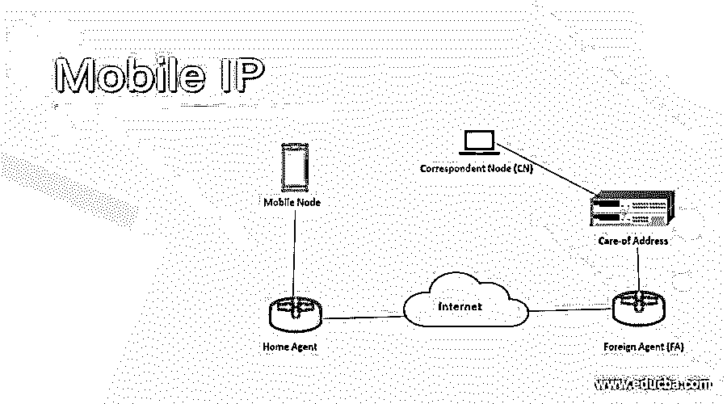
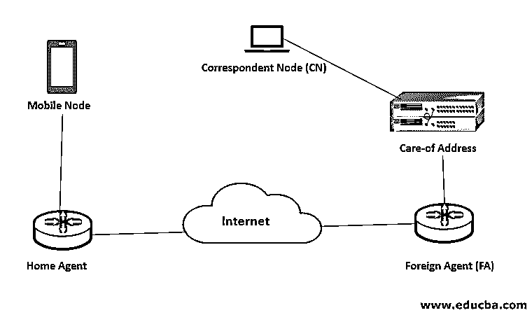

# 移动 IP

> 原文：<https://www.educba.com/mobile-ip/>

## 移动 IP 简介

移动 IP 是个好东西，当你了解它的时候，你会惊讶于它的重要性和好处。那么就从“移动 ip”开始我们的友谊吧。移动+ IP，这两个词合在一起是今天移动网络的福音，没有它，我们甚至无法想象手机的使用和其中的数据传输。让我们知道如何:

移动，简单来说，大家都知道，就是能够自由移动或者便携。例如，“移动床”是指可以折叠并自由携带的床，即活动床。无论你把床带到哪里，它的形状和大小都不会改变。你把床放在包里&你去旅行。同样，“移动 IP”本身也有它的含义——一个可以随身携带的 IP，即一个可移动或便携的 IP，无论您在哪里漫游，其 IP 都保持不变，保持所有其他内容不变，如您的连接信息、身份信息等。

<small>网页开发、编程语言、软件测试&其他</small>

就像你的便携式床放在你的包里一样，你的 IP 就放在你的手机或任何连接到互联网或内联网的数字设备里。不变的恒定 IP 是移动 IP 的核心含义，IP 是如此忠实，即使你在网络中旅行或改变网络，它仍保持原样。好了，现在让我们从一些调查问卷开始，你肯定会爱上你的不为人知的老朋友，移动 IP，因为它给了你巨大的帮助，它已经给了你很长一段时间。

*   你的电影在旅行中会停止缓冲吗？你的位置会从一个城市到另一个城市发生变化吗？
*   你有没有注意到，不只是你在旅行，你的手机也在旅行，但它从来不会说，“哎呀？我的连接丢失了&我脱离了网络 L！!! "
*   当你在火车上或公共汽车上与你的朋友或兄弟姐妹通话时，你的电话会断线吗？

99%的情况下，第一和第三个问题的答案肯定是否定的。移动 IP，我们的连接救星。这就是移动 IP 的好处，它可以帮助您始终保持与网络的连接。让我们多了解一点我们的好伙伴，他默默地帮助我们，甚至不告诉我们。

### 移动 IP 的组件

以下是以下移动 IP 中包含的一些重要组件:

#### **1。**移动节点

您的设备，如笔记本电脑、手机、i-pad 等。

#### 2.家乡代理

它是您的移动设备所连接的路由器，位于您的家庭网络中

#### 3.外国代理人

*   [您的移动设备所连接的路由器](https://www.educba.com/what-is-router/)。
*   当您离开家庭网络时，您的设备使用此代理向 HA(家庭代理)发送数据或从 HA 接收数据。
*   将您注册为外国网络中的外国人，类似于当您进入一个新的国家时，您被外国(作为新来者)以及您的居住国(作为外国的游客，保存您要去的地方和原因的所有详细信息)注册。

#### 4.转交地址

*   当您将移动设备带出其家庭网络(MyHN)并进入一个新的网络区域时，您的设备会被分配一个 CoA，即转交地址，它会告诉您的家庭网络您的当前位置以及您属于“MyHN”家庭。
*   通常是外地代理的 IP。
*   例如，当你想去外国时，你需要告诉签证办公室和大使馆你所有的转交细节，即你的祖国和一切的细节。在您到达国外后，他们会将您已到达的所有详细信息发送到您的祖国，例如，您的 ID 是 ID-001，因此该 ID 是您的转交地址。

#### 5.通信节点

*   它是您的设备所对应的节点(web 服务器)。
*   它与您的设备进行通信。

### 移动 IP 的工作原理

它包括 3 个阶段，详细解释如下:

#### 1.代理发现

*   每当你进入一个网络，你的设备需要知道它是在哪个网络，家庭网络还是外地网络？
*   为此，本地代理(HA)和外地代理(FA)会广告其服务，以便您的设备可以看到这些广告，并发现它位于哪个网络区域。
*   您的移动节点，即您的设备确定其当前的连接点；如果失败，它自己会尝试向代理(HA / FA)发送消息以发送它们的广告。

#### 2.登记

*   当您的设备进入外部网络时，就会发生这种情况。
*   您的设备通过经由外地代理或直接经由并置转交地址(CCoA)向其归属路由器/代理发送其转交地址来注册自己，并置转交地址是分配给它的临时 IP 地址。
*   然后，家用路由器通过 FA 将响应发送到您的设备，或者直接发送到 CCoA，以便数据包可以来回传送。
*   该请求被认证，并且具有注册时间到期，在此之前该设备必须注册其当前位置。
*   太好了！您将被添加到他们的访问者列表中。
*   注册成功并通过认证后，外地代理和本地代理会将您的设备添加到他们的访问者列表中。

#### 3.开挖隧道

*   隧道是从 HA 到 FA 的安全路径，可确保数据包成功传送到您的设备。
*   您的设备使用其家庭 IP 地址发送数据包，但显示它始终在家庭网络中。
*   当外部代理从设备接收到分组时，通过使外部代理将分组发送回归属代理的反向隧道来解决分组的丢弃。

### 利益

1.  始终保持连接和在线(99%的效率)
2.  无论何时何地，它都能让您无缝连接到网络。
3.  没有地理障碍。
4.  无需修改您设备的家庭 IP 地址
5.  永远感到安全；您的移动节点可以被跟踪，而无需更改 IP 地址。
6.  自动切换并注册到一个新的网络区域。你一定注意到了，当你进入一个新城市时，你的移动网络会自动“欢迎”你；这就是移动 IP 的力量。

### 推荐文章

这是一本移动 IP 指南。在这里，我们讨论了移动 IP 的基本概念和组件，以及工作原理及其优势。您也可以浏览我们推荐的其他文章，了解更多信息——

1.  [手机应用开发工具](https://www.educba.com/mobile-app-design-software/)
2.  [什么是 IPv6？](https://www.educba.com/what-is-ipv6/)
3.  [手机 SEO](https://www.educba.com/mobile-seo/)
4.  [网络安全原则](https://www.educba.com/cyber-security-principles/)

