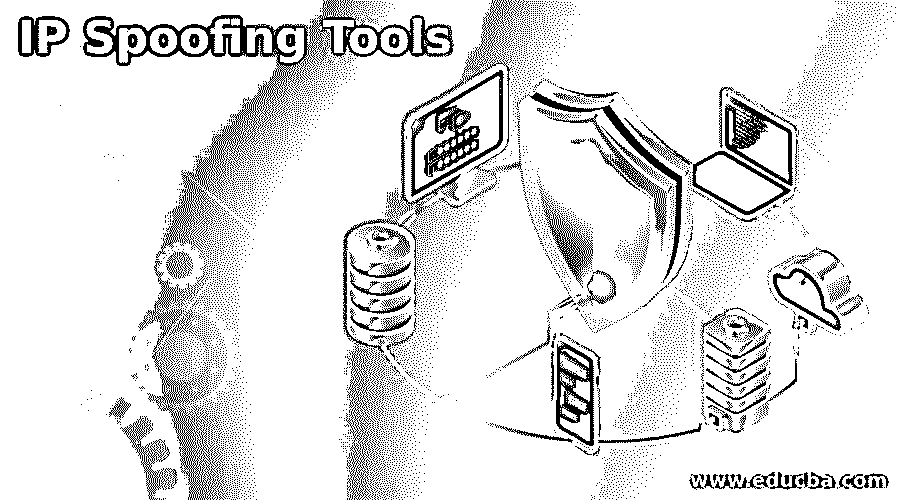

# IP 欺骗工具

> 原文：<https://www.educba.com/ip-spoofing-tools/>

## IP 欺骗工具简介

IP 欺骗是用虚假的源 IP 地址创建 IP(互联网协议)数据包来冒充另一个计算系统的过程。它包括使用受信任的 IP 地址，网络入侵者可以用它来克服网络安全措施，如基于 IP 地址的身份验证。当机器之间存在信任关系时，这种类型的攻击最为有效。IP 欺骗并不总是用于恶意目的。相反，各种工具被用来创建虚假的 IP 地址，这些工具被称为 IP 欺骗工具。

### IP 欺骗工具列表

以下是 IP 欺骗工具的列表:

<small>网页开发、编程语言、软件测试&其他</small>

#### 1.网络指挥官

Net commander 是一款 IP 欺骗工具，用于控制和管理 trip lite B070 和 B072 系列 net commander IP KVM 交换机以及与之相连的服务器、UPS 系统、计算机和环境传感器。它提供了连接到 KVM 交换机的所有服务器的单一集中列表。它允许将固件升级等推送配置同时升级到多个 KVM。此外，net commander 允许访问远程 KVM 会话。

#### 2.辛纳

另一个 IP 欺骗工具是 synner。这是一个定制的数据包生成器工具，用于测试防火墙和 DOS 攻击。它能够快速发送大量预先构建的 tcp 数据包。这些 tcp 数据包包括 MAC、tcp 标志、用户定义的 IP、有效载荷设置、窗口大小。在 synner 的帮助下，用户可以勾画出定制的分布和关系。Synner 还通过可视化生成数据的预览，对每个用户交互提供即时反馈。它允许用户生成逼真的数据。

#### 3.法凯内 bios

Fakenetbios 是一个 IP 欺骗工具，旨在模拟局域网上的 windows 主机。它分为两种类型法克内 bios DGM 和法克内 bios NS。两者都是独立的工具。Fakenetbios DGN 在 UDP 138 端口发送 netbios 图表服务数据包，并模拟 windows 主机广播。它定期通过网络发送 Netbios 公告来模拟 windows 计算机，并欺骗在局域网上运行的计算机浏览器服务。Fakenetbios Ns 是一个监听端口 137 的 netbios 名称服务守护程序。它像真正的 windows 计算机一样响应 Netbios 名称请求。

#### 4.nbnspoof

nbnspoof 是一个 IP 欺骗工具，它可以自动创建响应 Netbios 名称服务名称查询。当 windows 计算机无法通过 WINS 和 DNS 解析域名时，nbnspoof 会发送 Netbios 名称服务器查询，并查找有问题的名称是否与任何本地网络上的任何计算机名称相匹配。当受害者错误键入域名或 DNS 服务器无法到达时，精心制作对这些请求的响应对攻击者非常有用。Nbnspoof 工具旨在演示这种类型的攻击。它也有助于说明如何开发小型网络安全工具。

#### 5.Dns 欺骗

Dns 欺骗是另一个 IP 欺骗工具，它被设计用来接收来自其他主机的 dns 查询。来恶搞。一个选定的域名，首先我们需要激活 arp 欺骗或者 dhcp6 欺骗模块。要在后台启动 dns 欺骗，它使用以下命令–DNS . spoof on。同样，要在后台结束 dns 欺骗，它使用以下命令–DNS . spoof off。它使用各种参数，如域、地址、all 和主机。域定义域名的值来欺骗。address 定义映射域的 IP 地址。如果主机不为空，则使用主机文件将域映射到 IP 地址。所有参数用于验证；如果为真，则模块将回复每个 DNS 请求；如果为假，则模块将仅回复目标本地 PC。

#### 6.rbndr

另一个 IP 欺骗工具是 rbndr。这是一个简单的、非确认的名称服务器工具，用于测试软件是否存在 DNS 重新绑定漏洞。它通过随机选择主机名中指定的一个地址来发送对查询的响应，并将其作为答案返回。Rbndr 是测试易受攻击软件的简单方法，无需更改或设置服务器。如果软件仅将结果与主机名相关联，而不是与主机名和 IP 地址相关联，则您可以访问任何 IP 地址。

### 结论

在本文中，我们已经了解了 IP 欺骗的基本概念以及可以用来创建虚假 IP 地址的各种方法。比如 net commander、synner、fakenetbios、nbnspoof、dns spoof、rbndr 都是 IP 欺骗工具。

### 推荐文章

这是一个 IP 欺骗工具的指南。为了更好地理解，我们在这里讨论 IP 欺骗工具的介绍和列表。您也可以看看以下文章，了解更多信息–

1.  [Kali Linux 工具列表](https://www.educba.com/kali-linux-tools-list/)
2.  [VMware 工具](https://www.educba.com/vmware-tools/)
3.  [Java 测试工具](https://www.educba.com/java-testing-tools/)
4.  [手动测试工具](https://www.educba.com/manual-testing-tools/)

