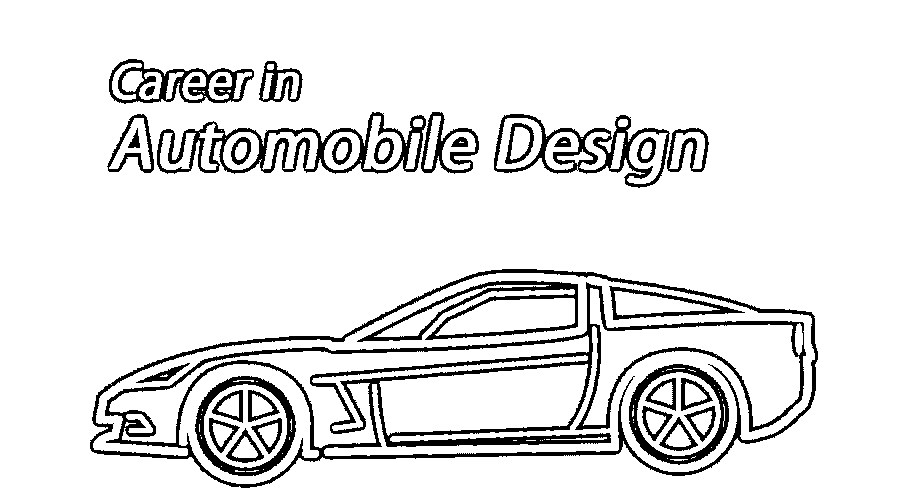

# 汽车设计职业

> 原文：<https://www.educba.com/career-in-automobile-design/>

## 汽车设计职业介绍

汽车设计师是为汽车创造新的[设计并改进其结构和功能的工程师。这样做时，他们必须牢记车辆的安全性，并在给定的参数下运行。他们只是负责制造吸引顾客的美观舒适的汽车。](https://www.educba.com/design-pattern-interview-questions/)

在这个话题中，我们将学习汽车设计职业。当你搜索“汽车”这个词的时候，你得到的结果是“一辆车”，它对你来说突然变得简单了。我们都见过汽车，我们中的许多人可能拥有一辆。但当你深入其中，你会听到许多术语，如内燃机、悬挂、推进系统等。，这就变得棘手了。汽车并不像它所表达的那样简单；这是复杂的机器。许多内部系统一起使用。为了制造一辆汽车，雇佣了一组技术高超的合格专业人员。设计者是生产车辆的专业人员之一。从某种意义上说，他们是汽车生产的发起人。

<small>3D 动画、建模、仿真、游戏开发&其他</small>

### 汽车设计师的角色和责任

*   使用图纸、模型和原型绘制汽车零件、总成和系统的设计草图。
*   主要致力于改善车辆的视觉外观。
*   汽车设计师从事三个领域中的一个:内部设计，外部设计或颜色，以及装饰设计。
*   必须对车辆中使用的液压、电气和机械系统有详细的了解。
*   使用计算机辅助设计软件准备带有形状和颜色细节的设计。
*   应了解客户的全部要求，并广泛研究设计及其产品的用途。

### 汽车设计的职业道路

汽车工程需要创造力。一个人应该对汽车有真正的兴趣和热情。他们应该有远见和跳出框框的能力。

*   汽车设计是一个竞争非常激烈的领域；找初级工作时，高学历是很有用的。当申请成为一名汽车设计师时，一个人必须至少拥有工业设计学士学位。
*   与汽车公司有着密切关系的专业学校和拥有设计课程的老牌大学都是很好的选择。
*   大多数课程侧重于设计车辆，车辆的功能和动力。所以仔细选择学校和他们提供的课程是至关重要的。
*   除了拥有大学学位，获得与车辆相关的工作经验也很重要。如果可能的话，花些时间去汽车商店看看汽车是如何组装和运行的。实习肯定有助于增长知识，激发制造汽车的热情。不仅仅是知识，一个人可以在实习期间留下印象，这可能对他们以后的就业过程有用。
*   一些设计师选择攻读硕士学位，以获得更高的报酬。由于竞争激烈，高水平的学位有利于找工作。
*   学习一门不同的语言将是有利的，也是你投资组合的一个附加部分，因为许多汽车行业位于世界的不同地方。

### 汽车设计职业的工作岗位或应用领域

一般来说，汽车设计师在汽车的整个设计过程中都与造型团队合作。

在初级阶段，汽车设计师的工作是室内设计师或室外设计师。室内设计师的主要关注点是让车内尽可能的舒适和实用。外部设计师画出汽车外部结构的样子，然后将这些设计转换成数字形式。然后他们塑造他们的三维结构。

随着他们职业生涯的进展，他们可以晋升到首席设计师，经理，原型工程师的职位。

### 薪水

美国劳工统计局(BLS)提交的一份报告没有具体说明准确的工资。尽管如此，它表示，2017 年 5 月工业设计师的中值年薪仅为 65，000 美元多一点。设计师的工资可能会根据不同的参数而变化，如经验、雇主和地点。

### 建立汽车设计职业所需的教育

*   要想找到一份汽车设计师的工作，至少要有工业设计的学士学位。
*   一些先前的经验在投资组合中看起来总是不错的。
*   良好的数学知识和对计算机辅助设计(CAD)软件的良好理解有助于就业。

### 汽车设计职业所需的技能

*   要成为一名有成就的设计师，你必须在视觉上有创造力，有良好的想象力，能跳出框框思考。
*   良好的沟通技巧对于将你的想法传达给客户和你的上司并理解他们的要求是必要的。
*   良好的研究技能和高水平的分析能力。
*   可用于解决问题的创新方法。
*   良好的商业意识和在紧张的时间表下工作的能力。

### 汽车设计职业观

美国劳工统计局表示，从 2015 年到 2025 年，汽车设计师的就业前景预计仅增长 2%至 4%。这比所有其他职业的平均增长都要慢。汽车设计师可能会看到比这更大的增长，因为目前的重点是开发电动、混合动力和更环保的汽车。随着汽车在技术上变得越来越复杂，燃油效率越来越高，以满足消费者的需求，未来的设计师应该准备好为行业就业进行激烈的竞争。

### 另类职业

想选择其他职业的设计师可以考虑以下几点

#### 起草者

绘图员使用计算机软件将设计转化为开始生产车辆所需的计划和技术图纸。他们画出草图，利用他们的技能生成可用于构建原型的缩放图像。他们的职责是通过指定产品的尺寸、材料和程序来为建筑计划添加细节。

#### 汽车技术员

这个汽车设计的职业，和我们讲过的相比，在汽车行业并不算太超前。他们的主要工作是监督汽车的生产。这些技术人员或工程师分析制造过程，并找到通过减少时间和成本以及提高质量和工作流程来提高过程效率的方法。技术人员的责任还包括让客户满意。

#### 美术设计员

这个汽车设计的职业是为那些喜欢更多关注艺术和展示目的的设计，而不是工业应用的人准备的。设计师的主要职责是以一种易于访问和区分的方式呈现数据。

### 推荐文章

这是汽车设计职业的指南。这里我们讨论了汽车设计的简介、教育、职业道路、工作职位、工资、汽车设计的职业前景等。您也可以阅读以下文章，了解更多信息——

1.  [3D 打印职业](https://www.educba.com/Careers-in-3D-Printing/)
2.  [Photoshop 职业](https://www.educba.com/Career-in-Photoshop/)
3.  [游戏开发职业](https://www.educba.com/careers-in-game-development/)
4.  [3D 职业生涯](https://www.educba.com/Careers-in-3D/)

