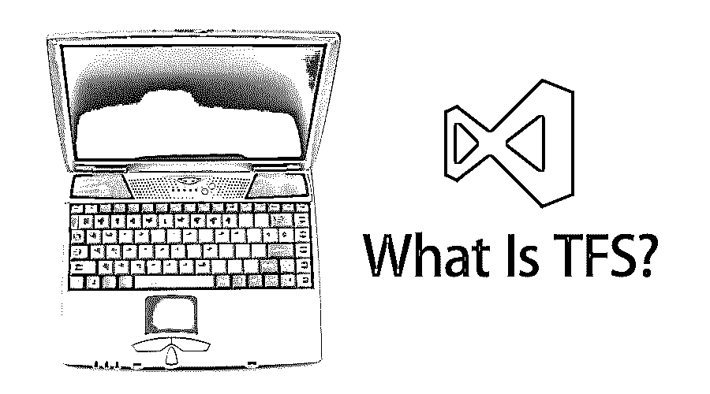

# 什么是 TFS？

> 原文：<https://www.educba.com/what-is-tfs/>

## TFS 概况

微软开发了 Team Foundation Server 或 TFS 来管理团队及其工作方式。它基本上是一个用于项目管理、报告、需求收集和测试的管理工具。它实际上覆盖了整个软件开发生命周期，并在 Microsoft Windows 中运行。它包括版本控制、问题解决和应用程序管理。这提供了软件和测试的端到端开发。这是一个后端管理系统，使用 Git 控制源代码。它代表应用程序的自动化过程和测试。它随 visual studio 代码一起提供。

### 了解 TFS

在本节中，我们将了解并看到 Visual Studio。

<small>网页开发、编程语言、软件测试&其他</small>

*   它是托管版本(配置在服务器上)，而 Visual Studio 是在线版本(配置在云服务器上)。
*   它只适用于前提(某种限制)，而 Visual Studio 适用于任何地方(你只需要一个 Microsoft 帐户)。
*   这需要服务器维护甚至升级，而 V Studio 则不需要。
*   这需要硬件/操作系统升级，但 V Studio 的云版本不需要。
*   它没有集成 SharePoint，而 V Studio 有
*   它缺少 SQL 报告服务特性，而 V Studio 有
*   负载测试在这种情况下是不可能的，但是在 V Studio 中是可能的。

### TFS 是如何如此轻松地工作的？

*   它的学习曲线很浅，这意味着理解它的行为和功能很复杂。使用它也比其他版本控制工具更容易，比如 Git 是它的操作系统(比如 Windows)。因为 windows 是一个用户友好的平台，所以 TFS 也是用户友好的。
*   由于 TFS 是一个 CVCS(又名集中式版本控制系统)，它在几个方面使开发人员的工作变得容易，其中之一是存储库细节信息。集中托管存储库文件系统的副本不会丢失数据。这样做的缺点是用户不能脱机提交更改。
*   此中的分支将创建一个新目录，同时将所有文件详细信息与父分支的目录详细信息一起复制。这是有用的，因为它为用户一直为新创建的分支定义关系节省了时间。

### 你能拿 TFS 怎么办？

*   它主要用于版本控制、工作流维护、项目跟踪和通知目的。
*   由于应用成本巨大，后来的公司试图寻找一些替代方案。这种帮助台替代的一个这样的可用性。
*   帮助台工具主要有 bug 报告工具、bug 跟踪工具、客户关系管理工具。有了它，你可以管理记录，关注以前的历史，管理联系人和更新信息，并作为一个知识库。
*   它也用于票证维护。

简而言之，我们想说，因为 TFS 的一部分确实跟踪；这些公司可以提供任何形式的跟踪和维护服务。

### 与 TFS 合作

这是一个世界范围内使用的工具，并且拥有大量的客户基础。人们使用该工具的体验喜忧参半，有些人觉得它很棒，有些人觉得与 Git 等其他工具相比它有点复杂。

*   这是一个用信息巩固工作的伟大工具。有了它，你可以在一个地方找到所有类似的问题；此外，有一些定制可以有效地处理它们。
*   您可以监控代码构建和部署；这对那些同时处理多个项目的人很有帮助。一种对实际发生的事情的可见性。
*   用户说，由于它兼容不同的应用程序，如 SharePoint，IIS 和 Visual Studios，它在几个方面使工作更容易。
*   支持 TFS 用户的另一个因素是，它让用户可以通过桌面客户端、网络浏览器和云访问该工具。

### 优势

*   你有一个装满糖果的盘子；挑一个你喜欢的就行了。听起来很棒，所以读者们，我们想说，一般来说，如果你有微软的企业协议许可证，你就会处于这种情况。由于微软有几个应用程序，如果你有企业协议，你可以选择任何你喜欢的应用程序。
*   如果你想在你的开发过程中实践敏捷方法，你需要 TFS。
*   俗话说，“时间就是金钱”，这对 TFS 来说是正确的，因为它通过在一个套件中管理多个工作来节省团队的时间。作为一个多任务应用是它最大的加分点。
*   这很容易理解，因为它有一个高度用户友好的 Windows 平台。

### 所需技能

如果你想在 TFS 发展事业，在学习方面没有特别的要求。然而，我们列出了一些可能帮助你在职业生涯中获得一些动力的技能。

*   有一个 B.Tech 学位是很好的(CSC 或 It 优先)。在市场上，计算机科学硕士学位同样重要。
*   你应该了解服务器和网络。
*   具备分析能力是件好事
*   编程知识是必须具备的
*   SQL server 技能和理解也至关重要。

### 范围

关于范围，我们只能建议我们的读者，因为 TFS 是微软的产品，你可以放心。这种工具非常重要，将继续留在市场上。关于 TFS 专业人士的薪资，我们列出了一些行业薪资表的详细信息以及各自的概况

*   软件工程师——7.4 万美元
*   软件开发人员-6.6 万美元
*   测试 QA 工程师——7.1 万美元
*   业务分析师——5.5 万美元
*   高级——9.8 万美元

### 结论

TFS 是版本控制、过程开发和维护、敏捷方法和跟踪工具的伟大工具。新人必须将此视为职业范围，因为它有巨大的可能性。

### 推荐文章

这是一个什么是 TFS 的指南。这里我们讨论什么是 TFS，工作，所需的技能，范围和优势。您也可以浏览我们推荐的其他文章，了解更多信息——

1.  [Python 是什么](https://www.educba.com/what-is-python/)
2.  [JavaScript 是什么？](https://www.educba.com/what-is-javascript/)
3.  [什么是 PowerShell](https://www.educba.com/what-is-powershell/)
4.  [JIRA vs TFS](https://www.educba.com/jira-vs-tfs/)

