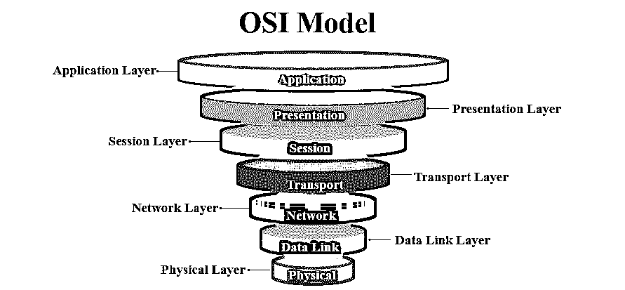
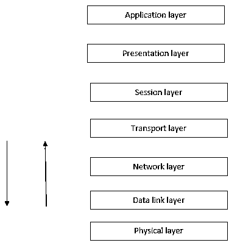
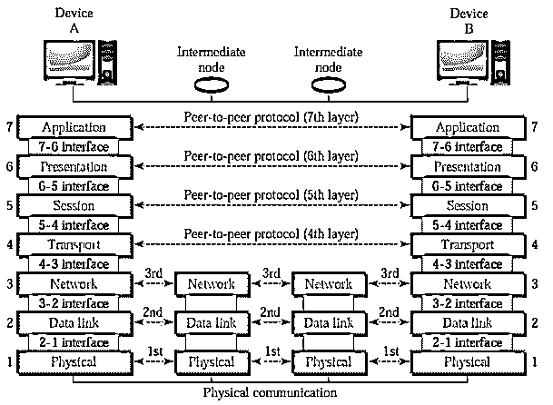

# 什么是 OSI 模型？

> 原文：<https://www.educba.com/what-is-osi-model/>

## OSI 模型概述

OSI 模型代表开放系统互连模式，由国际标准化组织于 1984 年开发，旨在显示将数据从一台计算机的一个软件应用程序移动到另一台计算机的另一个软件应用程序的流程。它由七层组成——物理层、数据链路层、网络层、传输层、会话层、表示层和应用层。每一层都有各自独立执行的任务。

### 什么是 OSI 模型？

OSI 模型是一种具有七个不同层的网络模型。该模型由 ISO(国际标准化组织)于 1974 年首次提出。这种模式有助于通过网络将数据从一台计算机设备传输到另一台计算机设备。这种模式只不过是全球采用的标准。

<small>网页开发、编程语言、软件测试&其他</small>

*   **OSI 模型定义:**开放系统互连(OSI)模型是描述具有内部结构和技术的计算机系统概念的虚拟模型。

*   **了解 OSI 模型:**开放系统互连(OSI)模型分为七层，如下图所示:

**

** 

### 简要解释:OSI 模型的 7 层

如下图所示。

有两台电脑。这两台计算机正在尝试通过网络相互通信。物理层、数据链路层和网络层是该模型的硬件层，会话层、表示层和应用层是该模型的软件层。传输层是 OSI 模型的核心。

### 使用 OSI 模型

让我们看看这些到底是什么:

1.  **物理层:**物理层是 OSI 模型的第一层。物理层负责将单个比特从一个节点发送到另一个节点。这一层实际上负责两个设备之间的连接。进入该层的任何数据都被转换为二进制格式，即 0 和 1。转换后，将数据发送到数据链路层。
2.  **数据链路层:**[数据链路层是模型物理层之上的第二层](https://www.educba.com/data-link-layer/)。数据链路层负责将帧从一个节点移动到另一个节点。这一层确保接收或传输的数据没有错误。它还通过在帧的开头和结尾附加一些位来确保安全性。
3.  **网络层**:网络层是这个模型的第三层。网络层有责任将单个数据包从源节点传送到目的节点。它实际上将数据从一个网络发送到另一个网络。它利用[不同的路由算法](https://www.educba.com/routing-algorithms/)来发送数据。网络层在报头携带 IP 地址。
4.  **传输层:**传输层是这个模型的第四层。传输层负责将消息从一个流程传递到另一个流程。它从网络层获取数据，并将数据传输到应用层。在这一层，最主要的是确认。确认是数据在网络上成功传输的过程。这一层驻留在设备的操作系统上。它与系统调用一起工作。
5.  **会话层:**会话层是第五层。顾名思义，这一层管理最终用户应用程序进程之间的会话。
6.  **表示层:**表示层是第六层。这一层也被称为翻译层**。**该层用于向应用程序呈现数据。
7.  **应用层:**应用层是 OSI 模型的最后一层，也是第七层。这一层是抽象层。它通过 OSI 和 [TCP/IP](https://www.educba.com/what-is-tcp-ip/) 处理计算机网络上的共享协议

### 优势

*   OSI 模型是开发任何网络模型的途径。
*   OSI 是一个 7 层网络模型。所有层都单独工作。它们不会影响其他层。
*   这种模式在本质上非常灵活。
*   OSI 模型支持面向连接的服务和无连接的服务。
*   它指导网络管理员决定必要的硬件和软件来构建健康的网络。
*   帮助硬件制造商创造出能够通过网络简单无误地相互通信的网络产品。
*   这有助于向他人传授网络的工作原理。
*   借助于该模型降低了复杂性。
*   它有助于轻松排除故障；作为网络管理员，它有助于更快地识别缺陷。

### 为什么我们应该使用 OSI 模型？

在早期，当这种模式被引入的时候，有一个连接的问题。一些模型已经存在。但是当涉及到计算机的连接性时，连接不同的模型并不容易。为了解决这个问题，引入了一个标准模型，它就是 OSI 模型。现在，每个网络设备都是基于这种模式创建的。

**对 OSI 模型的需求**

这是网络的关键部分。因此，该模型中提到的所有规范都被所有软件和硬件设备所遵循。

### 这项技术将如何帮助你的职业发展？

如果我们在计算机世界中看到，网络是永无止境的技术。在计算机的各个方面，网络都起着非常重要的作用。如果你渴望在计算机网络领域有所作为，那么对网络管理员的需求是永无止境的。彻底了解这个模型，您就掌握了整个网络概念。有了这个优势，这个作品也就有意思了。每次我们在做这个，叫做网络实时。

### 结论

OSI 模型是每个计算机工程师都必须知道的，因为它是与网络一起工作的一项基本的和强制性的技术。一些理论还指出，人际关系网是伴随工作保障而来的技术。所以在你职业生涯的开始，了解这个模型是一个很好的练习。

### 推荐文章

这是 OSI 模型的指南。在这里，我们讨论 7 层，工作，优势，需要和用途，分别。您也可以浏览我们推荐的其他文章，了解更多信息——

1.  [什么是网络安全？](https://www.educba.com/what-is-network-security/)
2.  [网络的基本原理。](https://www.educba.com/basic-fundamental-of-networking/)
3.  [什么是神经网络？](https://www.educba.com/what-is-neural-networks/)
4.  [CCNA 面试问题](https://www.educba.com/ccna-interview-questions/)

