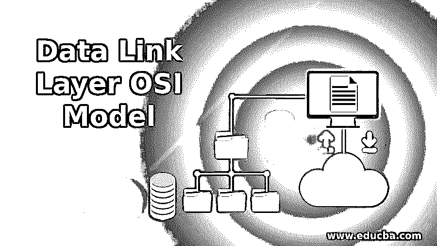

# 数据链路层开放系统互连模型

> 原文：<https://www.educba.com/data-link-layer-osi-model/>

## 数据链路层 OSI 模型介绍

在开放系统互连(OSI)参考模型中，数据链路层排在第二位。数据链路层位于物理层之上。在数据链路层中，在两个网络节点之间建立数据连接，其中为了数据传输而保持连接。可以使用数据链路层来创建、维护或释放连接。在数据链路连接之间可以有不同类型的物理线路，包括光缆、铜线、卫星信道和微波链路。在数据链路层，从网络层接收数据包，然后将这些数据包转换为帧，再转发到物理层。数据同步在数据链路层进行。数据链路层支持的其他功能包括错误同步、传输到物理层的数据编码。错误控制也在数据链路层完成。帧的重复可以通过错误控制的帮助来识别。错误控制被添加到帧的尾部以消除帧重复。

开放系统互连(OSI)模型是应用程序如何与网络交互的参考模型。OSI 模型有七个不同的层。这些层可用于定义框架，并可用于与网络交互。这些层包括物理层、数据链路层、网络层、传输层、会话层、表示层和应用层。OSI 模型用于理解网络的体系结构，在此基础上，可以借鉴 OSI 模型来设计电信产品。

<small>网页开发、编程语言、软件测试&其他</small>

### OSI 模型中数据链路层的功能

每个 OSI 模型层都是为执行某种功能而设计的。数据层功能描述如下:

1.  在数据链路层，从上层(即网络层)接收数据，数据链路层将接收到的数据转换为帧。
2.  将其转换为帧后，会将报头添加到每个帧中，以便为帧提供寻址信息。每个帧包含源计算机和目的计算机的地址。在成帧过程中，还添加了控制信息来标识数据帧的起始端和结束端，以便于将其传输到物理层。
3.  数据链路层的另一个功能是控制数据传输的流量。因为在接收数据和发送数据之间存在一些不平衡，所以流由发送器维持。速率是不同的，这在数据链路层产生了流量管理的问题。
4.  数据链路层为物理层提供数据可靠性功能。在数据链路层，重复帧、损坏帧和不完整帧与提供数据可靠性的正确帧区分开来，只有正确帧才会被转发到物理层。
5.  数据链路层也提供访问控制机制。当有多台设备通过同一链路连接到网络时，该协议用于维护所连接的不同设备的访问。
6.  另一个功能是大尺寸数据包的成帧。每当数据链路层从网络层接收到大量数据时，都会对数据进行成帧，其中小帧是从大数据流中创建的。这个过程被称为成帧或数据分段。由此，这些帧的传输变得容易，并且可以容易地传输到物理层。大尺寸的数据帧总是有帧损坏的风险，这可能在物理层中产生数据可靠性的问题。
7.  数据链路层的另一个重要功能是错误控制。在差错控制机制中，差错控制被添加到帧的末尾。这样，接收端被检查，并且如果错误控制值相同，则意味着分组没有被破坏。错误控制也有助于找出重复的帧。并且还移除被破坏的错误并防止它们转发到物理层。

### OSI 模型中数据层的设计问题

OSI 模型中每种类型的层总有一些优点和缺点。与数据链路层相关的设计问题描述如下:

*   主要的设计问题是维持一个具有高处理速度的发射机，以便它能够在慢速接收数据端之间保持平衡。数据链路层缺乏可用于跟踪接收端缓冲区空间的流量控制机制。
*   数据链路层的另一个设计问题是保持对需要在网络上共享的信道的正确访问。
*   数据链路层的第三个问题是跟踪源端和目的端之间路由的数据包数量。这可以通过维护不经常改变的静态表来实现。
*   从网络层接收的数据创建的帧的质量。
*   数据链路层的另一个问题是保持数据包的流动和处理传输错误问题。

### 结论

OSI 模型的所有层都有一些用于与网络通信的功能。每个电信层都使用 OSI 模型与网络交互。使用 OSI 模型来控制数据传输，并且还使用 OSI 模型来维持数据流，以维持位于网络中的两个网络节点之间的通信。

### 推荐文章

这是数据链路层 OSI 模型指南。这里我们讨论 OSI 模型中数据链路层的介绍、功能和 OSI 模型中的设计问题。您也可以浏览我们推荐的其他文章，了解更多信息——

1.  [数据建模工具](https://www.educba.com/data-modelling-tools/)
2.  [数据可视化的类型](https://www.educba.com/types-of-data-visualization/)
3.  [OSI 模型 vs TCP/IP 模型](https://www.educba.com/osi-model-vs-tcp-ip-model/)
4.  [什么是 OSI 模型？](https://www.educba.com/what-is-osi-model/)

