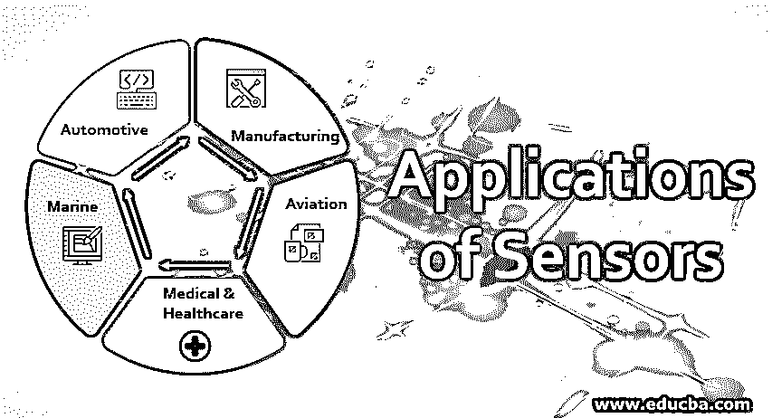

# 传感器的应用

> 原文：<https://www.educba.com/applications-of-sensors/>

## 传感器应用介绍

传感器是一种电子设备，用于测量温度、压力、距离、速度、扭矩、加速度等物理属性。、来自设备、器具、机器和任何其他系统。该传感器使用多种技术产生与输入成比例的电信号/光信号。这些信号要么被解释为可读格式，要么被传递到下一阶段进行进一步处理。传感器大致分为模拟传感器和数字传感器。模拟传感器测量物理变量的精确值，而数字传感器测量状态。应用程序对传感器、感测的属性、使用的技术和部署它们的系统进行分类。下面我们来详细分析一下传感器的应用。

### 我们为什么使用传感器？

传感器的能力是测量系统内发生的活动的各种数据，这带来了大量的使用案例。

<small>Hadoop、数据科学、统计学&其他</small>

传感器测量的数据可用于:

1.  高效运行系统。
2.  监控操作是否有任何异常。
3.  控制操作。
4.  有效利用资源。
5.  更改设计以进一步提高性能。
6.  增强未来的产品组合。

例如，安装在炉子中的温度传感器定期测量温度数据，并将其发送到控制单元。如果温度超过上限，控制单元内置的智能可以切断熔炉的电源。

**传感器类型**

| 1.温度传感器 | 2.接近传感器 | 3.红外传感器 | 4.光敏感元件 |
| 5.加速度传感器 | 6.压力传感器 | 7.超声波传感器 | 8.触摸传感器 |
| 9.烟、煤气、酒精 | 10.湿度传感器 | 11.流量和液位传感器 | 12.倾斜传感器 |

**传感器测量以下特性**

| 1.距离 | 2.温度 | 3.声音强度 | 4.压力 | 5.接近度 |
| 6.速度 | 7.速度 | 8.转矩 | 9.倾斜 | 10.氧 |
| 11.加速 | 12.射频辐射 | 13.海拔 | 14.移动 | 15.决定性的 |
| 16.传导性 | 17.流动 | 18.水平 | 19.力 | 20.碳氢化合物 |
| 21.微波辐射等等 |

**传感器使用的技术**

| 1.听觉的 | 2.电容性的 | 3.多普勒 | 4.电磁的 |
| 5.机电的 | 6.电热调节器 | 7.霍尔效应 | 8.感应系数 |
| 9.红外线的 | 10.激光 | 11.微波 | 12.视觉的 |
| 13.无线电频率 | 14.超声波的 | 15.巨麦哲伦抵抗组织 |

传感器使用多种技术，感知多种属性，用途广泛。因此，传感器在几乎每个行业都扮演着重要角色，而且无处不在。

### 传感器的主要应用

传感器广泛应用于各种行业，如汽车、制造、航空、航海、医疗、电信、化工和计算机硬件。让我们来看看传感器在这些行业中的一些应用。

#### 1.汽车的

下面是传感器的一些汽车应用:

*   **制动和牵引控制:**防抱死制动系统(ABS)传感器连接到车轮，测量车轮的速度和制动压力，并不断将它们发送到 ABS 控制系统。当驾驶员实施紧急制动时，ABS 系统根据从传感器接收到的制动压力和速度数据，释放制动压力，以避免车轮打滑/抱死。这是车辆的关键安全方面之一。
*   **安全气囊-反缓冲约束系统(ACRS):** 放置在车内的挤压传感器和加速度计测量压力，并在发生事故时发送到。一旦检测到压力超过极限，ACRS 将激活安全气囊，挽救乘客的生命。
*   **避免碰撞:**车辆前部、后部和侧面的接近传感器预先警告驾驶员可能发生的红外线、视频辅助、超声波技术在停车时帮助驾驶员。
*   **舒适和便利:**许多传感器为驾驶员提供车速、发动机转速、燃油油位、轮胎压力、车门/甲板、灯泡等输入和警告，以提高驾驶舒适性和便利性。
*   **发动机数据:**传感器提供关于发动机性能的大量数据，例如点火、b .燃烧、c .废气氧气、d .燃料混合、e .废气再循环、f .变速器控制等。,
*   **其他应用**

| 形容词（adjective 的缩写）供暖、通风和空调(HVAC) | b.导航， | 碳（carbon 的缩写）安全功能 |
| d.智能巡航 | e.暂停 | 氟（fluorine 的缩写）安全性 |
| g.远程锁定 |  |  |

#### 2.制造业

以下是传感器的一些制造应用:

*   使用从机器传感器收集的数据对机器、装配设备进行预测性维护。
*   通过持续监控性能并根据从传感器收集的数据有效地重新调整操作，实现机器的最佳利用率。
*   使用从传感器收集的数据微调质量系统并提高质量标准。质量和过程标准恶化时的设计通知和警报。
*   对市场需求反应敏捷。

#### 3.航空

航空工业中部署的传感器在飞机导航、监控各种系统和控制仪器的过程中测量数据。这些数据被用于低效的飞行操作，提高飞机性能和改进设计。

一些仪表传感器是转速表、测量发动机压力和油和燃料量的仪表、高度计、空速计等。传感器帮助测量地面条件、振动和环境因素的测试，并向飞行员提供有用的输入，以管理一般操作和紧急情况。

#### 4.医疗保健

由医疗设备、手术器械和装置中的传感器产生的信号被医生用于诊断、治疗和控制功能。

一些应用是:

1.  血压监测(自我)。
2.  个人连续血糖监测。
3.  自动测量患者的生命体征，并将其发送给患者的医生。
4.  更多的家庭护理设施和流动治疗。
5.  自动检测将疾病传播给医院病人的来访者。
6.  分散实验室。
7.  [手术室里的机器人](https://www.educba.com/what-is-robotics/)。

#### 5.海洋的

船上的传感器测量油箱液位、液体货物液位、油箱压力/温度。在传感器的帮助下，还可以测量和监控船舶的纵摇、横摇、速度和其他力矩。在发动机中有许多传感器测量内燃机参数的典型属性。

### 结论

行业对物联网的采用将传感器的应用推向了一个新的高度。车辆行驶时会被跟踪，并使用传感器生成的数据监控其健康状况，在极端情况下，可从中央位置采取纠正措施。由传感器生成并通过物联网应用程序收集到数据库中的数据为组织提供了宝贵的资产，人们考虑通过将数据出售给利益相关者来实现货币化。

### 推荐文章

这是传感器应用指南。在这里，我们讨论传感器的介绍、用途和 5 大应用，并给出详细解释。你也可以看看下面的文章来了解更多-

1.  [物联网应用](https://www.educba.com/applications-of-iot/)
2.  [安卓安全应用](https://www.educba.com/android-security-applications/)
3.  [机器学习的应用](https://www.educba.com/applications-of-machine-learning/)
4.  [传感器装置](https://www.educba.com/sensor-device/)
5.  [不同类型的传感器](https://www.educba.com/types-of-sensors/)

