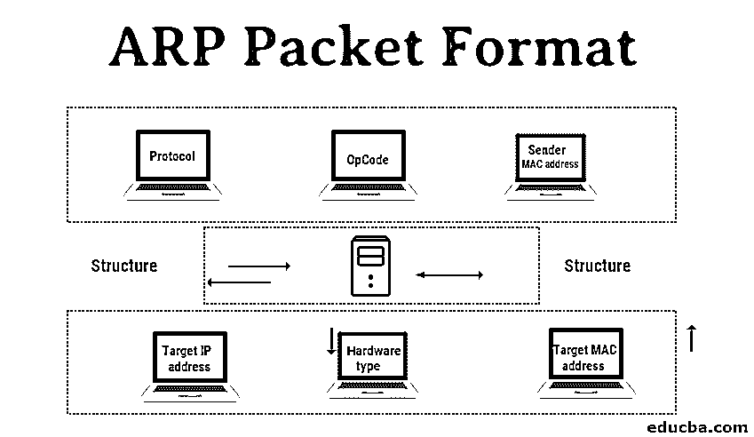
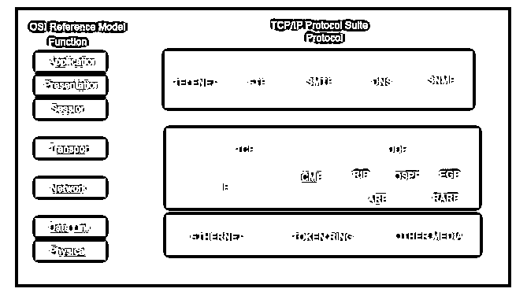
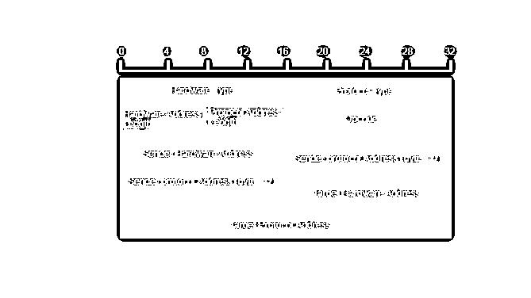

# ARP 数据包格式

> 原文：<https://www.educba.com/arp-packet-format/>

## ARP 数据包格式介绍

分层方法是一种很好的实践，尤其是当你必须演示一些东西的时候。因此，在本文中，我们将首先介绍“通信协议”,以了解 ARP 数据包格式下的工作原理，并了解 ARP 是如何构成协议套件的。

通信协议或协议组是通信系统的每个实体在使用物理介质传输各种信息时必须遵循的一种规则。这个协议定义了它所包含的一切，比如规则、语法、语义和同步。

<small>网页开发、编程语言、软件测试&其他</small>

ARP，代表[地址解析协议](https://www.educba.com/address-resolution-protocol/)、*T3，是众多通信协议组件之一。第二件事是 ARP 工作在链路层。ARP 帮助将 IP 地址连接到物理机器地址。对于 IPV4 版本，通常使用的 I 是 32 位长，而对于以太网本地地址，它是 48 位长。*

**Note** ARP lies in the “Network’ layer.

### 为什么我们需要在通信协议中加入 ARP？

“真正的挑战在于为 MAC 地址找到 IP 包寻址；然而，来源很容易确定，但目的地却是一项艰巨的任务”。

因此，要确定目的 MAC 地址，有几种方法

*   封闭型计算
*   表格查找
*   信息交换

对于所有列出的问题，ARP 都可以解决；让我们看看如何

ARP 内置于 IP 配置的每个节点中，这意味着在 IPV4 网络上开发的每个系统[都包含一个 ARP 代码。](https://www.educba.com/ipv4-header-format/)

在 ARP 中，只定义了两种消息——ARP 请求和 ARP 回复。

现在，我们回到问题陈述*，*，它说“问题在于找到目的 MAC 地址”。

因此，当主机发现目的地的 MAC 地址后，就会发出 ARP 请求。当收到这个 ARP 请求消息时，目的地将自动发回一个 ARP 回复。

这里发生的是 ARP 请求询问“我能有 MAC 地址吗”？而得到的回复是“是的，你可以”。

### Arp 的结构

ARP 消息中有下列字段。

*   **硬件类型**:指定本地网络传输地址解析协议报文所使用的硬件类型。以前，此类别下的常见硬件是值等于 1 的“以太网”,字段大小是 2。
*   **协议类型**:为了在该字段中分配一个固定的编号，IPV4 有一个编号 2048。
*   **硬件大小**:这是 MAC 地址的字节长度；通常，我们看到以太网的 MAC 地址有 6 个字节长。
*   **协议大小**:表示 IPV4 逻辑地址的长度，IPV4 地址一般为 4 字节长。
*   **OpCode** :这是逻辑地址的长度，以字节为单位；它指定了 ARP 消息的性质。ARP 请求的赋值为 1，而 ARP 回复的值为 2。
*   **发送方 MAC 地址**:发送消息的设备的第 2 层地址。
*   **发送方 IP 地址**:发送消息的设备在 IPV4 中的协议地址。
*   **目标 MAC 地址**:目标接收方的第二层。该字段在请求阶段不包含任何值，仅在回复阶段有效。
*   **目标 IP 地址**:该地址为预定接收者的协议地址。

### Arp 协议的工作原理

有两个设备。

1.  源设备
2.  目标设备

所以，这两个想在他们之间交流。在这些过程中要做的第一件事是，源设备将检查它的 ARP 缓存，并找出它是否有目的设备的解析 MAC 地址。如果 MAC 地址处于已解析状态，则它将利用该 MAC 地址来建立通信。

但是，如果解析的 ARP 不存在，那么源机器将创建 ARP 请求消息，并将它的数据链路地址加上它的 IPv4 地址作为发送方协议地址。需要注意的一点是，这里的“目标硬件地址”将被留空，因为机器正在试图发现源也向其本地网络广播 ARP 消息请求。

此后，设备开始将目标协议地址与其协议地址进行比较。如果没有匹配，那么它将被立即丢弃，没有任何动作。

如果发现有问题，就会生成一条 ARP 消息。这里，目标设备从 ARP 消息中获取“发送方硬件地址”和“发送方协议地址”,并将这些值用于目标硬件和协议。

现在，目的设备将更新其 ARP 缓存，因为它需要联系发送方机器以建立连接。源机器将处理来自其目的地的 ARP 回复，并存储“发送者硬件地址”。

在成功连接之前要做的最后一件事是，源机器将使用 ARP 回复消息中的发送方硬件地址和发送方协议地址来更新其 ARP 缓存。

#### ARP 数据包图表

#### 详细解释:ARP 数据包格式的组成部分

| **字段** **名称** | **大小** ( **字节**) | **描述** |
|  高纤维素饮食（High Roughage Diet 的缩写） |  Two | Hardware type and value.以太网= 1IEEE 802 网络= 6ARCNET = 6帧中继= 15异步传输模式(ATM) = 16HDLC = 17

光纤通道= 18

异步传输模式(ATM) = 19

串行线= 20

 |
|  专业人员 |  Two | 这是对硬件类型字段的补充，指定了消息中使用的层的类型。对于 IPv4，该值为 2048，这也对应于互联网协议的以太码。 |
| HLN | One | 这是为了指定消息中硬件相关地址的长度。 |
| 周围淋巴结 | One | 这指定了协议地址将在消息中存在多长时间。 |
|  观测所 |  Two | 该字段说明了 ARP 报文的性质。前两个值(即 0 和 1)用于常规 ARP。正在定义的其他值请看下表—

&#124; 操作码 &#124; ARP 报文类型 &#124;
&#124; 1 &#124; ARP 请求 &#124;
&#124; 2 &#124; ARP 回复 &#124;
&#124; 3 &#124; RARP 请求 &#124;
&#124; 4 &#124; RARP 7 &#124; DRARP 错误 &#124;
&#124; 8 &#124; InARP 请求 &#124;
&#124; 9 &#124; InARP 回复 &#124;

 |
| 恒星时角 | 等于 HLN 场 | 处理发送消息的设备的硬件地址 |
| 矿泉 | 等于计划字段 | 发送消息的设备的 IP 地址 |
| 总碳氢分析器 | 等于 HLN 场 | 接收消息的设备的硬件地址 |
| 12-o-十四烷酰佛波醋酸酯-13 | 等于计划字段 | 设备的 IP 地址在接收端。 |

### 结论

最后，我们来总结一下 e 在这篇文章中关于 ARP 的讨论。我们已经看到了通信协议结构(IPv4)以及 ARP(文章标题)在通信协议中的位置。我们也看到了它所扮演的角色，以及在有针对性地进行沟通时，它如何有效地履行自己的职责。我们已经看到了 ARP 的结构，ARP 的需要，ARP 数据包图和组件描述。

### 推荐文章

这是一个 ARP 数据包格式的指南。这里我们讨论 ARP 数据包格式的介绍，它的工作结构以及需要。您也可以看看以下文章，了解更多信息–

1.  [什么是 ARP？](https://www.educba.com/what-is-arp/)
2.  [地址解析协议](https://www.educba.com/address-resolution-protocol/)
3.  [Java 中的框架](https://www.educba.com/frameworks-in-java/)
4.  [获取 PHP 中的 IP 地址](https://www.educba.com/get-ip-address-in-php/)

