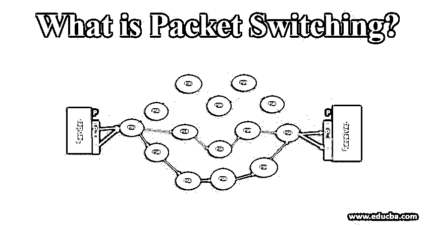
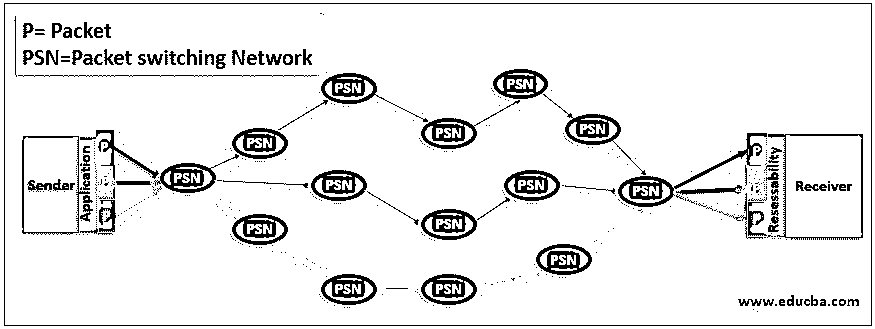

# 什么是分组交换？

> 原文：<https://www.educba.com/what-is-packet-switching/>

## 什么是分组交换？

分组交换是用分组寻址的用于数据传输的信道。分组交换是一种将数据路由和分组为数据包以在信道中传输的方法，其中数据包信道可用于网络流量的下一次传输。它基本上占用了信道中的流量，这样包含的数据包就可以被传送到网络中的路由地址。为了正确传送数据，数据包的结构中包含报头和有效载荷。报头用于将数据包定向到目的地，有效载荷用于数据提取，它是核心数据。它被称为消息交换。在数据传输中，任何超过最大限制的消息都将被分成更小的单元，这些更小的单元被视为数据包。

分组交换的独特区别在于:数据到分组的传输由预定义的报头形成，并且用于数据通信的链路不会被任何其他分组使用。

<small>网页开发、编程语言、软件测试&其他</small>

### 数据包及其结构

分组被构造为从分组交换网络中的起点路由到其目的地的数据单元。例如:用户向公司的客户支持部门发送电子邮件。一封电子邮件可以包含一个附加的图像或 PDF 等。电子邮件以基于数据包的传输方式通过网络发送。网络层中的协议，即 [TCP/IP 将](https://www.educba.com/what-is-tcp-ip/)数据分成更小的块作为数据包，并路由到目的地。每个数据包将被编号并路由到不同的路由；当它到达目的地时，数据包被组装成原始格式。这种重组是由 TCP 在目的地完成的。

数据包的结构分为报头、有效载荷和报尾。根据使用的协议，结构可能会有所不同:

1.  地址——起点和终点
2.  错误处理
3.  跳数
4.  长度
5.  优先
6.  有效载荷

### 为什么我们使用分组交换？

这个问题回答了我们在世界各地的整个网络。因为互联网世界都是以无连接的方式连接在一起的，而且大多数网络都是以类似的方式工作的。它遵循这样一个传统，即发送者和接收者之间的通信类型是无连接的。当数据传输时，通信被分解成数据包，它与同一网络中的各种用户共享同一数据路径称为无连接。

与分组交换不同的是电路交换。电路交换在连接期间是专用的，并且保持对其他用户不可用，直到链接结束。这有利于用户选择分组交换。由于其稳定高效的网络连接，它被用于许多应用中。它也在许多组织中使用，因为它们用于各种技术。在这里我们可以看到，为什么分组交换被广泛使用。

*   当链路断开或数据包丢失时，数据包具有使用路由器找到其目的路径的智能。因此，这是有弹性的，数据包可以在流量中高效传输。
*   分组交换是网络高效的，因为每个分组标识其自己到达目的地的路径，并且它不需要任何专用的传输连接。
*   它具有成本效益和可扩展性，因为数据包有效地使用了数据传输路径，并且有效地管理了链路。
*   它在网络中非常可靠，数据包不会在传输中丢失。因为包是有编号的。尽管它在不同的通信路径中传播，但它可以在接收端重新组装。
*   根据网络服务的用途，它使用两种协议。无连接和面向连接的协议。
*   无连接协议用于传输不需要任何预先设置的数据包传输。
*   面向连接的协议用于复杂的数据事务。预先建立并从源路由到目的地。延迟时间与无连接交换中的数据传输时间相同。
*   应用程序使用带有语音和视频呼叫临时协议的分组交换，如 WhatsApp、skype 等。

### 分组交换的重要性

1.  分组交换很重要，因为通信链路是根据分组的大小决定的。当分组较短时，节点之间的通信链路被分配较短的时间用于传输每个分组。并且较长的消息需要几个分组，即一系列分组用于传输。用于传输分组的链路不需要专用。连接的节点之间的链接可以携带每个分组并在共享资源的地方组装它。
2.  分组交换的方法被认为是流水线操作。流水线操作是指以同步方式将数据包从一个节点传输到另一个节点，例如当数据包从 A 传输到 B 和 C 传输到 D 时，数据包也可以从 B 传输到 C 和 C 传输到 A 和 B 到 D。这种传输方式节省了传播时间，延迟较小。具有低延迟时间的分组传输比消息交换具有更高的效率。
3.  减少通信路径的使用会带来更高的分组交换效率，因为带宽浪费会更少。这是切换的主要优势。
4.  分组交换是容错的，因为从源传输到目的地的分组可能携带不同的路由，并且它可能在网络中发生故障。
5.  对于数字网络中的数据通信，它允许数字数据从发送者直接传输到接收者。
6.  错误检查是在分组交换中完成的，在分组交换中，它也以分布式格式保持高质量的数据。因此在分组交换中分发的数据是无差错的。
7.  在将数据作为分组传输之前，分组的大小是固定的，并且被确定为使用所需的链路。这通过避免等待队列减少了网络中的延迟。

### 结论

分组交换有虚拟电路和数据报分组交换两种类型，每种类型都有自己的分组传输方法。尽管分组交换占用更多的空间，但交换协议的处理能力。分组交换在许多组织中广泛使用，在技术上有利于传输。

### 推荐文章

这是一个什么是分组交换的指南？.这里我们讨论为什么我们使用分组交换和它的重要性以及结构。您也可以浏览我们推荐的其他文章，了解更多信息——

1.  [网络设备介绍](https://www.educba.com/networking-devices/)
2.  [网络命令|前 9 名](https://www.educba.com/networking-commands/)
3.  [什么是网络协议](https://www.educba.com/what-is-networking-protocols/)
4.  [十大网络面试问题](https://www.educba.com/networking-interview-questions/)

