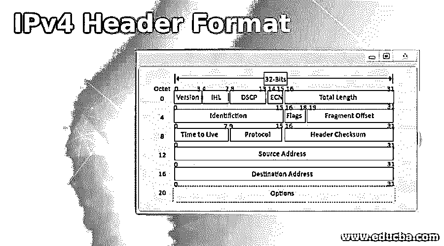
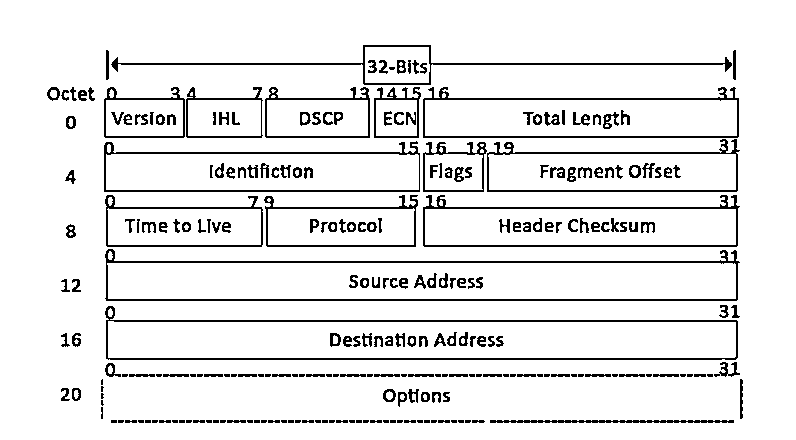

# IPv4 标头格式

> 原文：<https://www.educba.com/ipv4-header-format/>

## IPv4 报头格式概述

IPV4 报头格式的长度为 20 到 60 个字节，包含路由和传递所必需的信息，由 13 个字段组成，VER、HLEN、服务类型、总长度、标识、标志、碎片偏移、生存时间、协议、报头校验和、源 IP 地址、目的 IP 地址和选项+填充，其中每个字段都有自己的功能，并提供传输数据所需的基本数据。

<small>网页开发、编程语言、软件测试&其他</small>

IPv4 分组报头总共有 14 个字段；在这 14 个字段中，只有一个是可选的，它被恰当地称为 options 组件。

### IPv4 报头格式组件

下面是提到的列表。

1.  版本。
2.  互联网报头长度。
3.  服务类型。
4.  显式拥塞通知。
5.  总长度。
6.  身份证明。
7.  旗帜。
8.  片段偏移
9.  该去爱了
10.  协议。
11.  报头的校验和。
12.  源地址。
13.  目的地地址。
14.  选项。

让我们来看看这些组件、它们的大小以及它们能做什么:

*   **版本**:第一个头字段是 4 位版本指示符。在 IPv4 的情况下，其四位的值被设置为 0100，这在二进制中表示 4。
*   **互联网报头长度:** IHL 是 IPv4 报头的第二个和第三个字段，长度为 4 位。该报头组件用于显示报头中有多少个 32 位字。正如我们所知，IPv4 报头的大小是可变的，因此它用于指定报头的大小以避免任何错误。这个大小可以在 20 字节到 60 字节之间。
*   服务类型: ToS 也称为区分服务码点或 DSCP。该字段用于提供与服务质量相关的功能，例如数据流或 IP 语音(VoIP)呼叫。它用于指定如何处理数据报。
*   **显式拥塞通知:** ECN 用于在发生网络拥塞的情况下，向发送方或接收方发送通知。这是 IPv4 can 的可选功能；如果其中一个端点不支持它，则不使用它。
*   **总长度:**该字段的大小为 16 位，用于表示整个数据报的大小。IP 数据报的最小大小为 20 字节，最大值为 65，535 字节。实际上，所有主机都需要能够读取 576 字节的数据报。如果数据报对于网络中的主机来说太大，则使用分段，这在主机或分组交换机中处理。
*   **标识:**数据包中的标识或 ID 字段可以唯一标识一个 IP 数据报的片段。有人建议将该字段用于其他用途，如添加信息进行数据包跟踪等。
*   **Flags:**IP v4 报头中的 flag 是一个三位字段，用于控制和标识片段。以下是它们可能的配置:
    *   位 0:这是保留位，必须设置为零
    *   第 1 位:DF 或不分段
    *   位 2: MF 或更多碎片。
*   **片段偏移量:**该字段长度为 13 位，以 8 字节的块为单位进行度量。这些用于指定片段相对于 IP 数据报开始的偏移量，当它没有被分段时。如你所料，片段的第一个偏移量总是被设置为零。最大可能的偏移量是(2 13 -1 ) * 8 = 65528，但是它大于最大可能的 IP 分组长度，最大可能的 IP 分组长度是 65，535 字节长加上报头的长度。
*   **生存时间:**生存时间(或简称 TTL)是一个 8 位字段，表示数据报在互联网系统中生存的最长时间。这里的时间以秒为单位，如果 TTL 的值为零，数据报将被删除。每处理一个数据报，它的生存时间就减少一秒。这些用于自动丢弃未送达的数据报。TTL 可以在 0-255 之间。
*   **协议:**这是 IPv4 报头中的一个字段，用于指示在数据报的后面(数据)部分中使用的协议。例如，数字 6 用于表示 TCP，17 用于表示 UDP 协议。
*   **报头校验和:**校验和字段长度为 16 位，用于检查报头是否有错误。在每一跳将报头与其校验和值进行比较，如果报头校验和不匹配，则丢弃该数据包。请记住，这只是针对头部，它的协议处理数据字段。例如，UDP 和 TCP 有自己的校验和字段。
*   **源地址:**是 IPv4 包的源地址的 32 位地址。
*   **目的地址:**目的地址也是 32 位大小，包含接收方地址。
*   **选项**:这是 IPv4 报头的可选字段。仅当 IHL 的值设置为大于 5 时，才使用它。这些选项包含与安全性相关的值和设置。记录路线和时间戳等。您会发现，在许多情况下，选项列表组件以选项结尾或 EOL 结尾。

### 结论

IP 报头是协议的重要组成部分之一。能够告诉网络有关数据报、其来源和目的地的信息非常重要，检测报头中的任何错误以避免使用损坏的数据包的能力也非常重要。考虑到几乎所有的现代互联网都依赖于 [IPv4 和 IPv6](https://www.educba.com/ipv4-vs-ipv6/) ，这些报头几乎用于所有的 HTTP 互联网流量。

### 推荐文章

这是 IPv4 报头格式的指南。在这里，我们讨论了 IPv4 报头格式的介绍、其组件及其大小以及它们的用途。您也可以浏览我们推荐的其他文章，了解更多信息——

1.  [网络面试问题](https://www.educba.com/networking-interview-questions/)
2.  [计算机硬件 vs 网络](https://www.educba.com/computer-hardware-vs-networking/)
3.  [什么是 IPv6？](https://www.educba.com/what-is-ipv6/)
4.  [什么是 IPv4？](https://www.educba.com/what-is-ipv4/)

