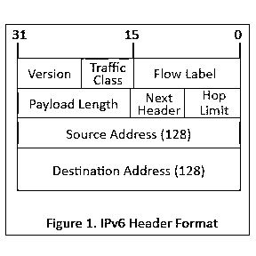

# IPv6 报头格式

> 原文：<https://www.educba.com/ipv6-header-format/>

## IPv6 报头格式简介

IPV6 报头格式的长度为 40 个字节，包含路由和传送所必需的信息，由 8 个字段组成:版本、流量类别、流标签、有效载荷长度、下一个报头、跳数限制、源地址和目的地址，其中每个字段都有自己的功能，并提供传输数据所需的基本数据。版本是 4 位字段；流量类别是 8 比特，流标签是 20 比特，有效载荷长度是 2 字节字段，下一个报头是 8 比特，跳限是 8 比特字段，源地址是 16 字节，目的地址是 16 字节。

### IPv6 报头格式组件列表

IPv6 报头格式组件，IPv6 的数据包包含两个主要部分，即报头和有效载荷。IPv6 由 40 字节长的固定报头组成，该报头包含以下字段。

<small>网页开发、编程语言、软件测试&其他</small>

让我们详细了解一下 IPv6 报头各个组成部分的重要性-

**1)版本:**

它以 4 位序列表示互联网协议的版本，即 0110。该字段不太重要，因为 [IPv6 和 IPv4 数据包](https://www.educba.com/ipv4-vs-ipv6/)不是基于版本字段确定的，而是由第 2 层信封中存在的协议类型确定的。

**2)流量等级:**

该字段类似于 IPv4 分组的服务字段。它表示 IPv6 数据包的优先级。它负责根据数据包的优先级处理流量。如果路由器出现拥塞，它会丢弃低优先级的数据包。

它使用 8 位内存来控制交通拥堵。

| **优先级** | **意为** |
| Zero | 没有特定的流量 |
| One | 背景数据信息 |
| Two | 无人值守的数据流量 |
| Three | 保留的 |
| Four | 有人值守的批量数据流量 |
| Five | 保留的 |
| Six | 交互式流量 |
| Seven | 控制交通 |

源节点可以设置优先级，但目的节点不能期望相同的优先级，因为路由器可以在途中更改优先级。

**3)流程标签:**

*   此标签确保数据包保持属于同一通信的顺序流。在源的帮助下，标签路由器识别哪个包属于哪个信息流。这也有助于避免数据分组的重新排序。
*   如果路由器和主机不支持流标签功能，则流标签必须设置为 0。它使用 20 位内存来运行。

**4)有效载荷长度** **(16 位):**

有效负载长度向路由器表明特定数据包包含的信息的大小。有效载荷长度还包括上层数据包和扩展报头(如果有)。如果有效负载长度大于 65，535 字节，则有效负载长度字段变为 0。

**5)下一个报头** **(8 位):**

下一个标头表示扩展标头类型；在某些情况下，当扩展报头不存在时，它表示上层数据包中存在协议，如 UDP、TCP 等。UDP (17)和 TCP (6)是最常见的 Next 报头，但是其他类型的报头也是可能的。如果与 IPv4 协议比较，下一个报头类似于 IPv4 协议字段。

**6)跳数限制** **(8 位):**

该字段确保数据包不会进入无限循环；每当数据包通过链路(路由器)时，该字段递减 1，当它最终到达数据包被丢弃的位置时。该字段还设置 IPv6 协议的两个节点之间的最大链路数量的上限。它允许节点之间的最大跳数为 255，之后的任何内容都将被丢弃。

**7)源地址** **(128 位):**

这个 128 位源地址字段表示包的源地址。

**8)目的地址** **(128 位):**

这个 128 位的目的地地址字段表示分组的预期接收方地址。

**9)扩展报头 IPv6 报头格式:**

*   IPv6 中引入了扩展报头，以克服 IPv4 选项字段的限制。与 IPv4 不同的是，在 [IPv6 中，唯一真正需要的信息](https://www.educba.com/what-is-ipv6/)被定义在固定报头中，所有那些不那么重要或者不经常使用的信息都被定义在扩展报头中。扩展报头存在于上层报头和固定报头之间。每个扩展标头都有一个唯一的值，该值将它与其他扩展标头区分开来。
*   在使用扩展报头的情况下，固定报头的下一个报头的字段将指向第一个扩展报头。类似地，如果有多个扩展头，那么它的工作方式类似。

IPv6 数据包可以有一个或多个扩展标头；这些标题应按如下所述的特定顺序出现:

| **订单** | **标题类型** | **下一个标题代码** |
| One | 基本 IPv6 报头 | – |
| Two | 逐跳选项 | Zero |
| Three | 目的地选项(带路由选项) | Sixty |
| Four | 路由标题 | Forty-three |
| Five | 片段头 | Forty-four |
| Six | 认证标题 | Fifty-one |
| Seven | 封装安全有效负载标头 | Fifty |
| Eight | 目的地选项 | Sixty |
| Nine | 移动标题 | One hundred and thirty-five |
|  | 没有下一个标题 | Fifty-nine |
| 上层 | 传输控制协议（Transmission Control Protocol） | Six |
| 上层 | 用户数据报协议(User Datagram Protocol) | Seventeen |
| 上层 | ICMPv6 | Fifty-eight |

### 标题规则

一些预定义的规则定义了标题的顺序；让我们来看看这些规则集。

1.  如果逐跳选项存在，则它应该出现在 IPv6 基本标头之后。
2.  除了目的标头，所有其他标头在列表中只能出现一次。
3.  如果目的地报头被放置在路由报头之前，那么目的地报头将被路由报头中存在的所有中间节点检查。
4.  如果目的地报头位于上层之前，则目的地报头将仅由目的地节点检查。

### 标题序列

让我们来看看 IPv6 数据包中所有扩展报头的排列顺序。

| **扩展头** | **描述** |
| 逐跳选项 | 由路径上的所有设备检查 |
| 目的地选项(带路由选项) | 由数据包的目的地检查 |
| 路由标题 | 方法来做出路由决定。 |
| 片段头 | 包含由源完成的分段数据报的参数 |
| 认证标题 | 验证真实性 |
| 封装安全负载 | 携带加密数据 |

### 结论

我们已经学习了 IPv6 报头格式以及报头中的不同组成部分。我们已经看到了每个组件的重要性，以及这些组件与 IPv4 协议的组件有何不同。我们还学习了在对标题类型排序时应该考虑的不同规则集。

### 推荐文章

这是 IPv6 报头格式的指南。这里我们已经讨论了 ipv6 数据包的基本概念、组件和排列顺序。您也可以浏览我们推荐的其他文章，了解更多信息——

1.  [IPv4 vs IPv6](https://www.educba.com/ipv4-vs-ipv6/)
2.  [CCNA 命令](https://www.educba.com/ccna-commands/)
3.  [计算机网络概论](https://www.educba.com/introduction-to-computer-network/)
4.  [计算机网络面试试题](https://www.educba.com/computer-network-interview-questions/)

