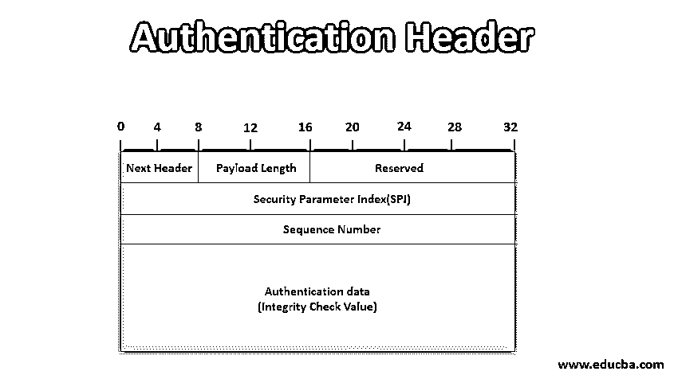
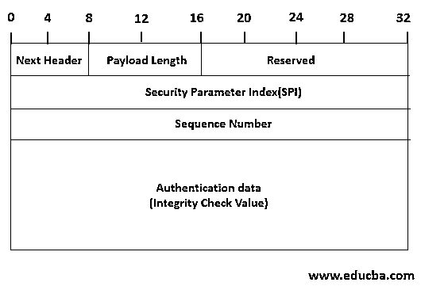

# 认证标题

> 原文：<https://www.educba.com/authentication-header/>

## 认证头介绍

认证头也被称为 AH。它为 IP 数据包的数据完整性和认证提供支持。这里，数据完整性确保位于 IP 分组内的数据在分组传输期间不被改变，并且认证服务使得用户或计算机系统能够向另一端的应用认证用户，并且基于结果，它决定是允许还是拒绝。身份验证报头可以防止 IP 欺骗攻击。为了使用 AH，双方必须共享密钥进行通信。

### 认证头的格式

认证头格式如下。认证报头中共有 6 个字段。以下是他们的名单:

<small>网页开发、编程语言、软件测试&其他</small>

*   下一个标题
*   有效负载长度
*   保留的
*   安全参数索引(SPI)
*   序号
*   认证数据

让我们详细讨论一下上述领域:

1.  **下一个报头**:该字段为 8 位，用于标识紧随认证报头之后的报头类型。例如，如果 ESP 报头跟在 AH 之后，则该字段包含值 50；否则，如果另一个 AH 跟在这个 AH 后面，它包含 51 作为值。
2.  **净荷长度:**该字段为 8 位。它包含以 32 位字减去的身份验证报头的长度。
3.  **保留:**该字段为 16 位，保留供将来使用。
4.  **安全参数索引(SPI):** 该字段为 32 位。它与源地址和目的地址以及 IPsec 协议(互联网协议安全)结合使用，唯一标识数据报所属流量的安全关联(SA)。
5.  **序列号**:该字段为 32 位，用于重放攻击。
6.  **认证数据**:这个变长字段包含认证数据，称为数据报的完整性校验值(ICV)。该值用于完整性，身份验证采用 MAC 形式。例如，对于 [IPV4 数据报](https://www.educba.com/ipv4-header-format/)，该字段是 32 的整数倍；对于 IPV6 数据报，该字段是 64 的整数倍。通过使用 HMAC 摘要算法生成 MAC 来计算完整性检查值。

### 认证报头中的操作模式

认证头中有两种模式:

*   **认证头传输模式:**在传输模式下，它位于 IP 包的原始 IP 头和原始 TCP 头之间。
*   **认证头隧道模式:**在隧道模式中，首先，原始 IP 分组被完全认证，并且认证头被插入到原始 IP 头和新的外部 IP 头之间。这里，内部 IP 报头包含最终的源 IP 地址和目的 IP 地址，而外部 IP 报头包含不同的 IP 地址(防火墙或其他安全网关的 IP 地址)

### 报头如何应对重放攻击？

在本节中，我们将讨论身份验证报头如何应对重放攻击:

*   在重放攻击中，攻击者获得经过身份验证的数据包的副本，然后将其发送到预定目的地。由于同一个数据包被接收两次，目的地用户可能会面临一些问题。为了克服这个问题，认证报头使用序列号字段。
*   在初始阶段，该字段的值被设置为 0。每当发送方通过同一 s a 向同一接收方发送数据包时，它会将该字段的值递增 1。那么发送者一定不允许这个值从 2^32 返回-1 到 0。如果同一网络上的数据包数量增加，则与接收方通信的发送方必须与接收方建立新的 SA。
*   在接收器端，接收器将滑动窗口大小保持为 W。该 W 的默认值为 64。该窗口的右边缘表示到目前为止接收到的有效数据包的最高序列号 N。当接收者从发送者那里得到一个包时，它执行一些动作。适当的操作取决于数据包的序列号。
*   如果接收到的包的序列号落在窗口内，并且如果包是新的，则检查其 MAC。如果 MAC 被成功验证，则窗口的相应槽被标记。窗口本身不会移动到右侧。
*   如果接收到的分组在窗口的右侧，即分组的序列号大于 n，并且如果分组是新的，则检查 MAC。如果分组被成功认证，则窗口向右前进，使得窗口的右边缘将匹配该分组的序列号，即序列号现在变成新的 n
*   如果接收到的分组在窗口的左侧，即窗口的序列号小于(N -W)，并且如果 MAC 检查失败，则分组将被拒绝，并且触发听觉事件。
    这就是如何认证报头防止重放攻击。

### 推荐文章

这是认证头的指南。这里我们讨论什么是认证头，它的 6 种格式，模式以及认证头如何应对重放攻击？您也可以浏览我们的其他相关文章，了解更多信息——

1.  [什么是 IPv6？](https://www.educba.com/what-is-ipv6/)
2.  [ARP 数据包格式](https://www.educba.com/arp-packet-format/)
3.  [IPv6 报头格式](https://www.educba.com/ipv6-header-format/)
4.  [IPv4 报头格式](https://www.educba.com/ipv4-header-format/)

