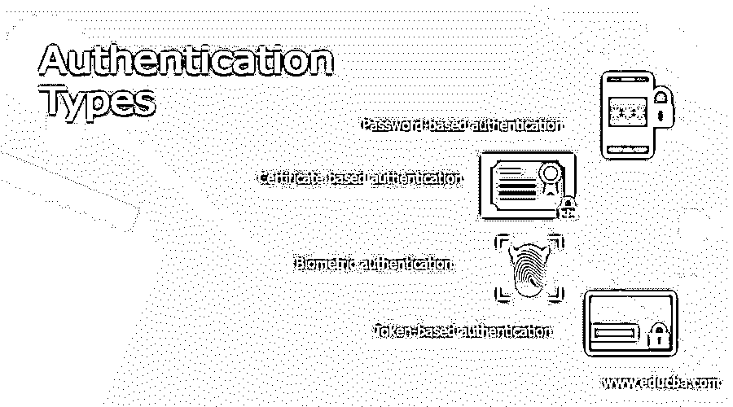

# 认证类型

> 原文：<https://www.educba.com/authentication-typesauthentication-types/>

## 身份验证类型介绍

身份验证是识别请求访问软件、网络或设备的用户的过程。访问控制使用用户名和密码验证用户身份。身份验证使用户或计算机系统能够向另一端的应用程序验证用户，并根据结果决定是允许还是拒绝用户。它为 IP 数据包的数据完整性和认证提供支持。身份验证过程根据其流程分为多种类型。这件事可以用各种方法来做。在本文中，我们将讨论身份验证的类型。

### 认证类型

身份验证的类型如下:

<small>网页开发、编程语言、软件测试&其他</small>

*   #### Password-based authentication

基于密码的身份验证是最常见的身份验证形式。它是一串字母、特殊字符、数字，应该只有被认证的人知道。明文密码是最简单的基于密码的机制。在这种机制中，用户 id 和密码被分配给用户。为了安全起见，用户定期更改密码。密码以明文格式存储在数据库中，与用户 ID 相对应。在认证过程中，第一个应用程序提示输入用户 ID 和密码。然后，用户输入他/她的用户 ID 和密码，并按下 OK 或登录按钮。单击“确定”后，用户 ID 和密码将以明文格式传送到服务器。服务器检查用户数据库，看这个特定的用户 ID 和密码是否存在。这种验证是由用户验证程序完成的。这些程序根据存储的用户数据库检查输入的用户 ID 和密码，并根据成功或失败返回结果。

*   #### Certificate-based authentication

数字证书是大词安全的一部分。它包含有关密钥、所有者和验证证书的第三方实体的数字签名的信息。如果证书有效，验证证书的软件信任证书颁发者，并可用作安全通信的密钥。证书由被称为证书颁发机构(CA)的第三方组织提供，如 VeriSign、GeoTrust 和 DigiCert。X.509 定义了公钥证书的通用格式。数字证书充当信任文档。它声明您是通过对信息进行数字签名来转换信息的人。它帮助接收者识别发送者的真实性。

*   #### Biological authentication

生物认证是一种流行的认证机制，越来越受到公众的关注。你可以看到，从用指纹或面部锁解锁手机到办公室考勤，我们在任何地方都在使用生物认证。生物认证的应用不仅限于电话和办公室，它们被用于各种领域来实现安全性。第一个用户的样本(指纹、人脸、视网膜、声音等。)并存储在用户数据库中。然后，在认证时，用户需要提供他或她在创建时提供的样本。这通常通过加密会话发送到服务器。在服务器端，用户的当前样本被解密，并与数据库中存储的样本进行比较。如果这两个样本在生物特征的特定值的基础上匹配到期望的程度，用户将被认为是有效的，否则，它将被认为是无效的。两个执行，生物认证两种技术是使用生理技术和行为技术。生理技术利用人脸、指纹、声音、视网膜、虹膜。在行为技术中，观察一个人的行为，以确保他或她没有试图自称是别人。它利用击键和签名。

*   #### Token-based authentication

身份验证令牌是密码的替代方案。它是一个小装置，用于每次生成一个新的随机值。这个随机值成为认证的基础。小型设备通常具有小型钥匙链、计算器或信用卡的大小。通常，认证令牌具有诸如电池、用于输出显示的液晶显示器(LCD)、处理器、用于输入信息的小键盘(可选)、实时时钟(可选)等功能。每个认证令牌都预编程有一个称为随机种子的唯一数字。这个随机种子确保身份验证令牌生成的每个值都是唯一的。有两种类型的身份验证令牌。一种是挑战/响应令牌，使用了多种技术的组合。种子在认证令牌内被预编程，该种子被保密并且应该是唯一的。在这种令牌中，种子成为加密密钥。第二个是基于时间的令牌，其中服务器需要向用户发送任何随机挑战。这背后的目标是使用时间作为身份验证过程的可变输入，而不是随机挑战。

### 结论

在本文中，我们讨论了四种类型的身份验证，如基于密码的身份验证、基于证书的身份验证、生物特征身份验证和基于令牌的身份验证。我们已经详细讨论了它的工作原理。希望你喜欢这篇文章。

### 推荐文章

这是认证类型的指南。这里我们讨论一下身份验证的简介和类型。您也可以看看以下文章，了解更多信息–

1.  [烧瓶认证](https://www.educba.com/flask-authentication/)
2.  [ASP.NET 认证](https://www.educba.com/authentication-in-asp-dot-net/)
3.  [Vue.js 认证](https://www.educba.com/vue-js-authentication/)
4.  [相互认证](https://www.educba.com/mutual-authentication/)

