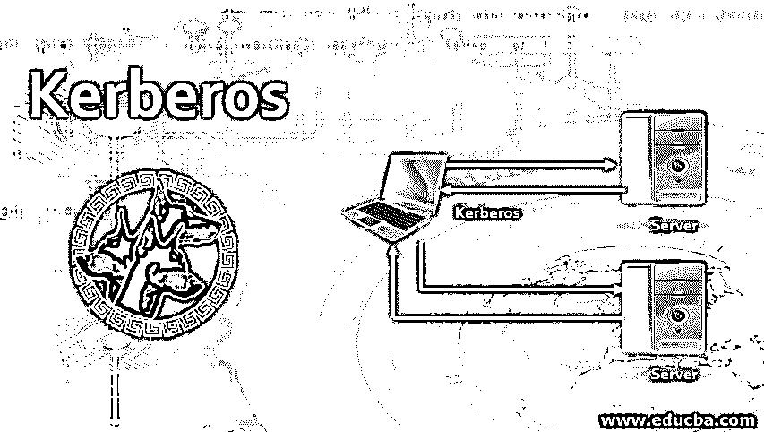

# 麻省理工学院开发的安全认证系统

> 原文：<https://www.educba.com/kerberos/>

## Kerberos 简介

以下文章提供了 Kerberos 的概述。Kerberos 是一种计算机[网络认证协议](https://www.educba.com/types-of-networking-protocols/)。它是在麻省理工学院设计的，允许以安全的方式使用网络资源。

### Kerberos 是如何工作的？

Kerberos 分三步工作。

<small>网页开发、编程语言、软件测试&其他</small>

让我们一个接一个地看看这三个步骤:

#### 第一步:登录

客户在任意工作站输入他的名字。然后，工作站以纯文本格式将该名称发送到认证服务器。作为响应，认证服务器执行一些动作。首先，它创建用户名包，即 Client，并生成会话密钥。它用认证服务器与票据授予服务器(TGS)共享的对称密钥加密这个包。这个过程的输出被称为票据授予票据(TGT)。然后，身份验证服务器将 TGT 和会话密钥结合在一起，并使用对称密钥对它们进行加密，对称密钥是从客户端的密码中获得的。

**Note:** TGT can be open only by using TGS, and the final output can be open only by the client.

收到此消息后，用户的工作站会询问密码。当用户或客户端输入其密码时，工作站会从身份验证服务器的密码中生成对称密钥。该密钥用于提取会话密钥和 TGT。之后，工作站从内存中销毁客户的密码以防止攻击。

**Note:** Users cannot open the Ticket Granting Ticket.

#### 步骤 2:获取服务授权票据

让我们假设，在成功登录之后，用户想要通过邮件服务器与其他用户通信。

对于通知他的工作站他想要联系另一个用户 x 的客户端，客户端需要一个票证来与 x 通信。此时，客户端工作站创建一个用于票证授予服务器的消息，该消息包含下面提到的项目:

*   票授予票。
*   客户对其服务感兴趣的 X 的 id。
*   当前时间戳应该用相同的会话密钥加密。

票据授予，仅使用票据授予服务器的密钥对票据进行加密；因此，只有票据授予服务器可以打开票据授予票据。由于这个原因，票据授予服务器认为消息来自真正的客户端。会话认证服务器加密了票据授予票据和会话密钥。

认证服务器使用秘密密钥对其进行加密，秘密密钥是从客户端的密码中获得的。因此，唯一的客户端可以打开包并检索票据授予票据。
一旦票证授予服务器对客户端输入的详细信息感到满意，票证授予服务器将为客户端创建一个会话密钥 KAB，以执行与 X 的安全通信。票证授予服务器将它发送给客户端两次——第一次是在与 X 的 id 组合并使用会话密钥加密时发送，第二次是在与客户端 id 组合并使用 X 的秘密密钥 KB 加密时发送。

在这种情况下，攻击者可以尝试获取客户端的第一条消息，并尝试进行回复攻击。然而，这将失败，因为客户端消息包含加密的时间戳，并且攻击者不能替换时间戳，因为他没有会话密钥。

#### 步骤 3:用于访问服务器的用户联系人 X

客户端向 X 发送 KAB 以创建与 X 的会话。为了安全通信，客户端将使用 X 的密钥加密的 KAB 转发给 X。X 可以访问 KAB。为了防止回复攻击，客户端向 X 发送一个用 KAB 加密的时间戳。x 使用他的秘密密钥获得信息；他使用 KAB 从该信息中解密邮票值。然后 X 在时间戳值上加 1，用 KAB 加密，并发送给客户端。然后，客户端打开数据包，并验证 X 增加的时间戳。在此过程中，客户端确保 X 收到客户端发送的相同 KAB。

现在客户机和 X 可以安全地相互通信了。两者都使用共享密钥 KAB yo 在发送时加密数据，并使用相同的密钥解密消息。假设客户端可能想要与另一个服务器 Y 通信；在这种情况下，客户机只需要从票据授予服务器获得另一个秘密密钥。在获得秘密密钥后，他可以与 Y 通信，类似于我们在 X 的情况下讨论的那样。如果客户端可能再次与 X 通信，他可以使用相同的先前密钥；没有必要每次都生成一张票。只有第一次，他需要获得票。

### Kerberos 的优点和缺点

下面给出了优点和缺点:

#### 优势:

*   在 Kerberos 中，客户端和服务是相互认证的。
*   各种操作系统都支持它。
*   Kerberos 中的票证有一个有限的期限。如果票被盗，由于强认证需求，很难重用票。
*   密码从不通过未加密的网络发送[。](https://www.educba.com/types-of-network-attacks/)
*   在 Kerberos 中，秘密密钥是共享的，这比共享公开密钥更有效。

#### 缺点:

*   它容易受到弱密码或重复密码的攻击。
*   它只为服务和客户端提供身份验证。

### 结论

在本文中，我们已经了解了 kerberos 是什么，它是如何工作的，以及它的优缺点。

### 推荐文章

这是一个 Kerberos 指南。在这里，我们讨论了介绍，kerberos 如何工作，优点和缺点分别。您也可以浏览我们推荐的其他文章，了解更多信息——

1.  [虚拟主机的类型](https://www.educba.com/types-of-web-hosting/)
2.  什么是 Web 应用程序？
3.  [什么是星型模式？](https://www.educba.com/what-is-star-schema/)
4.  [Elasticsearch Java](https://www.educba.com/elasticsearch-java/)

