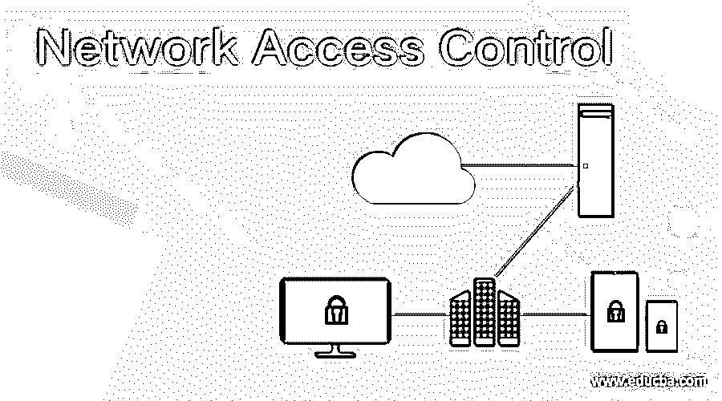

# 网络访问控制

> 原文：<https://www.educba.com/network-access-control/>

## 什么是网络访问控制？

网络访问控制是一种集中的终端安全方法，通过对所有用户和设备实施策略，强调网络可见性和限制性访问管理。顾名思义，NAC 意在控制网络接入。网络访问管理旨在限制未经授权的设备或用户进入私有企业网络。根据公司网络，网络访问控制提供可见性、访问控制和安全性。网络访问控制有助于组织识别和应用严格的访问管理控制，遵守安全法规，减少人工劳动，并防止数据泄露。

### NAC 是如何工作的？

网络访问控制是一种定义和实施规则的工具，这些规则使用一组协议和策略来指定哪些用户和设备可以访问网络。在大多数情况下，构建 NAC 系统是为了禁止不合规和未经授权的设备访问网络。基于许多因素，如系统健康或基于角色的变量，NAC 使您能够拒绝或允许网络访问。NAC 有助于根据公司内部的任务确定网络访问策略，并执行这些策略。因此，应对 NAC 进行配置，以便员工只能访问完成其工作职能所需的数据。

<small>网页开发、编程语言、软件测试&其他</small>

NAC 是一个两阶段的过程:认证和授权。如果任一阶段失败，它将阻止并隔离设备或用户。

NAC 系统在认证期间提示用户输入凭证，以检查他们作为授权用户的身份。

公司可以使用各种身份验证形式，如用户名或密码、pin、生物特征扫描等。

然后，NAC 在身份验证后根据本地访问策略批准访问。如果访问策略授权用户或计算机，则授予访问权限。如果不是，则拒绝访问。

### 网络访问控制能力

在进入您的网络之前，NAC 解决方案主要用于阻止攻击、未经授权的访问、不兼容的设备和其他风险。因此，它的许多功能都是主动的。

网络访问控制工具通过以下功能执行访问管理:

1.  **集中式策略管理:**实施和强制执行策略，无需针对操作场景、计算机和用户的不同项目或附加模块。
2.  **配置和可见性:**识别用户及其计算机，对其进行分类，并按照特定业务策略的规定允许访问。
3.  **访客网络访问:**使用灵活的门户来控制访客访问，包括注册、管理和认证。
4.  **安全状态检查:**根据用户类型、操作系统和设备类型确定是否符合安全策略和设备安全性。
5.  **事件响应:**通过实施无需人工干预的策略来限制、隔离和修复不合规系统，从而减少网络漏洞。
6.  **双向集成:**与其他网络和安全技术的集成。

### NAC 为什么重要？

根据市场、规模、IT 员工、网络基础设施和许多其他因素，NAC 工具对任何企业都是必不可少的。然而，通过灵活的方式安全地允许认可的设备连接到您的网络是 NAC 解决方案的主要优势。由于物联网(IoT)设备的兴起及其在工作场所的存在，NAC 近年来已经成为一种强有力的工具。在大多数情况下，此类物联网设备缺少防病毒、补丁或主机入侵防御软件，或者无法提供这些软件。NAC 还会阻止他们访问您的网络，并使其他设备面临交叉感染的可能性。

网络访问控制主要用于以下领域

**1。承包商的 NAC**

为了确保非员工拥有受限的访问权限，NAC 解决方案允许组织对承包商、来宾、访客和合作伙伴进行统计。在连接之前，NAC 确保设备与预定义的安全策略兼容。

**2。物联网设备的 NAC**

通过提供可见性、访问管理解决方案和配置文件来监控其网络访问，NAC 降低了物联网设备上的这些风险。盘点和标记网络中每个未知硬件的能力是 NAC 系统的主要优势之一。

简而言之，为了确保设备符合您的安全和业务政策，NAC 系统将监控物联网操作。

**3。事件响应的 NAC**

NAC 系统可以与第三方安全组件共享上下文细节，如用户 ID 或设备类型。此外，通过自动实施隔离受损终端的安全策略，NCA 解决方案将响应网络安全警告。这样，任何可能的危险都可以很容易地被你的组织所控制。NAC 系统现在允许事故响应计划的某些方面的自动化。

**4。用于医疗设备的 NAC**

NAC 软件允许医疗机构检测和防御对设备和医疗记录的威胁和未经授权的访问。此外，对于必须遵守 HIPAA 法规的医疗保健组织来说，NAC 解决方案尤为重要。NAC 系统可让您加强医疗保健保护，防止未经授权访问 PHI。

### 什么是网络访问控制列表？

网络访问控制列表(ACL)是一组规则，根据特定要求，允许或拒绝对传入和传出流量的访问。

例如，这些要求可能取决于试图访问网络的源、目的地、系统、特定协议等。引入网络访问控制列表可能是一项耗时的工作。然而，它对设备和网络保护都很重要。不要指定每个用户的访问策略，而是根据他们的工作职能将他们组织到不同的职位。此外，在构建 NAC 列表时，使用最小特权的概念(POLP)。POLP 只为用户提供他们工作所需的访问级别。

### 结论

如今数据越来越重要，越来越受追捧。网络犯罪越来越成为一个价值数十亿美元的产业。通过控制对网络的访问，NAC 系统允许您的企业监控、识别和保护您的数据。因此，在本文中，我们已经了解了什么是网络访问控制，为什么它很重要，以及它的用途。

### 推荐文章

这是网络访问控制指南。这里我们讨论什么是网络访问控制？，NAC 是如何工作的？以及 NAC 为什么重要？分别是。您也可以看看以下文章，了解更多信息–

1.  [网络分析工具](https://www.educba.com/network-analysis-tools/)
2.  [单层神经网络](https://www.educba.com/single-layer-neural-network/)
3.  [网络发现工具](https://www.educba.com/network-discovery-tools/)
4.  [DNN 神经网络](https://www.educba.com/dnn-neural-network/)

