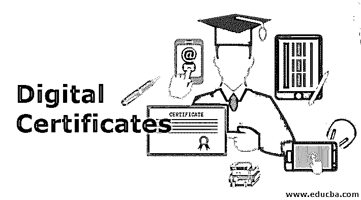

# 数字证书

> 原文：<https://www.educba.com/digital-certificate/>

**

** 

## 数字证书简介

以下文章提供了数字证书的概述。数字证书是一个小的计算机文件。它用于建立用户和他或她的公钥之间的关系。数码证书包含两项内容，即用户的姓名和网络钓鱼者或其公钥。以便我们可以识别特定的密钥属于特定的用户。

数字证书包含的信息如下:

<small>网页开发、编程语言、软件测试&其他</small>

*   主题名称
*   公开密钥
*   序列号
*   其他数据，如电子邮件、电话等
*   有效期从…
*   有效期至
*   发行人名称

这里的主题名代表用户的名字。公钥代表照片和签名。序列号代表数字证书的编号。其他数据包含用户的一些个人信息。有效性用于显示特定数字证书的有效性。颁发者的姓名是为用户颁发数字证书的人的姓名。

### 什么是证书颁发机构？

颁发数字证书的可信机构被称为证书颁发机构。证书颁发机构(CA)应该是受信任的机构；因此，在许多国家，政府决定谁应该和不应该是一个 CA。Verisign 和 Entrust 是世界上一些著名的认证机构。

### 数字证书的内容

下面给出了数字证书的内容:

X.509 是定义数字证书结构的标准。1998 年，ITU(国际电信联盟)提出了这个标准。X.509 有 3 个可用版本。

#### **版本 1:**

它有以下组件:

*   **版本:**用于标识 X.509 的版本。
*   **证书序列号:**是 CA 生成的唯一整数。
*   **签名算法标识:**用于[标识 CA 签名时使用的算法](https://www.educba.com/what-is-an-algorithm/)。
*   **颁发者名称:**显示颁发证书的 CA 的名称。
*   **有效期:**用于显示证书的有效期。
*   **主题名称:**显示证书所属用户的名称。
*   **主体公钥信息:**包含用户的公钥和该密钥所使用的算法。

#### 版本 2:

它有两个附加字段:

*   **发行者唯一标识符:**如果两个或多个 CA 使用相同的发行者名称，这有助于找到唯一的 CA。
*   **主题唯一标识符:**如果两个或两个以上的用户使用了相同的名称，这有助于唯一地找到用户。

**第三版:**

版本 3 包含数字证书的许多扩展。

### 数字证书的创建

以下是创建数字证书的不同步骤:

#### 步骤 1–密钥生成

在这个步骤中，生成一个密钥。可以使用两种方法生成密钥。

**方法 1:**

用户使用软件创建私钥和公钥对。用户必须对他们的私钥保密。用户将带有附加信息的公钥发送给 RA。RA 是 CA 和用户之间的中介。

**方法 2:**

RA 为用户生成一个密钥对。当用户不知道技术和软件知识时，需要这种方法的可能性。这种方法的缺点是 RA 可以找出用户的私钥。

#### 第二步-注册

只有当用户生成密钥对时，才需要这一步。如果 RA 为用户生成一对密钥，则仅在第一步中完成密钥注册。用户向 RA 发送他/她的公钥和一些其他信息。该软件提供了一个向导，用户可以在其中输入详细信息并提交。然后数据通过网络到达 RA。之后，用户对证书的请求将被注册，并且证书请求的格式已经被标准化。这个过程称为 CSR(证书签名请求)。

#### 步骤 3–验证

注册过程完成后，RA 识别用户凭证。

#### 步骤 4–证书创建

上述所有流程完成后，RA 将所有细节传递给 CA。CA cross 验证所有细节并为用户生成一个数字证书。CA 将证书发送给用户，并保留一份副本以保存记录。证书副本存储在证书目录中。

### 数字证书的类型

下面给出了数字证书的类型:

*   **邮箱证书:**包含用户的邮箱 id。这用于标识电子邮件消息的签名者具有与用户证书中提到的相同的电子邮件 id。
*   **服务器端 SSL 证书:**这些类型的证书对商家很有用，因为商家希望他们的用户信任他们，并从他们的网站购买优质服务。
*   **客户端 SSL 证书:**商家使用这种类型的证书来识别他们的客户。
*   **代码签名证书:**这种类型的数字证书[允许软件开发者](https://www.educba.com/career-as-a-software-developers/)对他们的软件或应用程序的代码进行加密。加密代码后，攻击者不能更改或修改该代码。代码签名证书确保最高级别的安全性和验证。代码签名证书的 CA 使用公钥基础设施(PKI)和数字签名技术来验证软件的完整性和发行者的身份，并确认您的代码没有被篡改或损坏。

### 推荐文章

这是数字证书的指南。这里我们已经讨论了数字证书、数字证书的内容以及它是如何创建的和它的类型。您也可以看看以下文章，了解更多信息–

1.  [数字签名类型](https://www.educba.com/digital-signature-types/)
2.  [数字学习](https://www.educba.com/digital-learning/)
3.  [数字电子&半导体捆绑](https://www.educba.com/bundle/digital-electronics-semiconductors-bundle/)
4.  什么是 SSL 证书？

