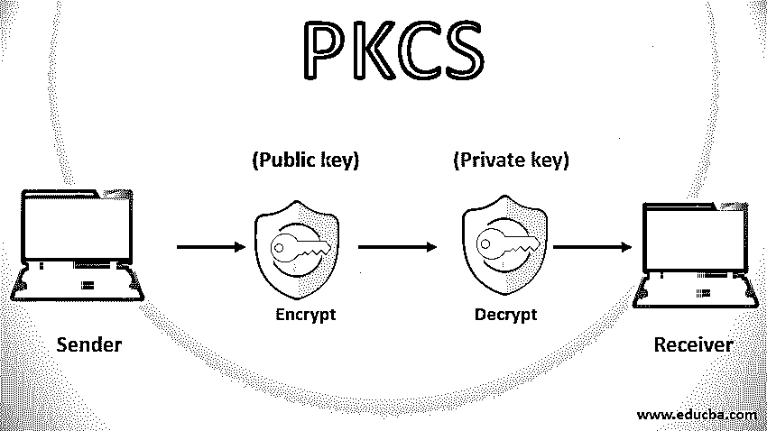

# PKCS

> 原文：<https://www.educba.com/pkcs/>

## 公钥加密标准简介

PKCS 代表公钥加密标准，是由 RSA 实验室在 1990 年初开发的模型，旨在标准化公钥基础设施。公钥密码标准总共提供了 15 个标准，以数字命名，如 PKCS#1，PKCS#2，PKCS#3，…..PKCS 15 号。

### 公钥加密标准列表

总共有 15 种公钥加密标准。让我们逐一讨论那些公钥密码标准。

<small>网页开发、编程语言、软件测试&其他</small>

#### PKCS 排名第一

该标准的主要目的是 RSA 加密标准。本标准定义了 RSA 公钥功能的基本规则，更具体地说，就是数字证书。该标准还定义了 RSA 私钥和公钥的语法，这有助于选择和计算 RSA 算法的密钥对。它还定义了如何计算数字证书，如何对数据结构进行签名，以及数字签名的格式。

#### PKCS 第二

本标准的主要目的是用于消息摘要的 RSA 加密标准。本标准定义了报文摘要的计算。现在 PKCS 2 号和 PKCS 1 号合并了。由于它与标准 1 合并，它没有独立的存在。

#### PKCS 第三名

本标准的主要目的是 [Diffie-Hellman 密钥协商标准](https://www.educba.com/diffie-hellman-key-exchange-algorithm/)。该标准定义了实现 Diffie Hellman 密钥协商协议的机制。

#### PKCS 排名第四

这个公钥[密码学标准](https://www.educba.com/what-is-cryptography/)也和 PKCS#1 合并了，所以它也没有独立存在。

#### PKCS 第五名

该标准的主要目的是基于密码的加密。它定义了使用从密码中导出的对称密钥加密八位字节字符串的方法。

#### PKCS 6 号

本标准的主要目的是扩展证书语法标准。它定义了扩展 X.509 数字证书属性的语法。

#### PKCS #7

该标准的主要目的是加密消息语法标准。它定义了数据的语法，数据是加密操作的结果形式，例如数字签名和数字信封。该标准还提供了各种格式选项，如仅封装、仅签名、已签名的消息。

#### PKCS 8 号

本标准的主要目的是私钥信息标准。它定义了私钥信息的语法。换句话说，我们可以说它定义了用于生成私钥的算法和属性。

#### PKCS 第九名

本标准的主要目的是选择属性类型。它定义了 PKCS#6 扩展证书中使用的选定属性类型。例如，电子邮件地址、非结构化地址和姓名。

#### PKCS 第十名

本标准的主要目的是证书请求语法标准。它定义了请求数字证书的语法。证书申请包含一个 Distinguishedname 和公钥。

#### PKCS 第 11 名

该标准的主要目的是加密令牌接口标准。这个标准也因 Cryptok 而闻名。它为单用户用户设备定义了 API，其中包含有关加密的信息，如数字证书和公钥。这些设备可以执行加密功能。例如，智能卡。

#### PKCS 第 12 名

本标准的主要目的是个人信息交换语法。它定义了个人识别的语法，如数字证书、私钥等。换句话说，我们可以说这个标准允许用户使用标准机制将他们的数据从一个设备传输到另一个设备。

#### PKCS 13 号

该标准的主要目的是椭圆曲线加密标准。该标准用于处理一种新的即将出现的加密机制，称为椭圆曲线加密。

#### PKCS 第 14 名

该标准的主要目的是伪随机数生成标准。本标准定义了随机数生成的要求和流程。由于随机数生成在密码学中非常常用，因此规范随机数生成变得非常重要。

#### PKCS 15 号

该标准的主要目的是加密令牌信息语法标准。该标准定义了在加密过程中使用的 tokes，以便它们可以互操作。

### 结论

本文详细介绍了公钥加密标准及其各种标准。我希望这篇文章对你有所帮助。

### 推荐文章

这是 PKCS 旅游指南。在这里，我们讨论公钥加密标准的介绍以及详细解释的各种标准。您也可以浏览我们推荐的其他文章，了解更多信息——

1.  [加密工具](https://www.educba.com/cryptography-tools/)
2.  [密码技术](https://www.educba.com/cryptography-techniques/)
3.  [数字签名加密](https://www.educba.com/digital-signature-cryptography/)
4.  [密码术 vs 加密](https://www.educba.com/cryptography-vs-encryption/)

