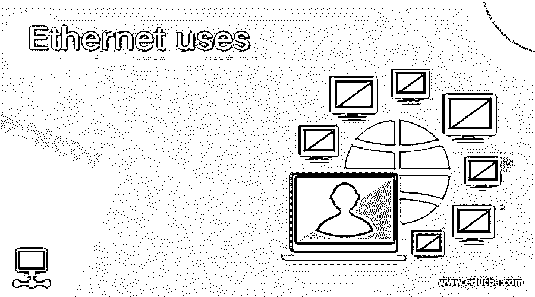

# 以太网用途

> 原文：<https://www.educba.com/ethernet-uses/>

## 以太网用途介绍

以太网是一种用于连接有线广域网或局域网中的设备的技术。它用于通过一组称为协议或通用网络语言的规则实现设备之间的通信。以太网定义了在局域网或广域网中的网络设备之间格式化和传输数据的方式，可以被网络范围内的设备识别。电缆用于数据传输；该电缆是一种被称为以太网电缆的封闭式布线。在本文中，我们将了解以太网并研究以太网的用途。

### 以太网的用途

以太网最基本的用途是连接网络中的不同设备，以太网也被认为是最流行的网络连接形式之一。以太网通常因其可靠性、速度和安全性而用于局域网，任何学校、学院、公司、办公室和医院都可以使用。

<small>网页开发、编程语言、软件测试&其他</small>

以太网之所以进入市场，主要是因为它的价格比同类产品低，包括 IBM 的令牌环网。随着时间的推移，以太网越来越受欢迎，因为它能够提供更高水平的性能，同时保持与早期版本的兼容性。在它出现的时候，以太网曾经提供每秒 10 兆比特的吞吐量，随着时间的推移，直到 20 世纪 90 年代，它已经增加到每秒 100 兆比特。电气和电子工程师协会通常被称为 IEEE，它总是提供最好的更新来增强以太网的性能。如今，以太网可以支持高达每秒 400 千兆比特的吞吐量。

以太网使用各种拓扑。其中一些解释如下:

#### 1.总线拓扑

当一个网络的所有节点都用一根电缆连接起来时，这就叫做总线拓扑。总线拓扑中使用的单条电缆称为主干。最初，总线拓扑用于 10Base-5 粗网和 10Base-2 细网同轴电缆以太网。这种拓扑将一个节点发送的消息广播给连接到电缆的所有其他节点。一旦消息被发送，那么目标节点只能处理该消息。总线拓扑是安装拓扑中最简单、最便宜的一种。

#### 2.环形和双环拓扑

当一个网络的所有节点都连接成一个环时，这就叫做环形拓扑。这里的每一个节点都像中继器一样工作，以保持信号的强度，防止信号在网络中传播时衰减。当在网络内发送一条信息时，发送计算机发送指向特定计算机的消息，然后信号通过环形网络逆时针或顺时针发送。

网络中传输的所有信号都必须单向传输。这样做是为了避免网络中的数据冲突和噪声。有时，其中一个节点可能会中断，从而导致网络故障。因此，双环拓扑用于解决这一问题，它向网络添加了另一条电缆以避免故障。

#### 3.星形和扩展星形拓扑

对于以太网，星形和扩展星形拓扑是最流行的。星型拓扑和扩展星型拓扑非常容易建立，价格也相对较低，并且比其他拓扑具有更高的冗余度。在星型拓扑中，所有节点都连接到网络中的中央设备。中央连接确保即使任何节点或电缆出现故障，网络也能继续工作。这种拓扑结构的唯一问题是，如果中央设备出现故障，网络将停止运行。

星型拓扑通常适用于集中式和小型网络。扩展星型拓扑用于大型网络，其中添加了子中心设备并连接到中心设备。这对于大型网络非常有利，并且允许对网络中的 IP 地址进行子网划分。

#### 4.树形/分层拓扑

在一个总线拓扑上配置多个星型拓扑，使用一个中心节点构成树型或层次型拓扑。这里的主要问题是，如果中央根节点出现故障，网络将停止运行或变得不稳定。这种拓扑结构主要适用于那些将来必须扩展的网络，比星形或总线拓扑结构更有优势。然而，树或层次拓扑由于其脆弱性而不太被使用。

#### 5.网状拓扑

有两种网状拓扑类型:一种是部分网状，另一种是全网状。在全网状拓扑中，每个节点都相互连接。与其他网络相比，这使得网络完全冗余并增强了其可靠性。在这种拓扑中，即使一个链路或节点中断，也有其他路径来传输数据。实现这种拓扑的主要问题是其配置的复杂性，并且这种拓扑的价格较高。

这种拓扑主要用于节点较少的网络或较小的网络。在部分网状拓扑中，从每个节点到彼此提供不同的替代路由。这种类型的拓扑提供了一些冗余，主要用于主干环境或服务非常重要的网络，也用于广域网。互联网是部分网状拓扑的一个例子。

### 结论

在上述文章的基础上，我们了解了以太网的概念及其用途。本文详细解释了使用以太网的各种拓扑结构，以了解数据如何在网络中传输，以及如何转换数据以提高效率。

### 推荐文章

这是以太网使用指南。这里我们讨论以太网的概念和以太网使用的各种拓扑结构。您也可以看看以下文章，了解更多信息–

1.  [什么是以太网？](https://www.educba.com/what-is-ethernet/)
2.  [以太网帧格式](https://www.educba.com/ethernet-frame-format/)
3.  [以太网拓扑](https://www.educba.com/ethernet-topology/)
4.  [寄存器内存](https://www.educba.com/register-memory/)

