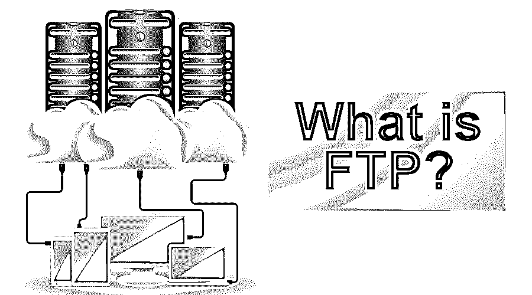
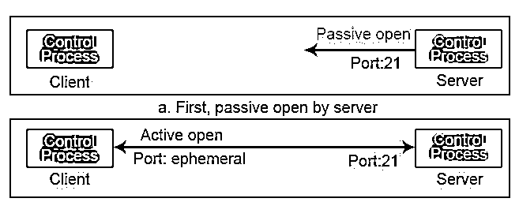
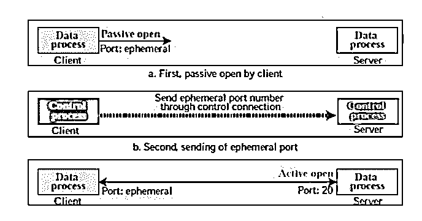
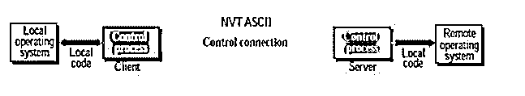
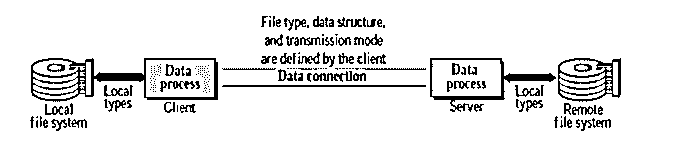

# 什么是 FTP？

> 原文：<https://www.educba.com/what-is-ftp/>

## FTP 简介

FTP 代表文件传输协议。它是一种协议，用于将文件从一个位置转换到另一个位置，即从一台主机转换到另一台主机。它是 TCP/IP 提供的[标准机制。将文件从一个系统转换到另一个系统看起来非常简单，但是在转换文件之前需要处理一些问题。](https://www.educba.com/tcp-ip-model/)

例如，两个系统可能使用不同的文件名约定；两个系统可能有不同的目录结构。两个系统可能有不同的数据表示方式；所有问题都通过文件传输协议解决。在将文件从一个主机转换到另一个主机之前，它会处理这个事情，然后传输文件。

<small>网页开发、编程语言、软件测试&其他</small>

### 它是如何工作的？

它使用 TCP 服务。它需要两个 TCP 连接。一个是控制连接，另一个是数据连接。对于控制连接，它使用众所周知的端口 21，对于数据连接，它使用众所周知的端口 20。

#### 1.控制连接

服务器站点控制连接使用众所周知的端口 21。

建立控制连接有两个步骤:

*   服务器在众所周知的端口 21 上发出被动打开，并等待客户端。
*   在发出被动打开之后，客户端使用临时端口发出主动打开。

该控制连接在整个过程中保持打开。由于用户和服务器使用交互式连接进行通信，因此他们使用的服务通过互联网协议使延迟最小化。对于通信，用户键入命令，作为回报，服务器没有任何延迟地给出响应。

#### 2.数据连接

在服务器端，数据连接使用众所周知的端口 20。

建立数据连接有三个步骤:

*   使用临时端口客户端发出被动打开。这一步必须由客户端完成，而不是服务器，因为客户端需要转换文件。
*   客户端使用 PORT 命令将该端口号发送给服务器。
*   当服务器从客户端接收到这个端口号时，它使用众所周知的端口 20 发出 active open。

#### 3.沟通

运行在两个不同系统上的客户机和服务器都必须进行通信以转换数据。对于通信，它使用两种方法，即通过控制连接的通信和通过数据连接的通信。

*   **通过控制连接的通信**

为了通过控制连接进行通信，FTP 使用 TELNET 或 SMTP。它使用 NVT ASCII 字符集。命令和响应确实通过控制连接进行通信。第一个命令通过连接发送，作为回报，另一个系统发送响应。我们可以一次发送一个命令或响应。只有单向的交流。

*   **通过数据连接进行通信**

要通过数据连接转换文件，客户端必须定义需要转换的文件类型、传输模式和数据结构。它通过定义这三个属性来解决异构性问题。

#### 4.指令处理

为了在客户端系统和服务器系统之间建立通信，FTP 使用控制连接。在此过程中，客户端向服务器发送命令，作为回报，服务器向客户端发送响应。

### FTP 传输的类型

它可以通过互联网连接传输以下文件类型:

*   **ASCII 文件:**这是将一个文件转换成另一个文件的默认格式。每个字符采用 NVT ASCII 编码，即网络虚拟终端 ASCII 字符集。发送方和接收方都将其文件从自己的表示形式转换成 NVT ASCII 码。
*   **EBCDIC:** 如果发送方或接收方连接使用 EBCDIC 编码方法，那么对于转换文件，FTP 使用 EBCDIC 编码。
*   **图像文件:**对于二进制文件的转换，图像文件是默认模式。该文件在互联网连接上以流位的形式进行转换，无需编码。

### FTP 的传输模式

为了通过互联网连接传输文件，它使用三种传输模式。

*   流模式
*   块状态
*   压缩模式

#### 1.流模式

这称为默认模式。在这种模式下，数据以流字节的形式从 FTP 转换到 TCP。这里，TCP 负责将数据分割成小段。如果转换数据已经是流字节的形式，那么数据连接会自动关闭。否则，由发送方关闭。

#### 2.块状态

块模式以块的形式将数据从一台主机传输到另一台主机。每个块之前都有一个 3 字节的报头。第一个字节包含关于块的所有信息，因此对于描述块是已知的。Oher 两个块以字节的形式包含块的大小。

#### 3.压缩模式

压缩模式用于大文件的情况。如果文件很大，由于大小限制，它不能通过互联网连接发送。在压缩模式下，大文件被压缩成小文件，然后通过互联网发送。

#### 4.数据结构

为了通过数据连接转换文件，它使用以下数据结构之一。

*   **数据结构:**这是默认的文件结构。它包含一个字节流。
*   **记录结构:**该结构只能用于文本文件。它把一个文件分成几个记录。
*   **页面结构:**整个文件分为若干页，每一页都包含一个页码和页眉。页面可以顺序或随机访问。

### 推荐文章

这是一个什么是 FTP 的指南？这里我们讨论了 FTP 的工作方式、类型和传输模式，并做了详细的解释。您也可以浏览我们推荐的其他文章，了解更多信息——

1.  [什么是 WebSocket？](https://www.educba.com/what-is-websocket/)
2.  [什么是网络拓扑？](https://www.educba.com/what-is-network-topology/)
3.  [网络拓扑类型](https://www.educba.com/types-of-network-topology/)
4.  [计算机网络面试试题](https://www.educba.com/computer-network-interview-questions/)

