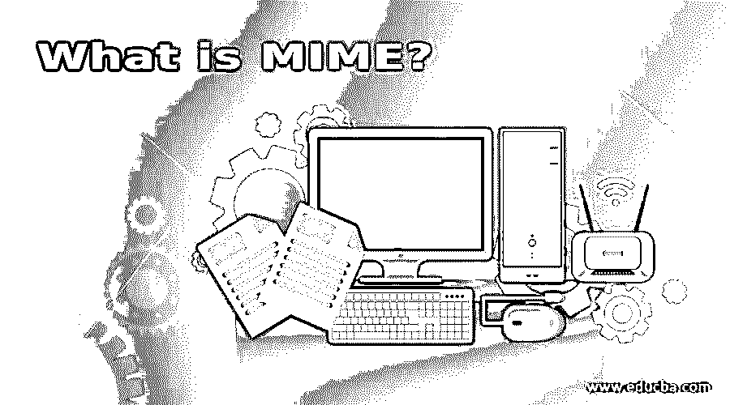

# 什么是哑剧？

> 原文：<https://www.educba.com/what-is-mime/>

## 多用途互联网邮件扩展介绍

MIME 代表多用途互联网邮件扩展，是一种通过允许用户使用基本电子邮件系统发送二进制文件来扩展基本电子邮件系统的系统。从 SMTP 协议发展到克服，由于使用 SMTP，只能交换文本消息。MIME 用于传输文本消息、文档、多媒体文件等。MIME 电子邮件消息包含普通的因特网文本消息，该消息具有一些特殊的报头和格式化的文本部分，其中每个部分保存 ASCII 编码的数据。每一部分都以解释如何在接收端解释/解码随后的数据开始。接收者电子邮件系统使用这个解释来解码数据。

### Top MIME Headers

MIME 中有 5 个标题，如下所示:

<small>网页开发、编程语言、软件测试&其他</small>

**1。MIME 版本:**这个头包含 MIME 版本号。目前，它被保留供将来使用。
2**。Content-type:** 这个头用于定义出现在消息体中的数据。内容类型包括文本、消息、图像、视频、音频、多媒体和应用程序。所提供的详细信息足以使收件人电子邮件系统能够正确处理收到的电子邮件。
**3。内容传输编码:**该报头用于定义传输类型，即用于消息正文的编码方法。有 5 种方法–7 位、8 位、二进制、Base-64 和可引用打印的
**4。内容 ID:** 这个头部分定义了唯一标识 MIME 实体的 ID。
**5。内容描述:**当无法阅读消息正文时，使用此标题部分，例如图像、视频。

### 哑剧的功能

MIME 提供了以下功能:

**1。签名数据:**它由用发送方的私钥加密的消息摘要组成。内容和数字签名都使用 Base-64 编码。
2**。明文签名数据:**它类似于签名数据，唯一的区别是明文签名数据中只有数字签名是使用 Base-64 编码的。
**3。封装数据:**由任何类型的加密内容组成，其中用于加密的密钥是用接收方的公钥加密的。
**4。签名和封装数据:**它结合了仅签名和仅封装的实体。我们可以对封装的数据进行签名，也可以对被封装的数据进行签名，或者对明文数据进行签名。
MIME 安全特性
**5。** **签收回执:**用于对原始消息的确认。换句话说，我们可以说它被用作向原始发送者传递消息的证明。接收者对用户发送的原始消息、发送者的签名和确认进行签名，并创建 MIME 消息类型。
**6。安全标签:**添加到报文中，用于标识报文的访问控制、优先级及其敏感度(机密级)
**7。** **安全邮件列表:**创建安全邮件列表是为了在邮件发送者向多个用户发送邮件时，接管每个收件人所需的处理工作。例如，如果一个消息被发送给 5 个接收者，它可能必须用接收者的 5 个各自的公钥加密。MIME 邮件列表代理可以接收单个传入邮件，使用密钥执行适当的加密，然后转发加密的邮件。发送方只对原始消息加密一次，并且只发送一次。安全邮件列表完成剩下的工作。

### MIME 中使用的加密算法

用于多用途互联网邮件扩展的加密算法列表如下:

*   **Diffie Hellman 算法:**用于对称密钥加密。
*   **数字签名标准(DSS):** 用于数字签名。
*   **DES-3:** 用于加密对称密钥。
*   **RSA:** 该算法用于加密对称密钥或数字签名。

对于算法的使用，MIME 使用了两个术语，must 和 should，其中必须指定算法的强制使用，并且应该指定可能的支持。

*   **消息摘要:**必须支持 MD5 和 SH1，应使用 SHA-1。
*   **封装:**发送方和接收方必须支持 Diffie-Hellman。发送方和接收方应该支持 RSA。
*   **数字签名:**发送方和接收方都必须支持 DSS，并且应该使用 RSA。
*   **对称密钥加密:**发送方应使用 DES-3 和 RC4，接收方必须使用 DES-3 和 RC2。

#### MIME 证书

多用途 Internet 邮件扩展使用 X.509V3 证书。MIME 中使用的密钥管理方案是 PGP(相当好的隐私)中规定的 X.509 证书层次结构和信任网的组合。这些证书仅由 CA 签名。

MIME 使用的密钥管理功能列表如下:

*   **密钥生成:**具有管理能力的用户应该能够创建 Diffie Hellman 和 DSS 密钥对，并且应该能够创建 RSA 密钥对。
*   **注册:**要接收 X.509 证书，用户必须向 CA 注册他/她的公钥。
*   **证书存储和检索:**为了解密传入消息并验证传入消息的签名，用户需要一个数字证书。此活动必须仅由当地管理部门维护。

### 结论

在本文中，我们已经了解了什么是 MIME，它的功能以及 MIME 中使用的加密算法。我希望这篇文章对你有所帮助。

### 推荐文章

这是一本关于什么是哑剧的指南？.在这里，我们简单地讨论一下多功能因特网邮件扩展的介绍和它的标题类型以及功能。您也可以浏览我们推荐的其他文章，了解更多信息——

1.  [SOA 备选方案列表](https://www.educba.com/soa-alternatives/)
2.  [谷歌云平台|重要性|好处](https://www.educba.com/what-is-google-cloud-platform/)
3.  [业内 7 大 JMeter 替代品](https://www.educba.com/jmeter-alternatives/)
4.  [体式的替代品清单](https://www.educba.com/asana-alternatives/)

