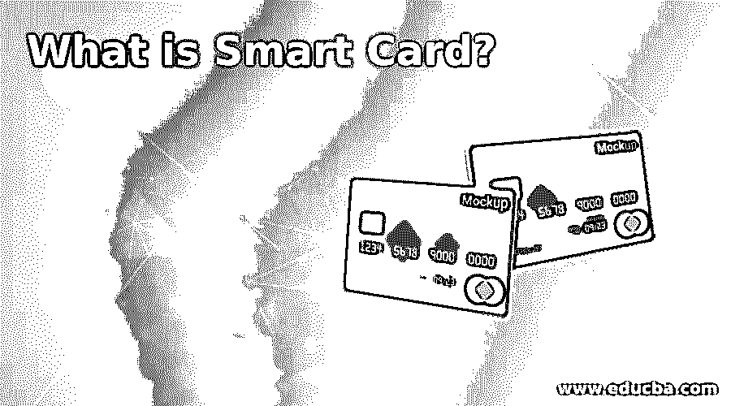

# 什么是智能卡？

> 原文：<https://www.educba.com/what-is-smart-card/>

## 智能卡简介

智能卡是一种带有嵌入式内置芯片的物理卡，用作安全令牌。它们通常大小相似，可以由金属或塑料制成，就像驾照或信用卡一样。您可以通过直接物理接触或短期无线网络协议(如射频识别或近距离通信)链接到阅读器。微控制器或内置存储芯片可以是智能卡上的芯片。

智能卡被设计成不受操纵，并使用加密来保护内存中的信息。微控制器芯片卡可以执行卡上的处理功能，并且可以访问芯片存储器中的数据。智能卡有多种用途，但主要用于信用卡和其他支付卡。近年来，支付卡行业采用符合 EMV 标准的智能卡推动了智能卡的销售。

<small>网页开发、编程语言、软件测试&其他</small>

### 智能卡的使用

*   一般来说，智能卡用于进行快速和安全的交易，并保护个人信息，包括信用卡和其他形式的卡、公司和政府身份证以及公共交通卡。
*   为此目的，电子护照和签证被多次使用。
*   例如，智能卡主要用作 ATM 卡或借记卡，使用锁。
*   组织也将它用于安全目的，除了用作多因素自动化令牌之外，这些卡还可用于验证个人登录用户。

### 智能卡是如何工作的？

*   智能微处理器或存储芯片通过串行接口与读卡器和其他设备共享数据。
*   外部源(通常是智能卡读卡器)驱动智能卡本身。
*   无论是通过直接的物理接触还是使用短程无线连接标准，如 RFID 或 NFC，智能卡都可以与读卡器进行通信。
*   然后，读卡器将数据从智能卡传输到目的地。
*   通常，它是通过与读卡器的网络链接来付费或认证的。

### 智能卡的类型

智能卡可以通过包括卡如何读取和写入数据的因素，通过嵌入在卡中的芯片的类型和能力来分类。

一些不同的智能卡形式包括:

#### 1.微处理器

除了存储块之外，芯片上还嵌入了微处理器智能卡。微处理器卡也可以包含不同的文件部分，其中每个文件都连接到一个特定的特征。文件数据和内存分配由智能设备的操作系统处理。每种卡形式可用于多种目的，通常用于添加、删除或修改存储器数据。

#### 2.记忆

智能卡存储器可以包含存储器芯片，并且只能存储、读取和键入芯片数据，数据可以在存储卡智能卡上被重写或改变，但是卡本身不能被编程，因此它不能以编程方式处理或改变数据。用于存储器的智能卡可以是只读的，用于存储诸如 PIN、密码或公钥之类的数据，也可以是读写的，并且可以用作用于写入或更新目的的用户信息。智能存储卡可以设计为可充电或一次性的，在这种情况下，它们包含的数据只能使用一次或在丢弃或升级前的有限时间内使用。

#### 3.遥控的

非接触式智能卡仅在接近读卡器时才具有可读性，要使卡正常工作，不需要直接接触。卡和读卡器都有天线，通过无线射频的非接触式连接进行通信。非接触式智能卡的工作原理是将读卡器靠近读卡器。

#### 4.双界面卡

双接口卡有非接触式接口和接触式接口。这种卡的形式使得非接触式设备或智能手机能够安全地访问卡的芯片。

### 优势

智能卡的优势如下:

*   它可以提供比磁条卡更好的保护，因为微处理器可以直接处理数据而无需远程访问，甚至只有存储器的智能卡也可以更安全，因为比传统的磁条卡安全地存储更多的认证和帐户数据。
*   一般来说，与磁条卡不同，智能卡技术不受电子干扰和磁场的影响。
*   卡上的应用程序和数据也可以通过安全渠道进行更新，以防止发行商在需要更新时自动发行新卡。

### 推荐文章

这是什么是智能卡的指南？在这里，我们讨论了智能卡的介绍以及用途，工作，类型和各自的优势。您也可以看看以下文章，了解更多信息–

1.  [什么是显示器？](https://www.educba.com/what-is-a-monitor/)
2.  [什么是 GPRS？](https://www.educba.com/what-is-gprs/)
3.  [Web 测试工具](https://www.educba.com/web-testing-tools/)
4.  [RC5](https://www.educba.com/rc5/)

