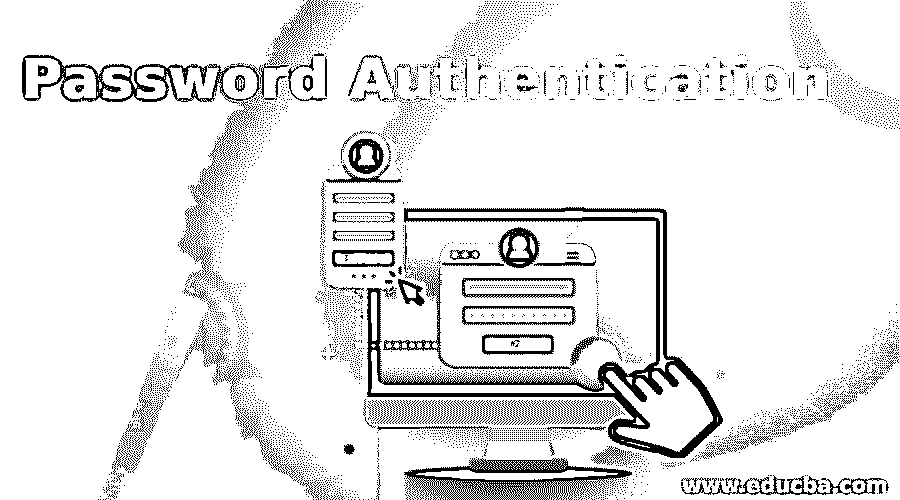

# 密码认证

> 原文：<https://www.educba.com/password-authentication/>

## 密码验证简介

密码是最常见的身份验证形式，是一串字母、特殊字符和数字，只有被验证的人知道。在密码认证的背后，有着伟大的神话。人们认为使用密码是最简单和最便宜的认证机制，因为它不需要任何特殊的硬件或软件支持。这是完全错误的看法。在本文中，我们将详细了解为密码实现的机制。

### 密码认证机制

在本节中，我们将讨论用于密码认证的两种主要机制。

<small>网页开发、编程语言、软件测试&其他</small>

#### 1.明文密码

明文密码是最简单的基于密码的机制。在这种机制中，用户 id 和密码被分配给用户。为了安全起见，用户定期更改密码。密码以明文格式存储在数据库中，与用户 ID 相对应。

这种密码验证的工作方式如下:

**第一步:**提示输入用户 ID 和密码

在认证过程中，第一个应用程序提示输入用户 ID 和密码。

**第二步:**用户输入用户 ID 和密码

当应用程序提示屏幕时，用户输入他/她的用户 ID 和密码，然后按 OK 或登录按钮。单击“确定”后，用户 ID 和密码将以明文格式传送到服务器

**第三步:**用户 ID 和密码验证

在这一步中，服务器检查用户数据库，查看这个特定的用户 ID 和密码是否存在。这种验证是由用户验证程序完成的。这些程序对照存储的用户数据库检查输入的用户 ID 和密码，并基于成功或失败；它返回一个结果。

**第四步:**认证结果

在此步骤中，用户验证程序根据用户 ID 和密码验证过程的成功和失败向服务器返回结果。

**第五步:**相应地通知用户

基于结果，服务器将结果发送给用户。如果认证结果正确，则服务器向用户发送选项菜单，其中包含用户要执行的各种操作。如果身份验证结果失败，则服务器会向用户发送一个错误屏幕。

#### 2.问题

这种口令认证机制有两个主要问题:

数据库包含明文格式的密码:用户数据库包含明文格式的用户 ID 和密码，因此如果攻击者以某种方式访问该用户数据库，攻击者将获得所有用户 ID 和密码的 kist。为了避免这种情况，建议以加密格式存储用户 id 和密码

密码以明文形式从用户计算机传输到服务器计算机:如果我们以加密格式存储用户 ID 和密码，第一个问题就可以解决。但是，如果攻击者在从用户计算机到服务器计算机的过程中获得了这些信息，用户 ID 和密码以明文格式传输，该怎么办呢？攻击者可以很容易地获得密码。源自密码的东西。为了克服明文密码机制，这种机制引入了一种对密码运行的算法，并将该算法的输出作为密码存储在数据库中。即，当用户输入密码时，用户自己的计算机对密码运行算法，并将导出的密码发送到服务器。

这种机制的工作原理如下。

##### 密码的消息摘要

*   与其以不明确的文本格式存储密码，不如计算密码的消息摘要，然后将其存储在用户数据库中。
*   执行用户验证，用户的计算机计算密码的消息摘要，并将用户 ID 和密码发送到服务器进行验证。
*   服务器将这些值传递给用户验证器程序，以便根据数据库验证用户 ID 和密码的消息摘要。程序将适当的结果返回给服务器。然后服务器将结果返回给用户。

##### 增加随机性

为了提高先前方案的安全性，我们需要增加随机性。

*   计算密码的消息摘要并作为派生密码存储在用户数据库中
*   用户仅使用用户 ID 向服务器发送登录请求。
*   当服务器收到登录请求时，它首先检查用户 ID 是否有效。如果没有，它会发送一个错误屏幕，如果用户 ID 有效，那么它会创建随机质询并将其发送回用户。
*   应用程序为用户显示密码输入屏幕。当用户输入密码时，应用程序运行一个程序来计算密码的消息摘要。这些消息摘要用于加密在步骤 3 中从服务器接收的随机挑战。
*   当服务器收到来自用户的加密随机质询时，它会验证随机质询，以确保它来自正确的用户。这种验证可以通过两种方式完成。第一种方式是服务器尝试用用户密码的消息摘要解密随机挑战，然后将其与原始随机挑战进行比较。如果匹配，就能确保它来自正确的用户。第二种方式是服务器用用户密码的消息摘要加密原始随机挑战，并将其与用户加密的随机挑战进行比较。如果匹配，就能确保它来自正确的用户。
*   基于先前的动作，即成功或失败，服务器向用户发送适当的动作。

### 推荐文章

这是一个密码认证指南。在这里，我们还将讨论简介以及它如何帮助验证用户的身份及其机制。您也可以看看以下文章，了解更多信息–

1.  [React 本地认证](https://www.educba.com/react-native-authentication/)
2.  [MongoDB 认证](https://www.educba.com/mongodb-authentication/)
3.  [MySQL Root 密码](https://www.educba.com/mysql-root-password/)
4.  [认证令牌](https://www.educba.com/authentication-tokens/)

