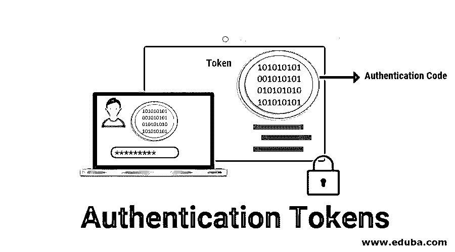
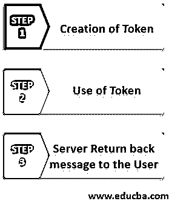

# 认证令牌

> 原文：<https://www.educba.com/authentication-tokens/>

## 身份验证令牌简介

身份验证令牌是密码的替代方案。它是一个小装置，用于每次生成一个新的随机值。这个随机值成为认证的基础。小型设备通常具有小型钥匙链、计算器或信用卡的大小。通常，认证令牌具有诸如电池、用于输出显示的液晶显示器(LCD)、处理器、用于输入信息的小键盘(可选)、实时时钟(可选)等功能。每个认证令牌都预编程有一个唯一的编号，称为随机种子或种子。这个随机种子确保身份验证令牌生成的每个值都是唯一的。

### 身份验证令牌是如何工作的？

身份验证令牌基本上包括三个步骤。

<small>网页开发、编程语言、软件测试&其他</small>

#### 步骤 1:创建令牌

*   每当创建身份验证令牌时，身份验证服务器都会为令牌生成相应的随机种子。
*   该种子被预编程并存储在令牌中，并且其条目是针对用户数据库中的用户记录而生成的。
*   从概念上来说，这是用户的密码。此外，与密码不同，用户不知道种子的值。这是因为种子由身份验证令牌自动使用。

#### 步骤 2:令牌的使用

*   它会自动生成伪随机数，称为一次性密码。该一次性密码由身份验证令牌根据这些预编程的值生成。它们被称为一次性密码，因为它们仅在生成时使用一次。
*   当用户想要被认证时，用户将得到一个屏幕，允许用户输入第三个且是一次性的密码。在这种情况下，用户将输入用户 id 和由身份验证令牌生成的一次性密码。
*   用户 id 和密码作为登录请求的一部分传送到服务器。服务器使用种子检索程序从用户数据库中获取用户 id 的相应种子。在那个服务器调用之后，另一个程序调用一个密码验证程序。
*   服务器向密码验证程序提交种子和一次性密码。然后，该程序在种子和一次性密码之间建立关系。这个过程是使用对称技术完成的。
*   它生成与身份验证令牌相同的一次性密码。认证服务器也可以使用该程序来识别特定的种子值是否与特定的一次性密码相关。
*   它受 4 位 pin 码保护，该 pin 码用于创建一次性密码。因此，如果用户不知何故丢失了身份验证令牌，也不必担心。

#### 步骤 3:服务器向用户返回适当的消息

最后，服务器向用户发送适当的消息。就看之前操作的成败了。

### 类型令牌

有两种类型的身份验证令牌，解释如下:

#### 1.挑战或响应令牌

*   挑战/响应令牌，使用技术的组合。种子在认证令牌内被预编程，该种子被保密并且应该是唯一的。在这种令牌中，种子成为加密密钥。
*   在这种技术中，用户必须输入三个条目，第一个用户需要输入 PIN 来访问令牌。第二个用户需要从屏幕上读取随机挑战，并将随机数挑战键入令牌。最后一个是用户必须从令牌的 LCD 上读取加密的随机挑战，并将其输入密码字段。
*   这个标记的问题是，它会导致生成很长的字符串。假设如果我们使用 128 位种子和 128 位密钥，加密的种子也将是 128 位的。这意味着用户必须从身份验证令牌的 LCD 上读取 16 个字符，并在屏幕上输入密码。这对用户来说可能相当麻烦。为了解决这个问题，使用了另一种方法，即消息摘要技术。
*   它将种子与随机挑战相结合以产生消息摘要。它将其截断为预定的位数，将其转换为用户可读的格式，并在 LCD 上显示。然后，用户将阅读这个较小的文本，并将其作为密码输入。服务器也执行相同的过程。

#### 2.基于时间的令牌

*   挑战/响应令牌存在一些缺点和问题，这些问题在基于时间的令牌中得到解决。在这种技术中，服务器需要向用户发送任何随机挑战。
*   令牌不需要键盘来输入。这背后的目标是使用时间作为身份验证过程的可变输入，而不是随机挑战。

### 推荐文章

这是认证令牌的指南。在这里，我们讨论什么是认证令牌及其详细的工作方式以及它们的类型。您也可以阅读以下文章，了解更多信息——

1.  [c#中的构造函数](https://www.educba.com/constructor-in-c-sharp/)
2.  [视频编辑工具](https://www.educba.com/video-editing-tools/)
3.  [代码覆盖工具](https://www.educba.com/code-coverage-tools/)
4.  [Python 中的标记化](https://www.educba.com/tokenization-in-python/)

